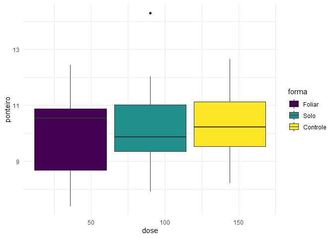
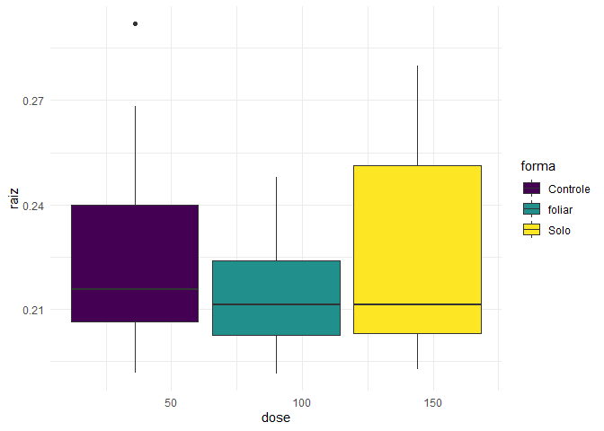
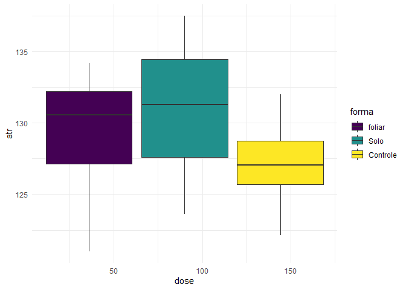

<!-- README.md is generated from README.Rmd. Please edit that file -->

# Projeto cana Aryane J. Fereira (IAC)

## Análise Preliminar

### Carregando o banco de dados

``` r
dados <-readr::read_rds("data/my_data.rds")
```

### Resumo estatístico rápido

``` r
dados$data %>% 
  purrr::map(skimr::skim) %>%
  purrr::map_chr(knitr::knit_print, options = list(skimr_include_summary = FALSE)) %>%
  knitr::asis_output()
```

**Variable type: factor**

| skim_variable | n_missing | complete_rate | ordered | n_unique | top_counts                |
|:--------------|----------:|--------------:|:--------|---------:|:--------------------------|
| forma         |         0 |             1 | FALSE   |        3 | fol: 16, Sol: 16, Con: 16 |

**Variable type: numeric**

| skim_variable | n_missing | complete_rate |   mean |    sd |    p0 |    p25 |    p50 |    p75 |   p100 | hist  |
|:--------------|----------:|--------------:|-------:|------:|------:|-------:|-------:|-------:|-------:|:------|
| parcela       |         0 |             1 |  24.50 | 14.00 |  1.00 |  12.75 |  24.50 |  36.25 |  48.00 | ▇▇▇▇▇ |
| dose          |         0 |             1 |  90.00 | 67.79 |  0.00 |  45.00 |  90.00 | 135.00 | 180.00 | ▇▇▁▇▇ |
| bloco         |         0 |             1 |   2.50 |  1.13 |  1.00 |   1.75 |   2.50 |   3.25 |   4.00 | ▇▇▁▇▇ |
| tch           |         0 |             1 | 110.84 | 10.04 | 88.31 | 107.17 | 110.03 | 116.41 | 141.42 | ▃▇▇▂▁ |

**Variable type: factor**

| skim_variable | n_missing | complete_rate | ordered | n_unique | top_counts                |
|:--------------|----------:|--------------:|:--------|---------:|:--------------------------|
| forma         |         0 |             1 | FALSE   |        3 | Fol: 16, Sol: 16, Con: 16 |

**Variable type: numeric**

| skim_variable | n_missing | complete_rate |  mean |    sd |    p0 |   p25 |   p50 |    p75 |   p100 | hist  |
|:--------------|----------:|--------------:|------:|------:|------:|------:|------:|-------:|-------:|:------|
| parcela       |         0 |             1 | 24.50 | 14.00 |  1.00 | 12.75 | 24.50 |  36.25 |  48.00 | ▇▇▇▇▇ |
| dose          |         0 |             1 | 90.00 | 67.79 |  0.00 | 45.00 | 90.00 | 135.00 | 180.00 | ▇▇▁▇▇ |
| bloco         |         0 |             1 |  2.50 |  1.13 |  1.00 |  1.75 |  2.50 |   3.25 |   4.00 | ▇▇▁▇▇ |
| n_1           |         0 |             1 | 19.41 |  0.64 | 18.10 | 19.02 | 19.36 |  19.83 |  20.65 | ▂▃▇▃▃ |
| mo_1          |         0 |             1 |  2.04 |  0.70 |  1.13 |  1.61 |  1.87 |   2.23 |   4.10 | ▇▇▁▁▁ |
| n_2           |         0 |             1 | 20.12 |  0.96 | 17.59 | 19.53 | 20.19 |  20.65 |  22.17 | ▂▃▇▆▃ |
| mo_2          |         0 |             1 |  3.53 |  1.21 |  1.30 |  2.59 |  3.35 |   4.62 |   6.30 | ▅▇▅▆▂ |

**Variable type: factor**

| skim_variable | n_missing | complete_rate | ordered | n_unique | top_counts                |
|:--------------|----------:|--------------:|:--------|---------:|:--------------------------|
| forma         |         0 |             1 | FALSE   |        3 | Fol: 16, Sol: 16, Con: 16 |

**Variable type: numeric**

| skim_variable  | n_missing | complete_rate |   mean |    sd |    p0 |    p25 |    p50 |    p75 |   p100 | hist  |
|:---------------|----------:|--------------:|-------:|------:|------:|-------:|-------:|-------:|-------:|:------|
| parcela        |         0 |             1 |  24.50 | 14.00 |  1.00 |  12.75 |  24.50 |  36.25 |  48.00 | ▇▇▇▇▇ |
| dose           |         0 |             1 |  90.00 | 67.79 |  0.00 |  45.00 |  90.00 | 135.00 | 180.00 | ▇▇▁▇▇ |
| bloco          |         0 |             1 |   2.50 |  1.13 |  1.00 |   1.75 |   2.50 |   3.25 |   4.00 | ▇▇▁▇▇ |
| colmo          |         0 |             1 |  19.42 |  5.06 | 10.41 |  16.10 |  18.50 |  22.47 |  30.84 | ▅▇▇▃▂ |
| ponteiro       |         0 |             1 |  12.94 |  5.29 |  5.05 |   8.71 |  12.55 |  15.62 |  29.72 | ▇▇▅▁▁ |
| palha          |         0 |             1 |  17.08 |  6.96 |  6.96 |  13.23 |  16.14 |  18.90 |  42.52 | ▅▇▁▁▁ |
| extracao_total |         0 |             1 |  49.45 | 10.16 | 29.35 |  43.34 |  48.08 |  53.86 |  73.52 | ▃▇▇▂▂ |
| tch            |         0 |             1 | 110.84 | 10.04 | 88.31 | 107.17 | 110.03 | 116.41 | 141.42 | ▃▇▇▂▁ |
| exportacao_mo  |         0 |             1 |   0.18 |  0.04 |  0.11 |   0.15 |   0.17 |   0.20 |   0.27 | ▅▇▆▂▃ |

**Variable type: factor**

| skim_variable | n_missing | complete_rate | ordered | n_unique | top_counts                |
|:--------------|----------:|--------------:|:--------|---------:|:--------------------------|
| forma         |         0 |             1 | FALSE   |        3 | Fol: 16, Sol: 16, Con: 16 |

**Variable type: numeric**

| skim_variable  | n_missing | complete_rate |   mean |    sd |     p0 |    p25 |    p50 |    p75 |   p100 | hist  |
|:---------------|----------:|--------------:|-------:|------:|-------:|-------:|-------:|-------:|-------:|:------|
| parcela        |         0 |             1 |  24.50 | 14.00 |   1.00 |  12.75 |  24.50 |  36.25 |  48.00 | ▇▇▇▇▇ |
| dose           |         0 |             1 |  90.00 | 67.79 |   0.00 |  45.00 |  90.00 | 135.00 | 180.00 | ▇▇▁▇▇ |
| bloco          |         0 |             1 |   2.50 |  1.13 |   1.00 |   1.75 |   2.50 |   3.25 |   4.00 | ▇▇▁▇▇ |
| colmo          |         0 |             1 |  88.38 | 15.16 |  59.44 |  76.60 |  86.78 |  97.91 | 137.37 | ▅▇▇▁▁ |
| ponteiro       |         0 |             1 |  10.20 |  1.42 |   7.40 |   9.35 |  10.12 |  11.10 |  14.29 | ▃▇▇▃▁ |
| palha          |         0 |             1 |  54.23 | 22.01 |  19.65 |  37.77 |  50.59 |  65.31 | 115.34 | ▆▇▃▂▁ |
| extracao_total |         0 |             1 | 152.82 | 28.42 | 100.92 | 132.92 | 145.83 | 164.37 | 220.97 | ▃▇▆▂▂ |
| tch            |         0 |             1 | 110.84 | 10.04 |  88.31 | 107.17 | 110.03 | 116.41 | 141.42 | ▃▇▇▂▁ |
| exportacao_n   |         0 |             1 |   0.80 |  0.12 |   0.62 |   0.71 |   0.80 |   0.84 |   1.20 | ▅▇▂▁▁ |

**Variable type: factor**

| skim_variable | n_missing | complete_rate | ordered | n_unique | top_counts                |
|:--------------|----------:|--------------:|:--------|---------:|:--------------------------|
| forma         |         0 |             1 | FALSE   |        3 | Con: 16, fol: 16, Sol: 16 |

**Variable type: numeric**

| skim_variable     | n_missing | complete_rate |  mean |    sd |   p0 |   p25 |   p50 |    p75 |   p100 | hist  |
|:------------------|----------:|--------------:|------:|------:|-----:|------:|------:|-------:|-------:|:------|
| parcela           |         0 |             1 | 24.50 | 14.00 | 1.00 | 12.75 | 24.50 |  36.25 |  48.00 | ▇▇▇▇▇ |
| dose              |         0 |             1 | 90.00 | 67.79 | 0.00 | 45.00 | 90.00 | 135.00 | 180.00 | ▇▇▁▇▇ |
| bloco             |         0 |             1 |  2.44 |  1.13 | 1.00 |  1.00 |  2.00 |   3.00 |   4.00 | ▇▇▁▇▇ |
| parcela_2         |         0 |             1 | 24.50 | 14.00 | 1.00 | 12.75 | 24.50 |  36.25 |  48.00 | ▇▇▇▇▇ |
| redutase_1\_epoca |         0 |             1 |  0.65 |  0.10 | 0.41 |  0.60 |  0.64 |   0.72 |   0.89 | ▂▃▇▃▁ |
| redutase_2\_epoca |         0 |             1 |  0.73 |  0.24 | 0.41 |  0.60 |  0.66 |   0.74 |   1.53 | ▅▇▁▁▁ |
| raiz              |         0 |             1 |  0.22 |  0.02 | 0.19 |  0.20 |  0.21 |   0.23 |   0.29 | ▇▅▂▂▁ |

**Variable type: factor**

| skim_variable | n_missing | complete_rate | ordered | n_unique | top_counts                |
|:--------------|----------:|--------------:|:--------|---------:|:--------------------------|
| forma         |         0 |             1 | FALSE   |        3 | fol: 16, Sol: 16, Con: 16 |

**Variable type: numeric**

| skim_variable | n_missing | complete_rate |   mean |    sd |     p0 |    p25 |    p50 |    p75 |   p100 | hist  |
|:--------------|----------:|--------------:|-------:|------:|-------:|-------:|-------:|-------:|-------:|:------|
| parcela       |         0 |             1 |  24.50 | 14.00 |   1.00 |  12.75 |  24.50 |  36.25 |  48.00 | ▇▇▇▇▇ |
| dose          |         0 |             1 |  90.00 | 67.79 |   0.00 |  45.00 |  90.00 | 135.00 | 180.00 | ▇▇▁▇▇ |
| bloco         |         0 |             1 |   2.50 |  1.13 |   1.00 |   1.75 |   2.50 |   3.25 |   4.00 | ▇▇▁▇▇ |
| tch           |         0 |             1 | 110.84 | 10.04 |  88.31 | 107.17 | 110.03 | 116.41 | 141.42 | ▃▇▇▂▁ |
| atr           |         0 |             1 | 129.19 |  3.92 | 121.02 | 126.76 | 128.86 | 132.21 | 137.48 | ▃▇▇▇▃ |
| tah           |         0 |             1 |  14.31 |  1.32 |  11.35 |  13.77 |  14.25 |  15.14 |  17.27 | ▂▂▇▅▂ |

### Gráfios boxplot

``` r
dados <- dados %>% 
  dplyr::mutate(
    boxplots = purrr::map(data, my_summary)
  )
dados$boxplots
#> [[1]]
#> [[1]][[1]]
```

<!-- -->

    #> 
    #> 
    #> [[2]]
    #> [[2]][[1]]

<!-- -->

    #> 
    #> [[2]][[2]]

<!-- -->

    #> 
    #> [[2]][[3]]

<!-- -->

    #> 
    #> [[2]][[4]]

<!-- -->

    #> 
    #> 
    #> [[3]]
    #> [[3]][[1]]

<!-- -->

    #> 
    #> [[3]][[2]]

<!-- -->

    #> 
    #> [[3]][[3]]

<!-- -->

    #> 
    #> [[3]][[4]]

<!-- -->

    #> 
    #> [[3]][[5]]

<!-- -->

    #> 
    #> [[3]][[6]]

<!-- -->

    #> 
    #> 
    #> [[4]]
    #> [[4]][[1]]

<!-- -->

    #> 
    #> [[4]][[2]]

<!-- -->

    #> 
    #> [[4]][[3]]

<!-- -->

    #> 
    #> [[4]][[4]]

<!-- -->

    #> 
    #> [[4]][[5]]

<!-- -->

    #> 
    #> [[4]][[6]]

<!-- -->

    #> 
    #> 
    #> [[5]]
    #> [[5]][[1]]

<!-- -->

    #> 
    #> [[5]][[2]]

<!-- -->

    #> 
    #> [[5]][[3]]

<!-- -->

    #> 
    #> [[5]][[4]]

<!-- -->

    #> 
    #> 
    #> [[6]]
    #> [[6]][[1]]

<!-- -->

    #> 
    #> [[6]][[2]]

<!-- -->

    #> 
    #> [[6]][[3]]

<!-- -->
