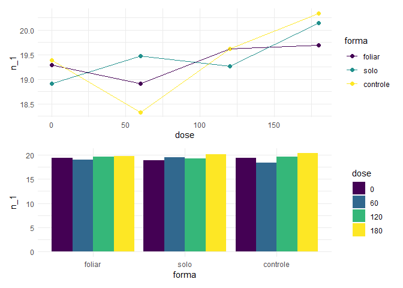
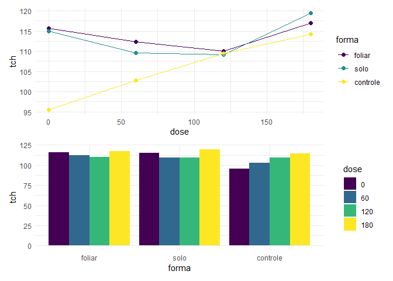
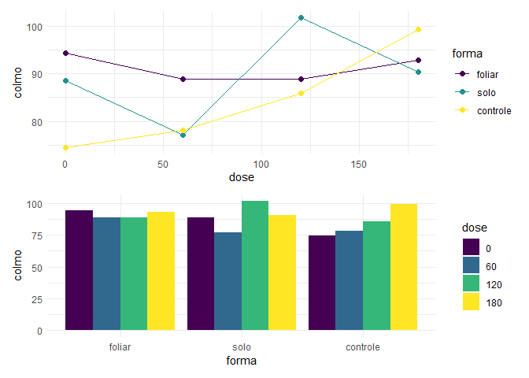
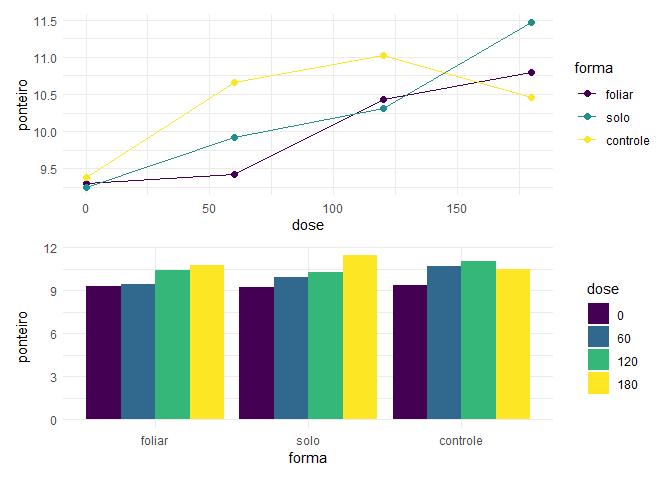
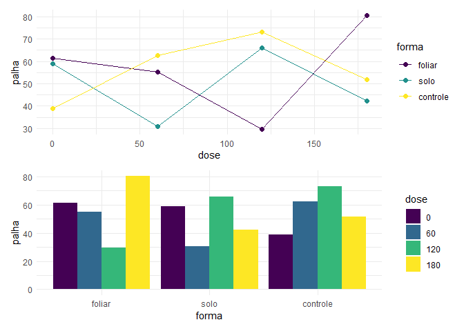
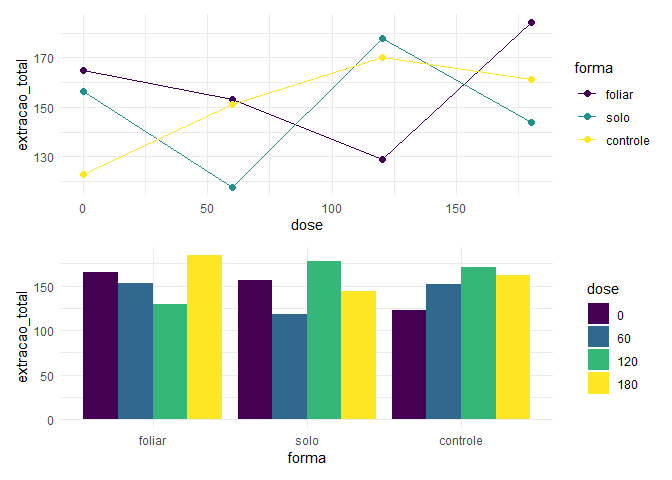
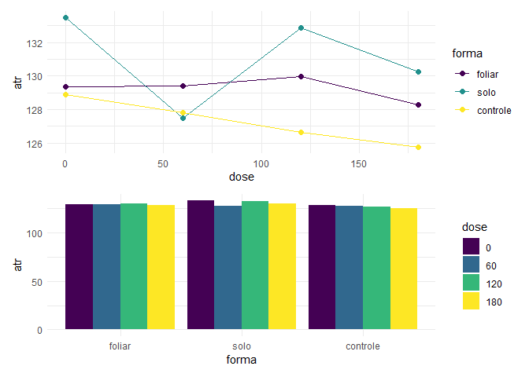

<!-- README.md is generated from README.Rmd. Please edit that file -->

# Projeto cana Aryane J. Ferreira (IAC)

## Análise Preliminar

### Carregando o banco de dados

``` r
dados <-readr::read_rds("data/my_data.rds")
```

### Resumo estatístico rápido

``` r
dados$data %>% 
  purrr::map(skimr::skim) %>%
  purrr::map_chr(knitr::knit_print, options = list(skimr_include_summary = FALSE)) %>%
  knitr::asis_output()
```

**Variable type: factor**

| skim_variable | n_missing | complete_rate | ordered | n_unique | top_counts                |
|:--------------|----------:|--------------:|:--------|---------:|:--------------------------|
| forma         |         0 |             1 | FALSE   |        3 | fol: 16, Sol: 16, Con: 16 |

**Variable type: numeric**

| skim_variable | n_missing | complete_rate |   mean |    sd |    p0 |    p25 |    p50 |    p75 |   p100 | hist  |
|:--------------|----------:|--------------:|-------:|------:|------:|-------:|-------:|-------:|-------:|:------|
| parcela       |         0 |             1 |  24.50 | 14.00 |  1.00 |  12.75 |  24.50 |  36.25 |  48.00 | ▇▇▇▇▇ |
| dose          |         0 |             1 |  90.00 | 67.79 |  0.00 |  45.00 |  90.00 | 135.00 | 180.00 | ▇▇▁▇▇ |
| bloco         |         0 |             1 |   2.50 |  1.13 |  1.00 |   1.75 |   2.50 |   3.25 |   4.00 | ▇▇▁▇▇ |
| tch           |         0 |             1 | 110.84 | 10.04 | 88.31 | 107.17 | 110.03 | 116.41 | 141.42 | ▃▇▇▂▁ |

**Variable type: factor**

| skim_variable | n_missing | complete_rate | ordered | n_unique | top_counts                |
|:--------------|----------:|--------------:|:--------|---------:|:--------------------------|
| forma         |         0 |             1 | FALSE   |        3 | Fol: 16, Sol: 16, Con: 16 |

**Variable type: numeric**

| skim_variable | n_missing | complete_rate |  mean |    sd |    p0 |   p25 |   p50 |    p75 |   p100 | hist  |
|:--------------|----------:|--------------:|------:|------:|------:|------:|------:|-------:|-------:|:------|
| parcela       |         0 |             1 | 24.50 | 14.00 |  1.00 | 12.75 | 24.50 |  36.25 |  48.00 | ▇▇▇▇▇ |
| dose          |         0 |             1 | 90.00 | 67.79 |  0.00 | 45.00 | 90.00 | 135.00 | 180.00 | ▇▇▁▇▇ |
| bloco         |         0 |             1 |  2.50 |  1.13 |  1.00 |  1.75 |  2.50 |   3.25 |   4.00 | ▇▇▁▇▇ |
| n_1           |         0 |             1 | 19.41 |  0.64 | 18.10 | 19.02 | 19.36 |  19.83 |  20.65 | ▂▃▇▃▃ |
| mo_1          |         0 |             1 |  2.04 |  0.70 |  1.13 |  1.61 |  1.87 |   2.23 |   4.10 | ▇▇▁▁▁ |
| n_2           |         0 |             1 | 20.12 |  0.96 | 17.59 | 19.53 | 20.19 |  20.65 |  22.17 | ▂▃▇▆▃ |
| mo_2          |         0 |             1 |  3.53 |  1.21 |  1.30 |  2.59 |  3.35 |   4.62 |   6.30 | ▅▇▅▆▂ |

**Variable type: factor**

| skim_variable | n_missing | complete_rate | ordered | n_unique | top_counts                |
|:--------------|----------:|--------------:|:--------|---------:|:--------------------------|
| forma         |         0 |             1 | FALSE   |        3 | Fol: 16, Sol: 16, Con: 16 |

**Variable type: numeric**

| skim_variable  | n_missing | complete_rate |   mean |    sd |    p0 |    p25 |    p50 |    p75 |   p100 | hist  |
|:---------------|----------:|--------------:|-------:|------:|------:|-------:|-------:|-------:|-------:|:------|
| parcela        |         0 |             1 |  24.50 | 14.00 |  1.00 |  12.75 |  24.50 |  36.25 |  48.00 | ▇▇▇▇▇ |
| dose           |         0 |             1 |  90.00 | 67.79 |  0.00 |  45.00 |  90.00 | 135.00 | 180.00 | ▇▇▁▇▇ |
| bloco          |         0 |             1 |   2.50 |  1.13 |  1.00 |   1.75 |   2.50 |   3.25 |   4.00 | ▇▇▁▇▇ |
| colmo          |         0 |             1 |  19.42 |  5.06 | 10.41 |  16.10 |  18.50 |  22.47 |  30.84 | ▅▇▇▃▂ |
| ponteiro       |         0 |             1 |  12.94 |  5.29 |  5.05 |   8.71 |  12.55 |  15.62 |  29.72 | ▇▇▅▁▁ |
| palha          |         0 |             1 |  17.08 |  6.96 |  6.96 |  13.23 |  16.14 |  18.90 |  42.52 | ▅▇▁▁▁ |
| extracao_total |         0 |             1 |  49.45 | 10.16 | 29.35 |  43.34 |  48.08 |  53.86 |  73.52 | ▃▇▇▂▂ |
| tch            |         0 |             1 | 110.84 | 10.04 | 88.31 | 107.17 | 110.03 | 116.41 | 141.42 | ▃▇▇▂▁ |
| exportacao_mo  |         0 |             1 |   0.18 |  0.04 |  0.11 |   0.15 |   0.17 |   0.20 |   0.27 | ▅▇▆▂▃ |

**Variable type: factor**

| skim_variable | n_missing | complete_rate | ordered | n_unique | top_counts                |
|:--------------|----------:|--------------:|:--------|---------:|:--------------------------|
| forma         |         0 |             1 | FALSE   |        3 | Fol: 16, Sol: 16, Con: 16 |

**Variable type: numeric**

| skim_variable  | n_missing | complete_rate |   mean |    sd |     p0 |    p25 |    p50 |    p75 |   p100 | hist  |
|:---------------|----------:|--------------:|-------:|------:|-------:|-------:|-------:|-------:|-------:|:------|
| parcela        |         0 |             1 |  24.50 | 14.00 |   1.00 |  12.75 |  24.50 |  36.25 |  48.00 | ▇▇▇▇▇ |
| dose           |         0 |             1 |  90.00 | 67.79 |   0.00 |  45.00 |  90.00 | 135.00 | 180.00 | ▇▇▁▇▇ |
| bloco          |         0 |             1 |   2.50 |  1.13 |   1.00 |   1.75 |   2.50 |   3.25 |   4.00 | ▇▇▁▇▇ |
| colmo          |         0 |             1 |  88.38 | 15.16 |  59.44 |  76.60 |  86.78 |  97.91 | 137.37 | ▅▇▇▁▁ |
| ponteiro       |         0 |             1 |  10.20 |  1.42 |   7.40 |   9.35 |  10.12 |  11.10 |  14.29 | ▃▇▇▃▁ |
| palha          |         0 |             1 |  54.23 | 22.01 |  19.65 |  37.77 |  50.59 |  65.31 | 115.34 | ▆▇▃▂▁ |
| extracao_total |         0 |             1 | 152.82 | 28.42 | 100.92 | 132.92 | 145.83 | 164.37 | 220.97 | ▃▇▆▂▂ |
| tch            |         0 |             1 | 110.84 | 10.04 |  88.31 | 107.17 | 110.03 | 116.41 | 141.42 | ▃▇▇▂▁ |
| exportacao_n   |         0 |             1 |   0.80 |  0.12 |   0.62 |   0.71 |   0.80 |   0.84 |   1.20 | ▅▇▂▁▁ |

**Variable type: factor**

| skim_variable | n_missing | complete_rate | ordered | n_unique | top_counts                |
|:--------------|----------:|--------------:|:--------|---------:|:--------------------------|
| forma         |         0 |             1 | FALSE   |        3 | Con: 16, fol: 16, Sol: 16 |

**Variable type: numeric**

| skim_variable     | n_missing | complete_rate |  mean |    sd |   p0 |   p25 |   p50 |    p75 |   p100 | hist  |
|:------------------|----------:|--------------:|------:|------:|-----:|------:|------:|-------:|-------:|:------|
| parcela           |         0 |             1 | 24.50 | 14.00 | 1.00 | 12.75 | 24.50 |  36.25 |  48.00 | ▇▇▇▇▇ |
| dose              |         0 |             1 | 90.00 | 67.79 | 0.00 | 45.00 | 90.00 | 135.00 | 180.00 | ▇▇▁▇▇ |
| bloco             |         0 |             1 |  2.44 |  1.13 | 1.00 |  1.00 |  2.00 |   3.00 |   4.00 | ▇▇▁▇▇ |
| redutase_1\_epoca |         0 |             1 |  0.65 |  0.10 | 0.41 |  0.60 |  0.64 |   0.72 |   0.89 | ▂▃▇▃▁ |
| redutase_2\_epoca |         0 |             1 |  0.73 |  0.24 | 0.41 |  0.60 |  0.66 |   0.74 |   1.53 | ▅▇▁▁▁ |
| raiz              |         0 |             1 |  0.22 |  0.02 | 0.19 |  0.20 |  0.21 |   0.23 |   0.29 | ▇▅▂▂▁ |

**Variable type: factor**

| skim_variable | n_missing | complete_rate | ordered | n_unique | top_counts                |
|:--------------|----------:|--------------:|:--------|---------:|:--------------------------|
| forma         |         0 |             1 | FALSE   |        3 | fol: 16, Sol: 16, Con: 16 |

**Variable type: numeric**

| skim_variable | n_missing | complete_rate |   mean |    sd |     p0 |    p25 |    p50 |    p75 |   p100 | hist  |
|:--------------|----------:|--------------:|-------:|------:|-------:|-------:|-------:|-------:|-------:|:------|
| parcela       |         0 |             1 |  24.50 | 14.00 |   1.00 |  12.75 |  24.50 |  36.25 |  48.00 | ▇▇▇▇▇ |
| dose          |         0 |             1 |  90.00 | 67.79 |   0.00 |  45.00 |  90.00 | 135.00 | 180.00 | ▇▇▁▇▇ |
| bloco         |         0 |             1 |   2.50 |  1.13 |   1.00 |   1.75 |   2.50 |   3.25 |   4.00 | ▇▇▁▇▇ |
| tch           |         0 |             1 | 110.84 | 10.04 |  88.31 | 107.17 | 110.03 | 116.41 | 141.42 | ▃▇▇▂▁ |
| atr           |         0 |             1 | 129.19 |  3.92 | 121.02 | 126.76 | 128.86 | 132.21 | 137.48 | ▃▇▇▇▃ |
| tah           |         0 |             1 |  14.31 |  1.32 |  11.35 |  13.77 |  14.25 |  15.14 |  17.27 | ▂▂▇▅▂ |

## Análise com desdobramento.

Observe que nessa análise desdobramos as interações menores que
.
Utilizando regressão para doses e LSD (teste-t), para forma.

``` r
dados <- dados %>% 
  dplyr::mutate(
    boxplot = purrr::map(data, my_summary, type="boxplot"),
    histograma = purrr::map(data, my_summary,type="histograma"),
    anova = purrr::map(data, my_summary,type="regressao"),
    interacao = purrr::map(data, my_summary,type="interacao"),
    desdobramento = purrr::map(data, my_summary,type="desdobramento")
  )
#> [1] "Variavel: tch"
#> ------------------------------------------------------------------------
#> Legenda:
#> FATOR 1:  Dose 
#> FATOR 2:  Forma 
#> ------------------------------------------------------------------------
#> 
#> 
#> Quadro da analise de variancia
#> ------------------------------------------------------------------------
#>            GL     SQ QM     Fc   Pr>Fc
#> Bloco       3  121.7  5 0.4907 0.69113
#> Dose        3  594.9  3 2.3979 0.08567
#> Forma       2  686.2  4 4.1490 0.02470
#> Dose*Forma  6  603.5  2 1.2163 0.32284
#> Residuo    33 2728.9  6               
#> Total      47 4735.2  1               
#> ------------------------------------------------------------------------
#> CV = 8.2 %
#> 
#> ------------------------------------------------------------------------
#> Teste de normalidade dos residuos (Shapiro-Wilk)
#> valor-p:  0.04037964 
#> ATENCAO: a 5% de significancia, os residuos nao podem ser considerados normais!
#> ------------------------------------------------------------------------
#> 
#> 
#> 
#> Interacao significativa: desdobrando a interacao
#> ------------------------------------------------------------------------
#> 
#> Desdobrando  Dose  dentro de cada nivel de  Forma 
#> ------------------------------------------------------------------------
#> ------------------------------------------------------------------------
#> Quadro da analise de variancia
#> ------------------------------------------------------------------------
#>                     GL        SQ        QM     Fc  Pr.Fc
#> Bloco                3  121.7378  40.57928 0.4907 0.6911
#> Forma                2  686.1880 343.09403  4.149 0.0247
#> Dose:Forma foliar    3  123.5995  41.19982 0.4982 0.6861
#> Dose:Forma Solo      3  285.0157  95.00524 1.1489 0.3439
#> Dose:Forma Controle  3  789.7431 263.24771 3.1834 0.0366
#> Residuo             33 2728.8719  82.69309              
#> Total               47 4735.1561 100.74800              
#> ------------------------------------------------------------------------
#> 
#> 
#> 
#>  Dose  dentro do nivel  foliar  de  Forma 
#> 
#> De acordo com o teste F, as medias desse fator sao estatisticamente iguais.
#> ------------------------------------------------------------------------
#>   Niveis   Medias
#> 1      0 115.6896
#> 2    120 109.9608
#> 3    180 117.0527
#> 4     60 112.3811
#> ------------------------------------------------------------------------
#> 
#> 
#>  Dose  dentro do nivel  Solo  de  Forma 
#> ------------------------------------------------------------------------
#> Ajuste de modelos polinomiais de regressao
#> ------------------------------------------------------------------------
#> 
#> Modelo Linear
#> =========================================
#>    Estimativa Erro.padrao   tc    valor.p
#> -----------------------------------------
#> b0  111.2669    3.8041    29.2491    0   
#> b1   0.0219     0.0339    0.6471  0.5220 
#> -----------------------------------------
#> 
#> R2 do modelo linear
#> --------
#> 0.121505
#> --------
#> 
#> Analise de variancia do modelo linear
#> ========================================================
#>                      GL     SQ        QM     Fc  valor.p
#> --------------------------------------------------------
#> Efeito linear        1   34.6308   34.6308  0.42 0.52202
#> Desvios de Regressao 2   250.3849  125.1925 1.51 0.23493
#> Residuos             33 2,728.8720 82.6931              
#> --------------------------------------------------------
#> ------------------------------------------------------------------------
#> 
#> Modelo quadratico
#> =========================================
#>    Estimativa Erro.padrao   tc    valor.p
#> -----------------------------------------
#> b0  115.1725    4.4317    25.9886    0   
#> b1  -0.1734     0.1186    -1.4615 0.1533 
#> b2   0.0011     0.0006    1.7180  0.0952 
#> -----------------------------------------
#> 
#> R2 do modelo quadratico
#> --------
#> 0.977842
#> --------
#> 
#> Analise de variancia do modelo quadratico
#> ========================================================
#>                      GL     SQ        QM     Fc  valor.p
#> --------------------------------------------------------
#> Efeito linear        1   34.6308   34.6308  0.42 0.52202
#> Efeito quadratico    1   244.0695  244.0695 2.95 0.09517
#> Desvios de Regressao 1    6.3154    6.3154  0.08  0.784 
#> Residuos             33 2,728.8720 82.6931              
#> --------------------------------------------------------
#> ------------------------------------------------------------------------
#> 
#> Modelo cubico
#> =========================================
#>    Estimativa Erro.padrao   tc    valor.p
#> -----------------------------------------
#> b0  114.8916    4.5468    25.2687    0   
#> b1  -0.1000     0.2908    -0.3439 0.7331 
#> b2  -0.0001     0.0043    -0.0200 0.9841 
#> b3  0.000004    0.00002   0.2764  0.7840 
#> -----------------------------------------
#> 
#> R2 do modelo cubico
#> -
#> 1
#> -
#> 
#> Analise de variancia do modelo cubico
#> ========================================================
#>                      GL     SQ        QM     Fc  valor.p
#> --------------------------------------------------------
#> Efeito linear        1   34.6308   34.6308  0.42 0.52202
#> Efeito quadratico    1   244.0695  244.0695 2.95 0.09517
#> Efeito cubico        1    6.3154    6.3154  0.08  0.784 
#> Desvios de Regressao 0      0         0      0      1   
#> Residuos             33 2,728.8720 82.6931              
#> --------------------------------------------------------
#> ------------------------------------------------------------------------
#> 
#> 
#>  Dose  dentro do nivel  Controle  de  Forma 
#> ------------------------------------------------------------------------
#> Ajuste de modelos polinomiais de regressao
#> ------------------------------------------------------------------------
#> 
#> Modelo Linear
#> =========================================
#>    Estimativa Erro.padrao   tc    valor.p
#> -----------------------------------------
#> b0  96.1123     3.8041    25.2653    0   
#> b1   0.1043     0.0339    3.0774  0.0042 
#> -----------------------------------------
#> 
#> R2 do modelo linear
#> --------
#> 0.991600
#> --------
#> 
#> Analise de variancia do modelo linear
#> ========================================================
#>                      GL     SQ        QM     Fc  valor.p
#> --------------------------------------------------------
#> Efeito linear        1   783.1089  783.1089 9.47 0.00418
#> Desvios de Regressao 2    6.6342    3.3171  0.04 0.96073
#> Residuos             33 2,728.8720 82.6931              
#> --------------------------------------------------------
#> ------------------------------------------------------------------------
#> 
#> Modelo quadratico
#> =========================================
#>    Estimativa Erro.padrao   tc    valor.p
#> -----------------------------------------
#> b0  95.4869     4.4317    21.5465    0   
#> b1   0.1356     0.1186    1.1429  0.2613 
#> b2  -0.0002     0.0006    -0.2751 0.7850 
#> -----------------------------------------
#> 
#> R2 do modelo quadratico
#> --------
#> 0.999523
#> --------
#> 
#> Analise de variancia do modelo quadratico
#> ========================================================
#>                      GL     SQ        QM     Fc  valor.p
#> --------------------------------------------------------
#> Efeito linear        1   783.1089  783.1089 9.47 0.00418
#> Efeito quadratico    1    6.2573    6.2573  0.08 0.78497
#> Desvios de Regressao 1    0.3769    0.3769   0   0.94658
#> Residuos             33 2,728.8720 82.6931              
#> --------------------------------------------------------
#> ------------------------------------------------------------------------
#> 
#> Modelo cubico
#> =========================================
#>    Estimativa Erro.padrao   tc    valor.p
#> -----------------------------------------
#> b0  95.5555     4.5468    21.0161    0   
#> b1   0.1176     0.2908    0.4046  0.6884 
#> b2   0.0001     0.0043    0.0262  0.9792 
#> b3 -0.000001    0.00002   -0.0675 0.9466 
#> -----------------------------------------
#> 
#> R2 do modelo cubico
#> -
#> 1
#> -
#> 
#> Analise de variancia do modelo cubico
#> ========================================================
#>                      GL     SQ        QM     Fc  valor.p
#> --------------------------------------------------------
#> Efeito linear        1   783.1089  783.1089 9.47 0.00418
#> Efeito quadratico    1    6.2573    6.2573  0.08 0.78497
#> Efeito cubico        1    0.3769    0.3769   0   0.94658
#> Desvios de Regressao 0      0         0      0      1   
#> Residuos             33 2,728.8720 82.6931              
#> --------------------------------------------------------
#> ------------------------------------------------------------------------
#> 
#> 
#> 
#> Desdobrando  Forma  dentro de cada nivel de  Dose 
#> ------------------------------------------------------------------------
#> ------------------------------------------------------------------------
#> Quadro da analise de variancia
#> ------------------------------------------------------------------------
#>                GL         SQ        QM     Fc  Pr.Fc
#> Bloco           3  121.73785  40.57928 0.4907 0.6911
#> Dose            3  594.87086 198.29029 2.3979 0.0857
#> Forma:Dose 0    2 1039.86498 519.93249 6.2875 0.0049
#> Forma:Dose 60   2  193.99439  96.99720  1.173  0.322
#> Forma:Dose 120  2    1.33964   0.66982 0.0081 0.9919
#> Forma:Dose 180  2   54.47649  27.23824 0.3294 0.7217
#> Residuo        33 2728.87191  82.69309              
#> Total          47 4735.15611 100.74800              
#> ------------------------------------------------------------------------
#> 
#> 
#> 
#>  Forma  dentro do nivel  0  de  Dose 
#> ------------------------------------------------------------------------
#> Teste t (LSD)
#> ------------------------------------------------------------------------
#> Grupos  Tratamentos  Medias
#> a     1   115.6896 
#> a     2   114.8916 
#>  b    3   95.55553 
#> ------------------------------------------------------------------------
#> 
#> 
#>  Forma  dentro do nivel  60  de  Dose 
#> ------------------------------------------------------------------------
#> Teste t (LSD)
#> ------------------------------------------------------------------------
#> Grupos  Tratamentos  Medias
#> a     1   112.3811 
#> a     2   109.52 
#> a     3   102.7891 
#> ------------------------------------------------------------------------
#> 
#> 
#>  Forma  dentro do nivel  120  de  Dose 
#> 
#> De acordo com o teste F, as medias desse fator sao estatisticamente iguais.
#> ------------------------------------------------------------------------
#>   Niveis   Medias
#> 1      1 109.9608
#> 2      2 109.1500
#> 3      3 109.4584
#> ------------------------------------------------------------------------
#> 
#> 
#>  Forma  dentro do nivel  180  de  Dose 
#> 
#> De acordo com o teste F, as medias desse fator sao estatisticamente iguais.
#> ------------------------------------------------------------------------
#>   Niveis   Medias
#> 1      1 117.0527
#> 2      2 119.4011
#> 3      3 114.1905
#> ------------------------------------------------------------------------
#> [1] "Variavel: atr"
#> ------------------------------------------------------------------------
#> Legenda:
#> FATOR 1:  Dose 
#> FATOR 2:  Forma 
#> ------------------------------------------------------------------------
#> 
#> 
#> Quadro da analise de variancia
#> ------------------------------------------------------------------------
#>            GL     SQ QM     Fc   Pr>Fc
#> Bloco       3  29.72  6 0.7056 0.55553
#> Dose        3  52.80  4 1.2534 0.30629
#> Forma       2 111.75  5 3.9791 0.02830
#> Dose*Forma  6  64.76  2 0.7687 0.59989
#> Residuo    33 463.38  3               
#> Total      47 722.42  1               
#> ------------------------------------------------------------------------
#> CV = 2.9 %
#> 
#> ------------------------------------------------------------------------
#> Teste de normalidade dos residuos (Shapiro-Wilk)
#> valor-p:  0.1780499 
#> De acordo com o teste de Shapiro-Wilk a 5% de significancia, os residuos podem ser considerados normais.
#> ------------------------------------------------------------------------
#> 
#> Interacao nao significativa: analisando os efeitos simples
#> ------------------------------------------------------------------------
#> Dose
#> Ajuste de modelos polinomiais de regressao
#> ------------------------------------------------------------------------
#> 
#> Modelo Linear
#> ==========================================
#>    Estimativa Erro.padrao    tc    valor.p
#> ------------------------------------------
#> b0  130.0582    0.9050    143.7035    0   
#> b1  -0.0097     0.0081    -1.2027  0.2376 
#> ------------------------------------------
#> 
#> R2 do modelo linear
#> --------
#> 0.384683
#> --------
#> 
#> Analise de variancia do modelo linear
#> =====================================================
#>                      GL    SQ      QM     Fc  valor.p
#> -----------------------------------------------------
#> Efeito linear        1  20.3118  20.3118 1.45 0.23765
#> Desvios de Regressao 2  32.4896  16.2448 1.16 0.32689
#> Residuos             33 463.3808 14.0418             
#> -----------------------------------------------------
#> ------------------------------------------------------------------------
#> 
#> Modelo quadratico
#> ==========================================
#>    Estimativa Erro.padrao    tc    valor.p
#> ------------------------------------------
#> b0  130.2073    1.0543    123.4958    0   
#> b1  -0.0172     0.0282    -0.6079  0.5474 
#> b2  0.00004     0.0001     0.2758  0.7844 
#> ------------------------------------------
#> 
#> R2 do modelo quadratico
#> --------
#> 0.404910
#> --------
#> 
#> Analise de variancia do modelo quadratico
#> =====================================================
#>                      GL    SQ      QM     Fc  valor.p
#> -----------------------------------------------------
#> Efeito linear        1  20.3118  20.3118 1.45 0.23765
#> Efeito quadratico    1   1.0680  1.0680  0.08 0.78443
#> Desvios de Regressao 1  31.4216  31.4216 2.24 0.14418
#> Residuos             33 463.3808 14.0418             
#> -----------------------------------------------------
#> ------------------------------------------------------------------------
#> 
#> Modelo cubico
#> ==========================================
#>    Estimativa Erro.padrao    tc    valor.p
#> ------------------------------------------
#> b0  130.5692    1.0817    120.7033    0   
#> b1  -0.1116     0.0692    -1.6138  0.1161 
#> b2   0.0015     0.0010     1.5202  0.1380 
#> b3  -0.00001       0      -1.4959  0.1442 
#> ------------------------------------------
#> 
#> R2 do modelo cubico
#> -
#> 1
#> -
#> 
#> Analise de variancia do modelo cubico
#> =====================================================
#>                      GL    SQ      QM     Fc  valor.p
#> -----------------------------------------------------
#> Efeito linear        1  20.3118  20.3118 1.45 0.23765
#> Efeito quadratico    1   1.0680  1.0680  0.08 0.78443
#> Efeito cubico        1  31.4216  31.4216 2.24 0.14418
#> Desvios de Regressao 0     0        0     0      1   
#> Residuos             33 463.3808 14.0418             
#> -----------------------------------------------------
#> ------------------------------------------------------------------------
#> 
#> Forma
#> Teste t (LSD)
#> ------------------------------------------------------------------------
#> Grupos  Tratamentos  Medias
#> a     Solo    131.0138 
#> ab    foliar      129.2638 
#>  b    Controle    127.2788 
#> ------------------------------------------------------------------------
#> 
#> [1] "Variavel: tah"
#> ------------------------------------------------------------------------
#> Legenda:
#> FATOR 1:  Dose 
#> FATOR 2:  Forma 
#> ------------------------------------------------------------------------
#> 
#> 
#> Quadro da analise de variancia
#> ------------------------------------------------------------------------
#>            GL     SQ QM     Fc   Pr>Fc
#> Bloco       3  0.834  2 0.2126 0.88697
#> Dose        3  7.724  5 1.9687 0.13784
#> Forma       2 19.927  6 7.6186 0.00190
#> Dose*Forma  6  9.659  4 1.2310 0.31584
#> Residuo    33 43.157  3               
#> Total      47 81.300  1               
#> ------------------------------------------------------------------------
#> CV = 7.99 %
#> 
#> ------------------------------------------------------------------------
#> Teste de normalidade dos residuos (Shapiro-Wilk)
#> valor-p:  0.5325157 
#> De acordo com o teste de Shapiro-Wilk a 5% de significancia, os residuos podem ser considerados normais.
#> ------------------------------------------------------------------------
#> 
#> 
#> 
#> Interacao significativa: desdobrando a interacao
#> ------------------------------------------------------------------------
#> 
#> Desdobrando  Dose  dentro de cada nivel de  Forma 
#> ------------------------------------------------------------------------
#> ------------------------------------------------------------------------
#> Quadro da analise de variancia
#> ------------------------------------------------------------------------
#>                     GL       SQ      QM     Fc  Pr.Fc
#> Bloco                3  0.83399 0.27800 0.2126  0.887
#> Forma                2 19.92688 9.96344 7.6186 0.0019
#> Dose:Forma foliar    3  1.45285 0.48428 0.3703 0.7749
#> Dose:Forma Solo      3  6.47410 2.15803 1.6502 0.1967
#> Dose:Forma Controle  3  9.45586 3.15195 2.4102 0.0845
#> Residuo             33 43.15656 1.30777              
#> Total               47 81.30024 1.72979              
#> ------------------------------------------------------------------------
#> 
#> 
#> 
#>  Dose  dentro do nivel  foliar  de  Forma 
#> 
#> De acordo com o teste F, as medias desse fator sao estatisticamente iguais.
#> ------------------------------------------------------------------------
#>   Niveis   Medias
#> 1      0 14.94644
#> 2    120 14.28244
#> 3    180 15.02097
#> 4     60 14.54152
#> ------------------------------------------------------------------------
#> 
#> 
#>  Dose  dentro do nivel  Solo  de  Forma 
#> ------------------------------------------------------------------------
#> Ajuste de modelos polinomiais de regressao
#> ------------------------------------------------------------------------
#> 
#> Modelo Linear
#> =========================================
#>    Estimativa Erro.padrao   tc    valor.p
#> -----------------------------------------
#> b0  14.6574     0.4784    30.6387    0   
#> b1   0.0020     0.0043    0.4745  0.6382 
#> -----------------------------------------
#> 
#> R2 do modelo linear
#> --------
#> 0.045488
#> --------
#> 
#> Analise de variancia do modelo linear
#> ===================================================
#>                      GL   SQ      QM    Fc  valor.p
#> ---------------------------------------------------
#> Efeito linear        1  0.2945  0.2945 0.23 0.63824
#> Desvios de Regressao 2  6.1796  3.0898 2.36 0.10991
#> Residuos             33 43.1566 1.3078             
#> ---------------------------------------------------
#> ------------------------------------------------------------------------
#> 
#> Modelo quadratico
#> =========================================
#>    Estimativa Erro.padrao   tc    valor.p
#> -----------------------------------------
#> b0  15.2567     0.5573    27.3756    0   
#> b1  -0.0279     0.0149    -1.8736 0.0699 
#> b2   0.0002     0.0001    2.0965  0.0438 
#> -----------------------------------------
#> 
#> R2 do modelo quadratico
#> --------
#> 0.933365
#> --------
#> 
#> Analise de variancia do modelo quadratico
#> ===================================================
#>                      GL   SQ      QM    Fc  valor.p
#> ---------------------------------------------------
#> Efeito linear        1  0.2945  0.2945 0.23 0.63824
#> Efeito quadratico    1  5.7482  5.7482 4.4  0.04378
#> Desvios de Regressao 1  0.4314  0.4314 0.33 0.56963
#> Residuos             33 43.1566 1.3078             
#> ---------------------------------------------------
#> ------------------------------------------------------------------------
#> 
#> Modelo cubico
#> =========================================
#>    Estimativa Erro.padrao   tc    valor.p
#> -----------------------------------------
#> b0  15.3302     0.5718    26.8109    0   
#> b1  -0.0471     0.0366    -1.2887 0.2065 
#> b2   0.0005     0.0005    0.8772  0.3867 
#> b3 -0.000001       0      -0.5744 0.5696 
#> -----------------------------------------
#> 
#> R2 do modelo cubico
#> -
#> 1
#> -
#> 
#> Analise de variancia do modelo cubico
#> ===================================================
#>                      GL   SQ      QM    Fc  valor.p
#> ---------------------------------------------------
#> Efeito linear        1  0.2945  0.2945 0.23 0.63824
#> Efeito quadratico    1  5.7482  5.7482 4.4  0.04378
#> Efeito cubico        1  0.4314  0.4314 0.33 0.56963
#> Desvios de Regressao 0     0      0     0      1   
#> Residuos             33 43.1566 1.3078             
#> ---------------------------------------------------
#> ------------------------------------------------------------------------
#> 
#> 
#>  Dose  dentro do nivel  Controle  de  Forma 
#> ------------------------------------------------------------------------
#> Ajuste de modelos polinomiais de regressao
#> ------------------------------------------------------------------------
#> 
#> Modelo Linear
#> =========================================
#>    Estimativa Erro.padrao   tc    valor.p
#> -----------------------------------------
#> b0  12.3830     0.4784    25.8846    0   
#> b1   0.0114     0.0043    2.6705  0.0117 
#> -----------------------------------------
#> 
#> R2 do modelo linear
#> --------
#> 0.986284
#> --------
#> 
#> Analise de variancia do modelo linear
#> ===================================================
#>                      GL   SQ      QM    Fc  valor.p
#> ---------------------------------------------------
#> Efeito linear        1  9.3262  9.3262 7.13 0.01167
#> Desvios de Regressao 2  0.1297  0.0649 0.05 0.95169
#> Residuos             33 43.1566 1.3078             
#> ---------------------------------------------------
#> ------------------------------------------------------------------------
#> 
#> Modelo quadratico
#> =========================================
#>    Estimativa Erro.padrao   tc    valor.p
#> -----------------------------------------
#> b0  12.2965     0.5573    22.0640    0   
#> b1   0.0157     0.0149    1.0528  0.3001 
#> b2  -0.00002    0.0001    -0.3024 0.7642 
#> -----------------------------------------
#> 
#> R2 do modelo quadratico
#> --------
#> 0.998935
#> --------
#> 
#> Analise de variancia do modelo quadratico
#> ===================================================
#>                      GL   SQ      QM    Fc  valor.p
#> ---------------------------------------------------
#> Efeito linear        1  9.3262  9.3262 7.13 0.01167
#> Efeito quadratico    1  0.1196  0.1196 0.09 0.76421
#> Desvios de Regressao 1  0.0101  0.0101 0.01 0.9306 
#> Residuos             33 43.1566 1.3078             
#> ---------------------------------------------------
#> ------------------------------------------------------------------------
#> 
#> Modelo cubico
#> =========================================
#>    Estimativa Erro.padrao   tc    valor.p
#> -----------------------------------------
#> b0  12.3078     0.5718    21.5250    0   
#> b1   0.0128     0.0366    0.3494  0.7290 
#> b2  0.00002     0.0005    0.0422  0.9666 
#> b3 -0.000000       0      -0.0877 0.9306 
#> -----------------------------------------
#> 
#> R2 do modelo cubico
#> -
#> 1
#> -
#> 
#> Analise de variancia do modelo cubico
#> ===================================================
#>                      GL   SQ      QM    Fc  valor.p
#> ---------------------------------------------------
#> Efeito linear        1  9.3262  9.3262 7.13 0.01167
#> Efeito quadratico    1  0.1196  0.1196 0.09 0.76421
#> Efeito cubico        1  0.0101  0.0101 0.01 0.9306 
#> Desvios de Regressao 0     0      0     0      1   
#> Residuos             33 43.1566 1.3078             
#> ---------------------------------------------------
#> ------------------------------------------------------------------------
#> 
#> 
#> 
#> Desdobrando  Forma  dentro de cada nivel de  Dose 
#> ------------------------------------------------------------------------
#> ------------------------------------------------------------------------
#> Quadro da analise de variancia
#> ------------------------------------------------------------------------
#>                GL       SQ       QM     Fc  Pr.Fc
#> Bloco           3  0.83399  0.27800 0.2126  0.887
#> Dose            3  7.72391  2.57464 1.9687 0.1378
#> Forma:Dose 0    2 21.65974 10.82987 8.2811 0.0012
#> Forma:Dose 60   2  4.09319  2.04660 1.5649 0.2242
#> Forma:Dose 120  2  0.87087  0.43544  0.333 0.7192
#> Forma:Dose 180  2  2.96198  1.48099 1.1325 0.3344
#> Residuo        33 43.15656  1.30777              
#> Total          47 81.30024  1.72979              
#> ------------------------------------------------------------------------
#> 
#> 
#> 
#>  Forma  dentro do nivel  0  de  Dose 
#> ------------------------------------------------------------------------
#> Teste t (LSD)
#> ------------------------------------------------------------------------
#> Grupos  Tratamentos  Medias
#> a     2   15.33018 
#> a     1   14.94644 
#>  b    3   12.30777 
#> ------------------------------------------------------------------------
#> 
#> 
#>  Forma  dentro do nivel  60  de  Dose 
#> ------------------------------------------------------------------------
#> Teste t (LSD)
#> ------------------------------------------------------------------------
#> Grupos  Tratamentos  Medias
#> a     1   14.54152 
#> ab    2   13.95902 
#>  b    3   13.11869 
#> ------------------------------------------------------------------------
#> 
#> 
#>  Forma  dentro do nivel  120  de  Dose 
#> 
#> De acordo com o teste F, as medias desse fator sao estatisticamente iguais.
#> ------------------------------------------------------------------------
#>   Niveis   Medias
#> 1      1 14.28244
#> 2      2 14.52097
#> 3      3 13.86888
#> ------------------------------------------------------------------------
#> 
#> 
#>  Forma  dentro do nivel  180  de  Dose 
#> ------------------------------------------------------------------------
#> Teste t (LSD)
#> ------------------------------------------------------------------------
#> Grupos  Tratamentos  Medias
#> a     2   15.54735 
#> a     1   15.02097 
#> a     3   14.33393 
#> ------------------------------------------------------------------------
#> [1] "Variavel: colmo"
#> ------------------------------------------------------------------------
#> Legenda:
#> FATOR 1:  Dose 
#> FATOR 2:  Forma 
#> ------------------------------------------------------------------------
#> 
#> 
#> Quadro da analise de variancia
#> ------------------------------------------------------------------------
#>            GL      SQ QM      Fc   Pr>Fc
#> Bloco       3   63.03  5  1.4138 0.25621
#> Dose        3   49.00  3  1.0991 0.36333
#> Forma       2  488.35  6 16.4304 0.00001
#> Dose*Forma  6  112.35  4  1.2600 0.30235
#> Residuo    33  490.42  2                
#> Total      47 1203.16  1                
#> ------------------------------------------------------------------------
#> CV = 19.85 %
#> 
#> ------------------------------------------------------------------------
#> Teste de normalidade dos residuos (Shapiro-Wilk)
#> valor-p:  0.4641792 
#> De acordo com o teste de Shapiro-Wilk a 5% de significancia, os residuos podem ser considerados normais.
#> ------------------------------------------------------------------------
#> 
#> 
#> 
#> Interacao significativa: desdobrando a interacao
#> ------------------------------------------------------------------------
#> 
#> Desdobrando  Dose  dentro de cada nivel de  Forma 
#> ------------------------------------------------------------------------
#> ------------------------------------------------------------------------
#> Quadro da analise de variancia
#> ------------------------------------------------------------------------
#>                     GL         SQ        QM      Fc  Pr.Fc
#> Bloco                3   63.03065  21.01022  1.4138 0.2562
#> Forma                2  488.35378 244.17689 16.4304      0
#> Dose:Forma Foliar    3   20.37849   6.79283  0.4571 0.7141
#> Dose:Forma Solo      3   69.80813  23.26938  1.5658 0.2162
#> Dose:Forma Controle  3   71.16304  23.72101  1.5962  0.209
#> Residuo             33  490.42108  14.86124               
#> Total               47 1203.15518  25.59905               
#> ------------------------------------------------------------------------
#> 
#> 
#> 
#>  Dose  dentro do nivel  Foliar  de  Forma 
#> 
#> De acordo com o teste F, as medias desse fator sao estatisticamente iguais.
#> ------------------------------------------------------------------------
#>   Niveis   Medias
#> 1      0 18.23079
#> 2    120 21.15900
#> 3    180 18.63286
#> 4     60 19.06893
#> ------------------------------------------------------------------------
#> 
#> 
#>  Dose  dentro do nivel  Solo  de  Forma 
#> ------------------------------------------------------------------------
#> Ajuste de modelos polinomiais de regressao
#> ------------------------------------------------------------------------
#> 
#> Modelo Linear
#> =========================================
#>    Estimativa Erro.padrao   tc    valor.p
#> -----------------------------------------
#> b0  25.5374     1.6127    15.8354    0   
#> b1  -0.0237     0.0144    -1.6523 0.1080 
#> -----------------------------------------
#> 
#> R2 do modelo linear
#> --------
#> 0.581186
#> --------
#> 
#> Analise de variancia do modelo linear
#> =====================================================
#>                      GL    SQ      QM     Fc  valor.p
#> -----------------------------------------------------
#> Efeito linear        1  40.5715  40.5715 2.73 0.10796
#> Desvios de Regressao 2  29.2366  14.6183 0.98 0.38464
#> Residuos             33 490.4211 14.8612             
#> -----------------------------------------------------
#> ------------------------------------------------------------------------
#> 
#> Modelo quadratico
#> =========================================
#>    Estimativa Erro.padrao   tc    valor.p
#> -----------------------------------------
#> b0  25.3712     1.8787    13.5046    0   
#> b1  -0.0154     0.0503    -0.3068 0.7609 
#> b2  -0.00005    0.0003    -0.1724 0.8641 
#> -----------------------------------------
#> 
#> R2 do modelo quadratico
#> --------
#> 0.587517
#> --------
#> 
#> Analise de variancia do modelo quadratico
#> =====================================================
#>                      GL    SQ      QM     Fc  valor.p
#> -----------------------------------------------------
#> Efeito linear        1  40.5715  40.5715 2.73 0.10796
#> Efeito quadratico    1   0.4419  0.4419  0.03 0.86414
#> Desvios de Regressao 1  28.7947  28.7947 1.94 0.17324
#> Residuos             33 490.4211 14.8612             
#> -----------------------------------------------------
#> ------------------------------------------------------------------------
#> 
#> Modelo cubico
#> =========================================
#>    Estimativa Erro.padrao   tc    valor.p
#> -----------------------------------------
#> b0  25.9711     1.9275    13.4739    0   
#> b1  -0.1721     0.1233    -1.3960 0.1720 
#> b2   0.0025     0.0018    1.3513  0.1858 
#> b3  -0.00001    0.00001   -1.3920 0.1732 
#> -----------------------------------------
#> 
#> R2 do modelo cubico
#> -
#> 1
#> -
#> 
#> Analise de variancia do modelo cubico
#> =====================================================
#>                      GL    SQ      QM     Fc  valor.p
#> -----------------------------------------------------
#> Efeito linear        1  40.5715  40.5715 2.73 0.10796
#> Efeito quadratico    1   0.4419  0.4419  0.03 0.86414
#> Efeito cubico        1  28.7947  28.7947 1.94 0.17324
#> Desvios de Regressao 0     0        0     0      1   
#> Residuos             33 490.4211 14.8612             
#> -----------------------------------------------------
#> ------------------------------------------------------------------------
#> 
#> 
#>  Dose  dentro do nivel  Controle  de  Forma 
#> ------------------------------------------------------------------------
#> Ajuste de modelos polinomiais de regressao
#> ------------------------------------------------------------------------
#> 
#> Modelo Linear
#> =========================================
#>    Estimativa Erro.padrao   tc    valor.p
#> -----------------------------------------
#> b0  16.5183     1.6127    10.2428    0   
#> b1  -0.0103     0.0144    -0.7162 0.4789 
#> -----------------------------------------
#> 
#> R2 do modelo linear
#> --------
#> 0.107131
#> --------
#> 
#> Analise de variancia do modelo linear
#> =====================================================
#>                      GL    SQ      QM     Fc  valor.p
#> -----------------------------------------------------
#> Efeito linear        1   7.6238  7.6238  0.51 0.47888
#> Desvios de Regressao 2  63.5393  31.7696 2.14 0.13397
#> Residuos             33 490.4211 14.8612             
#> -----------------------------------------------------
#> ------------------------------------------------------------------------
#> 
#> Modelo quadratico
#> =========================================
#>    Estimativa Erro.padrao   tc    valor.p
#> -----------------------------------------
#> b0  18.5063     1.8787    9.8505     0   
#> b1  -0.1097     0.0503    -2.1814 0.0364 
#> b2   0.0006     0.0003    2.0627  0.0471 
#> -----------------------------------------
#> 
#> R2 do modelo quadratico
#> --------
#> 0.995697
#> --------
#> 
#> Analise de variancia do modelo quadratico
#> =====================================================
#>                      GL    SQ      QM     Fc  valor.p
#> -----------------------------------------------------
#> Efeito linear        1   7.6238  7.6238  0.51 0.47888
#> Efeito quadratico    1  63.2330  63.2330 4.25 0.04708
#> Desvios de Regressao 1   0.3062  0.3062  0.02 0.88673
#> Residuos             33 490.4211 14.8612             
#> -----------------------------------------------------
#> ------------------------------------------------------------------------
#> 
#> Modelo cubico
#> =========================================
#>    Estimativa Erro.padrao   tc    valor.p
#> -----------------------------------------
#> b0  18.5681     1.9275    9.6332     0   
#> b1  -0.1258     0.1233    -1.0209 0.3147 
#> b2   0.0008     0.0018    0.4461  0.6584 
#> b3 -0.000001    0.00001   -0.1436 0.8867 
#> -----------------------------------------
#> 
#> R2 do modelo cubico
#> -
#> 1
#> -
#> 
#> Analise de variancia do modelo cubico
#> =====================================================
#>                      GL    SQ      QM     Fc  valor.p
#> -----------------------------------------------------
#> Efeito linear        1   7.6238  7.6238  0.51 0.47888
#> Efeito quadratico    1  63.2330  63.2330 4.25 0.04708
#> Efeito cubico        1   0.3062  0.3062  0.02 0.88673
#> Desvios de Regressao 0     0        0     0      1   
#> Residuos             33 490.4211 14.8612             
#> -----------------------------------------------------
#> ------------------------------------------------------------------------
#> 
#> 
#> 
#> Desdobrando  Forma  dentro de cada nivel de  Dose 
#> ------------------------------------------------------------------------
#> ------------------------------------------------------------------------
#> Quadro da analise de variancia
#> ------------------------------------------------------------------------
#>                GL         SQ        QM     Fc  Pr.Fc
#> Bloco           3   63.03065  21.01022 1.4138 0.2562
#> Dose            3   49.00253  16.33418 1.0991 0.3633
#> Forma:Dose 0    2  153.10881  76.55441 5.1513 0.0113
#> Forma:Dose 60   2  155.68808  77.84404 5.2381 0.0106
#> Forma:Dose 120  2  261.36609 130.68305 8.7935  9e-04
#> Forma:Dose 180  2   30.53794  15.26897 1.0274 0.3691
#> Residuo        33  490.42108  14.86124              
#> Total          47 1203.15518  25.59905              
#> ------------------------------------------------------------------------
#> 
#> 
#> 
#>  Forma  dentro do nivel  0  de  Dose 
#> ------------------------------------------------------------------------
#> Teste t (LSD)
#> ------------------------------------------------------------------------
#> Grupos  Tratamentos  Medias
#> a     2   25.97115 
#>  b    3   18.56813 
#>  b    1   18.23079 
#> ------------------------------------------------------------------------
#> 
#> 
#>  Forma  dentro do nivel  60  de  Dose 
#> ------------------------------------------------------------------------
#> Teste t (LSD)
#> ------------------------------------------------------------------------
#> Grupos  Tratamentos  Medias
#> a     2   22.47949 
#> a     1   19.06893 
#>  b    3   13.72729 
#> ------------------------------------------------------------------------
#> 
#> 
#>  Forma  dentro do nivel  120  de  Dose 
#> ------------------------------------------------------------------------
#> Teste t (LSD)
#> ------------------------------------------------------------------------
#> Grupos  Tratamentos  Medias
#> a     2   24.65487 
#> a     1   21.159 
#>  b    3   13.4811 
#> ------------------------------------------------------------------------
#> 
#> 
#>  Forma  dentro do nivel  180  de  Dose 
#> 
#> De acordo com o teste F, as medias desse fator sao estatisticamente iguais.
#> ------------------------------------------------------------------------
#>   Niveis   Medias
#> 1      1 18.63286
#> 2      2 20.49842
#> 3      3 16.59217
#> ------------------------------------------------------------------------
#> [1] "Variavel: ponteiro"
#> ------------------------------------------------------------------------
#> Legenda:
#> FATOR 1:  Dose 
#> FATOR 2:  Forma 
#> ------------------------------------------------------------------------
#> 
#> 
#> Quadro da analise de variancia
#> ------------------------------------------------------------------------
#>            GL      SQ QM     Fc   Pr>Fc
#> Bloco       3    6.10  4 0.1101 0.95357
#> Dose        3   64.14  5 1.1573 0.34073
#> Forma       2  217.88  2 5.8969 0.00646
#> Dose*Forma  6  416.22  6 3.7550 0.00587
#> Residuo    33  609.65  3               
#> Total      47 1314.00  1               
#> ------------------------------------------------------------------------
#> CV = 33.2 %
#> 
#> ------------------------------------------------------------------------
#> Teste de normalidade dos residuos (Shapiro-Wilk)
#> valor-p:  0.3236308 
#> De acordo com o teste de Shapiro-Wilk a 5% de significancia, os residuos podem ser considerados normais.
#> ------------------------------------------------------------------------
#> 
#> 
#> 
#> Interacao significativa: desdobrando a interacao
#> ------------------------------------------------------------------------
#> 
#> Desdobrando  Dose  dentro de cada nivel de  Forma 
#> ------------------------------------------------------------------------
#> ------------------------------------------------------------------------
#> Quadro da analise de variancia
#> ------------------------------------------------------------------------
#>                     GL         SQ        QM     Fc  Pr.Fc
#> Bloco                3    6.10431   2.03477 0.1101 0.9536
#> Forma                2  217.88234 108.94117 5.8969 0.0065
#> Dose:Forma Foliar    3   54.86711  18.28904   0.99 0.4095
#> Dose:Forma Solo      3  252.89572  84.29857  4.563 0.0088
#> Dose:Forma Controle  3  172.59960  57.53320 3.1142 0.0394
#> Residuo             33  609.65269  18.47432              
#> Total               47 1314.00177  27.95748              
#> ------------------------------------------------------------------------
#> 
#> 
#> 
#>  Dose  dentro do nivel  Foliar  de  Forma 
#> 
#> De acordo com o teste F, as medias desse fator sao estatisticamente iguais.
#> ------------------------------------------------------------------------
#>   Niveis    Medias
#> 1      0 10.928218
#> 2    120 14.800651
#> 3    180  9.924166
#> 4     60 12.663619
#> ------------------------------------------------------------------------
#> 
#> 
#>  Dose  dentro do nivel  Solo  de  Forma 
#> ------------------------------------------------------------------------
#> Ajuste de modelos polinomiais de regressao
#> ------------------------------------------------------------------------
#> 
#> Modelo Linear
#> =========================================
#>    Estimativa Erro.padrao   tc    valor.p
#> -----------------------------------------
#> b0  19.4732     1.7981    10.8301    0   
#> b1  -0.0400     0.0160    -2.4946 0.0178 
#> -----------------------------------------
#> 
#> R2 do modelo linear
#> --------
#> 0.454614
#> --------
#> 
#> Analise de variancia do modelo linear
#> ======================================================
#>                      GL    SQ       QM     Fc  valor.p
#> ------------------------------------------------------
#> Efeito linear        1  114.9700 114.9700 6.22 0.01779
#> Desvios de Regressao 2  137.9258 68.9629  3.73 0.03456
#> Residuos             33 609.6527 18.4743              
#> ------------------------------------------------------
#> ------------------------------------------------------------------------
#> 
#> Modelo quadratico
#> =========================================
#>    Estimativa Erro.padrao   tc    valor.p
#> -----------------------------------------
#> b0  22.2622     2.0947    10.6280    0   
#> b1  -0.1794     0.0561    -3.2000 0.0030 
#> b2   0.0008     0.0003    2.5955  0.0140 
#> -----------------------------------------
#> 
#> R2 do modelo quadratico
#> --------
#> 0.946727
#> --------
#> 
#> Analise de variancia do modelo quadratico
#> ======================================================
#>                      GL    SQ       QM     Fc  valor.p
#> ------------------------------------------------------
#> Efeito linear        1  114.9700 114.9700 6.22 0.01779
#> Efeito quadratico    1  124.4533 124.4533 6.74 0.01399
#> Desvios de Regressao 1  13.4725  13.4725  0.73 0.39928
#> Residuos             33 609.6527 18.4743              
#> ------------------------------------------------------
#> ------------------------------------------------------------------------
#> 
#> Modelo cubico
#> =========================================
#>    Estimativa Erro.padrao   tc    valor.p
#> -----------------------------------------
#> b0  21.8518     2.1491    10.1679    0   
#> b1  -0.0723     0.1374    -0.5258 0.6026 
#> b2  -0.0009     0.0020    -0.4620 0.6472 
#> b3  0.00001     0.00001   0.8540  0.3993 
#> -----------------------------------------
#> 
#> R2 do modelo cubico
#> -
#> 1
#> -
#> 
#> Analise de variancia do modelo cubico
#> ======================================================
#>                      GL    SQ       QM     Fc  valor.p
#> ------------------------------------------------------
#> Efeito linear        1  114.9700 114.9700 6.22 0.01779
#> Efeito quadratico    1  124.4533 124.4533 6.74 0.01399
#> Efeito cubico        1  13.4725  13.4725  0.73 0.39928
#> Desvios de Regressao 0     0        0      0      1   
#> Residuos             33 609.6527 18.4743              
#> ------------------------------------------------------
#> ------------------------------------------------------------------------
#> 
#> 
#>  Dose  dentro do nivel  Controle  de  Forma 
#> ------------------------------------------------------------------------
#> Ajuste de modelos polinomiais de regressao
#> ------------------------------------------------------------------------
#> 
#> Modelo Linear
#> ========================================
#>    Estimativa Erro.padrao   tc   valor.p
#> ----------------------------------------
#> b0   9.0098     1.7981    5.0108 0.00002
#> b1   0.0208     0.0160    1.2959 0.2040 
#> ----------------------------------------
#> 
#> R2 do modelo linear
#> --------
#> 0.179749
#> --------
#> 
#> Analise de variancia do modelo linear
#> =====================================================
#>                      GL    SQ      QM     Fc  valor.p
#> -----------------------------------------------------
#> Efeito linear        1  31.0246  31.0246 1.68  0.204 
#> Desvios de Regressao 2  141.5750 70.7875 3.83 0.03189
#> Residuos             33 609.6527 18.4743             
#> -----------------------------------------------------
#> ------------------------------------------------------------------------
#> 
#> Modelo quadratico
#> =========================================
#>    Estimativa Erro.padrao   tc    valor.p
#> -----------------------------------------
#> b0   8.7604     2.0947    4.1822  0.0002 
#> b1   0.0332     0.0561    0.5926  0.5575 
#> b2  -0.0001     0.0003    -0.2320 0.8180 
#> -----------------------------------------
#> 
#> R2 do modelo quadratico
#> --------
#> 0.185511
#> --------
#> 
#> Analise de variancia do modelo quadratico
#> ======================================================
#>                      GL    SQ       QM     Fc  valor.p
#> ------------------------------------------------------
#> Efeito linear        1  31.0246  31.0246  1.68  0.204 
#> Efeito quadratico    1   0.9945   0.9945  0.05 0.81795
#> Desvios de Regressao 1  140.5805 140.5805 7.61 0.00939
#> Residuos             33 609.6527 18.4743              
#> ------------------------------------------------------
#> ------------------------------------------------------------------------
#> 
#> Modelo cubico
#> =========================================
#>    Estimativa Erro.padrao   tc    valor.p
#> -----------------------------------------
#> b0   7.4348     2.1491    3.4595  0.0015 
#> b1   0.3794     0.1374    2.7603  0.0094 
#> b2  -0.0056     0.0020    -2.7626 0.0093 
#> b3  0.00002     0.00001   2.7585  0.0094 
#> -----------------------------------------
#> 
#> R2 do modelo cubico
#> -
#> 1
#> -
#> 
#> Analise de variancia do modelo cubico
#> ======================================================
#>                      GL    SQ       QM     Fc  valor.p
#> ------------------------------------------------------
#> Efeito linear        1  31.0246  31.0246  1.68  0.204 
#> Efeito quadratico    1   0.9945   0.9945  0.05 0.81795
#> Efeito cubico        1  140.5805 140.5805 7.61 0.00939
#> Desvios de Regressao 0     0        0      0      1   
#> Residuos             33 609.6527 18.4743              
#> ------------------------------------------------------
#> ------------------------------------------------------------------------
#> 
#> 
#> 
#> Desdobrando  Forma  dentro de cada nivel de  Dose 
#> ------------------------------------------------------------------------
#> ------------------------------------------------------------------------
#> Quadro da analise de variancia
#> ------------------------------------------------------------------------
#>                GL         SQ        QM      Fc  Pr.Fc
#> Bloco           3    6.10431   2.03477  0.1101 0.9536
#> Dose            3   64.14045  21.38015  1.1573 0.3407
#> Forma:Dose 0    2  452.50276 226.25138 12.2468  1e-04
#> Forma:Dose 60   2   16.69923   8.34962   0.452 0.6403
#> Forma:Dose 120  2   99.82532  49.91266  2.7017 0.0819
#> Forma:Dose 180  2   65.07701  32.53850  1.7613 0.1876
#> Residuo        33  609.65269  18.47432               
#> Total          47 1314.00177  27.95748               
#> ------------------------------------------------------------------------
#> 
#> 
#> 
#>  Forma  dentro do nivel  0  de  Dose 
#> ------------------------------------------------------------------------
#> Teste t (LSD)
#> ------------------------------------------------------------------------
#> Grupos  Tratamentos  Medias
#> a     2   21.85179 
#>  b    1   10.92822 
#>  b    3   7.434827 
#> ------------------------------------------------------------------------
#> 
#> 
#>  Forma  dentro do nivel  60  de  Dose 
#> 
#> De acordo com o teste F, as medias desse fator sao estatisticamente iguais.
#> ------------------------------------------------------------------------
#>   Niveis   Medias
#> 1      1 12.66362
#> 2      2 15.51775
#> 3      3 14.48141
#> ------------------------------------------------------------------------
#> 
#> 
#>  Forma  dentro do nivel  120  de  Dose 
#> ------------------------------------------------------------------------
#> Teste t (LSD)
#> ------------------------------------------------------------------------
#> Grupos  Tratamentos  Medias
#> a     1   14.80065 
#> ab    2   10.65791 
#>  b    3   7.773197 
#> ------------------------------------------------------------------------
#> 
#> 
#>  Forma  dentro do nivel  180  de  Dose 
#> ------------------------------------------------------------------------
#> Teste t (LSD)
#> ------------------------------------------------------------------------
#> Grupos  Tratamentos  Medias
#> a     2   15.47973 
#> ab    3   13.82251 
#>  b    1   9.924166 
#> ------------------------------------------------------------------------
#> [1] "Variavel: palha"
#> ------------------------------------------------------------------------
#> Legenda:
#> FATOR 1:  Dose 
#> FATOR 2:  Forma 
#> ------------------------------------------------------------------------
#> 
#> 
#> Quadro da analise de variancia
#> ------------------------------------------------------------------------
#>            GL      SQ QM     Fc   Pr>Fc
#> Bloco       3  442.38  2 4.1272 0.01367
#> Dose        3   75.51  3 0.7045 0.55616
#> Forma       2   59.44  4 0.8318 0.44419
#> Dose*Forma  6  521.51  6 2.4327 0.04663
#> Residuo    33 1179.05  5               
#> Total      47 2277.89  1               
#> ------------------------------------------------------------------------
#> CV = 34.99 %
#> 
#> ------------------------------------------------------------------------
#> Teste de normalidade dos residuos (Shapiro-Wilk)
#> valor-p:  0.0899291 
#> De acordo com o teste de Shapiro-Wilk a 5% de significancia, os residuos podem ser considerados normais.
#> ------------------------------------------------------------------------
#> 
#> 
#> 
#> Interacao significativa: desdobrando a interacao
#> ------------------------------------------------------------------------
#> 
#> Desdobrando  Dose  dentro de cada nivel de  Forma 
#> ------------------------------------------------------------------------
#> ------------------------------------------------------------------------
#> Quadro da analise de variancia
#> ------------------------------------------------------------------------
#>                     GL         SQ        QM     Fc  Pr.Fc
#> Bloco                3  442.37824 147.45941 4.1272 0.0137
#> Forma                2   59.43800  29.71900 0.8318 0.4442
#> Dose:Forma Foliar    3   78.81316  26.27105 0.7353 0.5385
#> Dose:Forma Solo      3  154.77595  51.59198  1.444 0.2477
#> Dose:Forma Controle  3  363.43161 121.14387 3.3906 0.0293
#> Residuo             33 1179.05392  35.72891              
#> Total               47 2277.89088  48.46576              
#> ------------------------------------------------------------------------
#> 
#> 
#> 
#>  Dose  dentro do nivel  Foliar  de  Forma 
#> 
#> De acordo com o teste F, as medias desse fator sao estatisticamente iguais.
#> ------------------------------------------------------------------------
#>   Niveis   Medias
#> 1      0 15.96385
#> 2    120 17.50216
#> 3    180 20.36498
#> 4     60 14.34257
#> ------------------------------------------------------------------------
#> 
#> 
#>  Dose  dentro do nivel  Solo  de  Forma 
#> ------------------------------------------------------------------------
#> Ajuste de modelos polinomiais de regressao
#> ------------------------------------------------------------------------
#> 
#> Modelo Linear
#> =========================================
#>    Estimativa Erro.padrao   tc    valor.p
#> -----------------------------------------
#> b0  16.6180     2.5005    6.6458     0   
#> b1  -0.0097     0.0223    -0.4375 0.6646 
#> -----------------------------------------
#> 
#> R2 do modelo linear
#> --------
#> 0.044180
#> --------
#> 
#> Analise de variancia do modelo linear
#> =======================================================
#>                      GL     SQ       QM     Fc  valor.p
#> -------------------------------------------------------
#> Efeito linear        1    6.8380   6.8380  0.19 0.66461
#> Desvios de Regressao 2   147.9379  73.9690 2.07 0.14223
#> Residuos             33 1,179.0540 35.7289             
#> -------------------------------------------------------
#> ------------------------------------------------------------------------
#> 
#> Modelo quadratico
#> =========================================
#>    Estimativa Erro.padrao   tc    valor.p
#> -----------------------------------------
#> b0  13.6600     2.9130    4.6893  0.00005
#> b1   0.1382     0.0780    1.7720  0.0856 
#> b2  -0.0008     0.0004    -1.9795 0.0562 
#> -----------------------------------------
#> 
#> R2 do modelo quadratico
#> --------
#> 0.948724
#> --------
#> 
#> Analise de variancia do modelo quadratico
#> ========================================================
#>                      GL     SQ        QM     Fc  valor.p
#> --------------------------------------------------------
#> Efeito linear        1    6.8380    6.8380  0.19 0.66461
#> Efeito quadratico    1   140.0016  140.0016 3.92 0.05615
#> Desvios de Regressao 1    7.9363    7.9363  0.22 0.64053
#> Residuos             33 1,179.0540 35.7289              
#> --------------------------------------------------------
#> ------------------------------------------------------------------------
#> 
#> Modelo cubico
#> =========================================
#>    Estimativa Erro.padrao   tc    valor.p
#> -----------------------------------------
#> b0  13.9749     2.9887    4.6760  0.00005
#> b1   0.0559     0.1911    0.2926  0.7717 
#> b2   0.0005     0.0028    0.1743  0.8627 
#> b3 -0.000005    0.00001   -0.4713 0.6405 
#> -----------------------------------------
#> 
#> R2 do modelo cubico
#> -
#> 1
#> -
#> 
#> Analise de variancia do modelo cubico
#> ========================================================
#>                      GL     SQ        QM     Fc  valor.p
#> --------------------------------------------------------
#> Efeito linear        1    6.8380    6.8380  0.19 0.66461
#> Efeito quadratico    1   140.0016  140.0016 3.92 0.05615
#> Efeito cubico        1    7.9363    7.9363  0.22 0.64053
#> Desvios de Regressao 0      0         0      0      1   
#> Residuos             33 1,179.0540 35.7289              
#> --------------------------------------------------------
#> ------------------------------------------------------------------------
#> 
#> 
#>  Dose  dentro do nivel  Controle  de  Forma 
#> ------------------------------------------------------------------------
#> Ajuste de modelos polinomiais de regressao
#> ------------------------------------------------------------------------
#> 
#> Modelo Linear
#> ========================================
#>    Estimativa Erro.padrao   tc   valor.p
#> ----------------------------------------
#> b0  16.5412     2.5005    6.6152    0   
#> b1   0.0214     0.0223    0.9600 0.3441 
#> ----------------------------------------
#> 
#> R2 do modelo linear
#> --------
#> 0.090593
#> --------
#> 
#> Analise de variancia do modelo linear
#> ========================================================
#>                      GL     SQ        QM     Fc  valor.p
#> --------------------------------------------------------
#> Efeito linear        1   32.9242   32.9242  0.92 0.34406
#> Desvios de Regressao 2   330.5074  165.2537 4.63 0.01695
#> Residuos             33 1,179.0540 35.7289              
#> --------------------------------------------------------
#> ------------------------------------------------------------------------
#> 
#> Modelo quadratico
#> =========================================
#>    Estimativa Erro.padrao   tc    valor.p
#> -----------------------------------------
#> b0  21.0301     2.9130    7.2194     0   
#> b1  -0.2031     0.0780    -2.6044 0.0137 
#> b2   0.0012     0.0004    3.0039  0.0051 
#> -----------------------------------------
#> 
#> R2 do modelo quadratico
#> --------
#> 0.977678
#> --------
#> 
#> Analise de variancia do modelo quadratico
#> ========================================================
#>                      GL     SQ        QM     Fc  valor.p
#> --------------------------------------------------------
#> Efeito linear        1   32.9242   32.9242  0.92 0.34406
#> Efeito quadratico    1   322.3949  322.3949 9.02 0.00506
#> Desvios de Regressao 1    8.1125    8.1125  0.23 0.63686
#> Residuos             33 1,179.0540 35.7289              
#> --------------------------------------------------------
#> ------------------------------------------------------------------------
#> 
#> Modelo cubico
#> =========================================
#>    Estimativa Erro.padrao   tc    valor.p
#> -----------------------------------------
#> b0  20.7116     2.9887    6.9300     0   
#> b1  -0.1199     0.1911    -0.6274 0.5347 
#> b2  -0.0001     0.0028    -0.0284 0.9775 
#> b3  0.000005    0.00001   0.4765  0.6369 
#> -----------------------------------------
#> 
#> R2 do modelo cubico
#> -
#> 1
#> -
#> 
#> Analise de variancia do modelo cubico
#> ========================================================
#>                      GL     SQ        QM     Fc  valor.p
#> --------------------------------------------------------
#> Efeito linear        1   32.9242   32.9242  0.92 0.34406
#> Efeito quadratico    1   322.3949  322.3949 9.02 0.00506
#> Efeito cubico        1    8.1125    8.1125  0.23 0.63686
#> Desvios de Regressao 0      0         0      0      1   
#> Residuos             33 1,179.0540 35.7289              
#> --------------------------------------------------------
#> ------------------------------------------------------------------------
#> 
#> 
#> 
#> Desdobrando  Forma  dentro de cada nivel de  Dose 
#> ------------------------------------------------------------------------
#> ------------------------------------------------------------------------
#> Quadro da analise de variancia
#> ------------------------------------------------------------------------
#>                GL         SQ        QM     Fc  Pr.Fc
#> Bloco           3  442.37824 147.45941 4.1272 0.0137
#> Dose            3   75.51297  25.17099 0.7045 0.5562
#> Forma:Dose 0    2   95.84073  47.92036 1.3412 0.2754
#> Forma:Dose 60   2   37.10220  18.55110 0.5192 0.5998
#> Forma:Dose 120  2   67.35395  33.67698 0.9426 0.3999
#> Forma:Dose 180  2  380.64887 190.32443 5.3269 0.0099
#> Residuo        33 1179.05392  35.72891              
#> Total          47 2277.89088  48.46576              
#> ------------------------------------------------------------------------
#> 
#> 
#> 
#>  Forma  dentro do nivel  0  de  Dose 
#> ------------------------------------------------------------------------
#> Teste t (LSD)
#> ------------------------------------------------------------------------
#> Grupos  Tratamentos  Medias
#> a     3   20.71165 
#> a     1   15.96385 
#> a     2   13.97494 
#> ------------------------------------------------------------------------
#> 
#> 
#>  Forma  dentro do nivel  60  de  Dose 
#> 
#> De acordo com o teste F, as medias desse fator sao estatisticamente iguais.
#> ------------------------------------------------------------------------
#>   Niveis   Medias
#> 1      1 14.34257
#> 2      2 18.04646
#> 3      3 14.29079
#> ------------------------------------------------------------------------
#> 
#> 
#>  Forma  dentro do nivel  120  de  Dose 
#> 
#> De acordo com o teste F, as medias desse fator sao estatisticamente iguais.
#> ------------------------------------------------------------------------
#>   Niveis   Medias
#> 1      1 17.50216
#> 2      2 19.35154
#> 3      3 13.66318
#> ------------------------------------------------------------------------
#> 
#> 
#>  Forma  dentro do nivel  180  de  Dose 
#> ------------------------------------------------------------------------
#> Teste t (LSD)
#> ------------------------------------------------------------------------
#> Grupos  Tratamentos  Medias
#> a     3   25.19767 
#> a     1   20.36498 
#>  b    2   11.59084 
#> ------------------------------------------------------------------------
#> [1] "Variavel: extracao_total"
#> ------------------------------------------------------------------------
#> Legenda:
#> FATOR 1:  Dose 
#> FATOR 2:  Forma 
#> ------------------------------------------------------------------------
#> 
#> 
#> Quadro da analise de variancia
#> ------------------------------------------------------------------------
#>            GL     SQ QM     Fc   Pr>Fc
#> Bloco       3  645.9  2 3.7590 0.01996
#> Dose        3  112.1  4 0.6526 0.58698
#> Forma       2  840.0  5 7.3329 0.00232
#> Dose*Forma  6 1360.4  3 3.9586 0.00432
#> Residuo    33 1890.1  6               
#> Total      47 4848.5  1               
#> ------------------------------------------------------------------------
#> CV = 15.3 %
#> 
#> ------------------------------------------------------------------------
#> Teste de normalidade dos residuos (Shapiro-Wilk)
#> valor-p:  0.3774467 
#> De acordo com o teste de Shapiro-Wilk a 5% de significancia, os residuos podem ser considerados normais.
#> ------------------------------------------------------------------------
#> 
#> 
#> 
#> Interacao significativa: desdobrando a interacao
#> ------------------------------------------------------------------------
#> 
#> Desdobrando  Dose  dentro de cada nivel de  Forma 
#> ------------------------------------------------------------------------
#> ------------------------------------------------------------------------
#> Quadro da analise de variancia
#> ------------------------------------------------------------------------
#>                     GL        SQ        QM     Fc  Pr.Fc
#> Bloco                3  645.8968 215.29893  3.759   0.02
#> Forma                2  839.9860 419.99302 7.3329 0.0023
#> Dose:Forma Foliar    3  168.1566  56.05219 0.9786 0.4146
#> Dose:Forma Solo      3  410.5271 136.84237 2.3892 0.0865
#> Dose:Forma Controle  3  893.8224 297.94079 5.2019 0.0047
#> Residuo             33 1890.0850  57.27530              
#> Total               47 4848.4739 103.15902              
#> ------------------------------------------------------------------------
#> 
#> 
#> 
#>  Dose  dentro do nivel  Foliar  de  Forma 
#> 
#> De acordo com o teste F, as medias desse fator sao estatisticamente iguais.
#> ------------------------------------------------------------------------
#>   Niveis   Medias
#> 1      0 45.12286
#> 2    120 53.46182
#> 3    180 48.92201
#> 4     60 46.07512
#> ------------------------------------------------------------------------
#> 
#> 
#>  Dose  dentro do nivel  Solo  de  Forma 
#> ------------------------------------------------------------------------
#> Ajuste de modelos polinomiais de regressao
#> ------------------------------------------------------------------------
#> 
#> Modelo Linear
#> =========================================
#>    Estimativa Erro.padrao   tc    valor.p
#> -----------------------------------------
#> b0  61.6286     3.1659    19.4661    0   
#> b1  -0.0734     0.0282    -2.6040 0.0137 
#> -----------------------------------------
#> 
#> R2 do modelo linear
#> --------
#> 0.946013
#> --------
#> 
#> Analise de variancia do modelo linear
#> ========================================================
#>                      GL     SQ        QM     Fc  valor.p
#> --------------------------------------------------------
#> Efeito linear        1   388.3638  388.3638 6.78 0.01371
#> Desvios de Regressao 2   22.1633   11.0817  0.19 0.82501
#> Residuos             33 1,890.0850 57.2753              
#> --------------------------------------------------------
#> ------------------------------------------------------------------------
#> 
#> Modelo quadratico
#> =========================================
#>    Estimativa Erro.padrao   tc    valor.p
#> -----------------------------------------
#> b0  61.2933     3.6882    16.6187    0   
#> b1  -0.0567     0.0987    -0.5742 0.5698 
#> b2  -0.0001     0.0005    -0.1772 0.8604 
#> -----------------------------------------
#> 
#> R2 do modelo quadratico
#> --------
#> 0.950394
#> --------
#> 
#> Analise de variancia do modelo quadratico
#> ========================================================
#>                      GL     SQ        QM     Fc  valor.p
#> --------------------------------------------------------
#> Efeito linear        1   388.3638  388.3638 6.78 0.01371
#> Efeito quadratico    1    1.7987    1.7987  0.03 0.86042
#> Desvios de Regressao 1   20.3646   20.3646  0.36 0.55505
#> Residuos             33 1,890.0850 57.2753              
#> --------------------------------------------------------
#> ------------------------------------------------------------------------
#> 
#> Modelo cubico
#> =========================================
#>    Estimativa Erro.padrao   tc    valor.p
#> -----------------------------------------
#> b0  61.7979     3.7840    16.3313    0   
#> b1  -0.1884     0.2420    -0.7786 0.4417 
#> b2   0.0020     0.0036    0.5636  0.5768 
#> b3  -0.00001    0.00001   -0.5963 0.5550 
#> -----------------------------------------
#> 
#> R2 do modelo cubico
#> -
#> 1
#> -
#> 
#> Analise de variancia do modelo cubico
#> ========================================================
#>                      GL     SQ        QM     Fc  valor.p
#> --------------------------------------------------------
#> Efeito linear        1   388.3638  388.3638 6.78 0.01371
#> Efeito quadratico    1    1.7987    1.7987  0.03 0.86042
#> Efeito cubico        1   20.3646   20.3646  0.36 0.55505
#> Desvios de Regressao 0      0         0      0      1   
#> Residuos             33 1,890.0850 57.2753              
#> --------------------------------------------------------
#> ------------------------------------------------------------------------
#> 
#> 
#>  Dose  dentro do nivel  Controle  de  Forma 
#> ------------------------------------------------------------------------
#> Ajuste de modelos polinomiais de regressao
#> ------------------------------------------------------------------------
#> 
#> Modelo Linear
#> =========================================
#>    Estimativa Erro.padrao   tc    valor.p
#> -----------------------------------------
#> b0  42.0693     3.1659    13.2881    0   
#> b1   0.0319     0.0282    1.1293  0.2669 
#> -----------------------------------------
#> 
#> R2 do modelo linear
#> --------
#> 0.081725
#> --------
#> 
#> Analise de variancia do modelo linear
#> ========================================================
#>                      GL     SQ        QM     Fc  valor.p
#> --------------------------------------------------------
#> Efeito linear        1   73.0481   73.0481  1.28 0.2669 
#> Desvios de Regressao 2   820.7743  410.3872 7.17 0.0026 
#> Residuos             33 1,890.0850 57.2753              
#> --------------------------------------------------------
#> ------------------------------------------------------------------------
#> 
#> Modelo quadratico
#> =========================================
#>    Estimativa Erro.padrao   tc    valor.p
#> -----------------------------------------
#> b0  48.2968     3.6882    13.0949    0   
#> b1  -0.2795     0.0987    -2.8316 0.0078 
#> b2   0.0017     0.0005    3.2915  0.0024 
#> -----------------------------------------
#> 
#> R2 do modelo quadratico
#> --------
#> 0.775945
#> --------
#> 
#> Analise de variancia do modelo quadratico
#> =========================================================
#>                      GL     SQ        QM     Fc   valor.p
#> ---------------------------------------------------------
#> Efeito linear        1   73.0481   73.0481  1.28  0.2669 
#> Efeito quadratico    1   620.5087  620.5087 10.83 0.00238
#> Desvios de Regressao 1   200.2656  200.2656  3.5  0.07039
#> Residuos             33 1,890.0850 57.2753               
#> ---------------------------------------------------------
#> ------------------------------------------------------------------------
#> 
#> Modelo cubico
#> =========================================
#>    Estimativa Erro.padrao   tc    valor.p
#> -----------------------------------------
#> b0  46.7146     3.7840    12.3452    0   
#> b1   0.1336     0.2420    0.5521  0.5846 
#> b2  -0.0049     0.0036    -1.3642 0.1818 
#> b3  0.00002     0.00001   1.8699  0.0704 
#> -----------------------------------------
#> 
#> R2 do modelo cubico
#> -
#> 1
#> -
#> 
#> Analise de variancia do modelo cubico
#> =========================================================
#>                      GL     SQ        QM     Fc   valor.p
#> ---------------------------------------------------------
#> Efeito linear        1   73.0481   73.0481  1.28  0.2669 
#> Efeito quadratico    1   620.5087  620.5087 10.83 0.00238
#> Efeito cubico        1   200.2656  200.2656  3.5  0.07039
#> Desvios de Regressao 0      0         0       0      1   
#> Residuos             33 1,890.0850 57.2753               
#> ---------------------------------------------------------
#> ------------------------------------------------------------------------
#> 
#> 
#> 
#> Desdobrando  Forma  dentro de cada nivel de  Dose 
#> ------------------------------------------------------------------------
#> ------------------------------------------------------------------------
#> Quadro da analise de variancia
#> ------------------------------------------------------------------------
#>                GL        SQ        QM     Fc  Pr.Fc
#> Bloco           3  645.8968 215.29893  3.759   0.02
#> Dose            3  112.1412  37.38041 0.6526  0.587
#> Forma:Dose 0    2  677.4602 338.73011 5.9141 0.0064
#> Forma:Dose 60   2  394.1386 197.06927 3.4407 0.0439
#> Forma:Dose 120  2  980.3690 490.18451 8.5584  0.001
#> Forma:Dose 180  2  148.3831  74.19154 1.2953 0.2874
#> Residuo        33 1890.0850  57.27530              
#> Total          47 4848.4739 103.15902              
#> ------------------------------------------------------------------------
#> 
#> 
#> 
#>  Forma  dentro do nivel  0  de  Dose 
#> ------------------------------------------------------------------------
#> Teste t (LSD)
#> ------------------------------------------------------------------------
#> Grupos  Tratamentos  Medias
#> a     2   61.79788 
#>  b    3   46.7146 
#>  b    1   45.12286 
#> ------------------------------------------------------------------------
#> 
#> 
#>  Forma  dentro do nivel  60  de  Dose 
#> ------------------------------------------------------------------------
#> Teste t (LSD)
#> ------------------------------------------------------------------------
#> Grupos  Tratamentos  Medias
#> a     2   56.0437 
#>  b    1   46.07512 
#>  b    3   42.49948 
#> ------------------------------------------------------------------------
#> 
#> 
#>  Forma  dentro do nivel  120  de  Dose 
#> ------------------------------------------------------------------------
#> Teste t (LSD)
#> ------------------------------------------------------------------------
#> Grupos  Tratamentos  Medias
#> a     2   54.66432 
#> a     1   53.46182 
#>  b    3   34.91747 
#> ------------------------------------------------------------------------
#> 
#> 
#>  Forma  dentro do nivel  180  de  Dose 
#> ------------------------------------------------------------------------
#> Teste t (LSD)
#> ------------------------------------------------------------------------
#> Grupos  Tratamentos  Medias
#> a     3   55.61236 
#> a     1   48.92201 
#> a     2   47.56898 
#> ------------------------------------------------------------------------
#> [1] "Variavel: tch"
#> ------------------------------------------------------------------------
#> Legenda:
#> FATOR 1:  Dose 
#> FATOR 2:  Forma 
#> ------------------------------------------------------------------------
#> 
#> 
#> Quadro da analise de variancia
#> ------------------------------------------------------------------------
#>            GL     SQ QM     Fc   Pr>Fc
#> Bloco       3  121.7  5 0.4907 0.69113
#> Dose        3  594.9  3 2.3979 0.08567
#> Forma       2  686.2  4 4.1490 0.02470
#> Dose*Forma  6  603.5  2 1.2163 0.32284
#> Residuo    33 2728.9  6               
#> Total      47 4735.2  1               
#> ------------------------------------------------------------------------
#> CV = 8.2 %
#> 
#> ------------------------------------------------------------------------
#> Teste de normalidade dos residuos (Shapiro-Wilk)
#> valor-p:  0.04037964 
#> ATENCAO: a 5% de significancia, os residuos nao podem ser considerados normais!
#> ------------------------------------------------------------------------
#> 
#> 
#> 
#> Interacao significativa: desdobrando a interacao
#> ------------------------------------------------------------------------
#> 
#> Desdobrando  Dose  dentro de cada nivel de  Forma 
#> ------------------------------------------------------------------------
#> ------------------------------------------------------------------------
#> Quadro da analise de variancia
#> ------------------------------------------------------------------------
#>                     GL        SQ        QM     Fc  Pr.Fc
#> Bloco                3  121.7378  40.57928 0.4907 0.6911
#> Forma                2  686.1880 343.09403  4.149 0.0247
#> Dose:Forma Foliar    3  123.5995  41.19982 0.4982 0.6861
#> Dose:Forma Solo      3  285.0157  95.00524 1.1489 0.3439
#> Dose:Forma Controle  3  789.7431 263.24771 3.1834 0.0366
#> Residuo             33 2728.8719  82.69309              
#> Total               47 4735.1561 100.74800              
#> ------------------------------------------------------------------------
#> 
#> 
#> 
#>  Dose  dentro do nivel  Foliar  de  Forma 
#> 
#> De acordo com o teste F, as medias desse fator sao estatisticamente iguais.
#> ------------------------------------------------------------------------
#>   Niveis   Medias
#> 1      0 115.6896
#> 2    120 109.9608
#> 3    180 117.0527
#> 4     60 112.3811
#> ------------------------------------------------------------------------
#> 
#> 
#>  Dose  dentro do nivel  Solo  de  Forma 
#> ------------------------------------------------------------------------
#> Ajuste de modelos polinomiais de regressao
#> ------------------------------------------------------------------------
#> 
#> Modelo Linear
#> =========================================
#>    Estimativa Erro.padrao   tc    valor.p
#> -----------------------------------------
#> b0  111.2669    3.8041    29.2491    0   
#> b1   0.0219     0.0339    0.6471  0.5220 
#> -----------------------------------------
#> 
#> R2 do modelo linear
#> --------
#> 0.121505
#> --------
#> 
#> Analise de variancia do modelo linear
#> ========================================================
#>                      GL     SQ        QM     Fc  valor.p
#> --------------------------------------------------------
#> Efeito linear        1   34.6308   34.6308  0.42 0.52202
#> Desvios de Regressao 2   250.3849  125.1925 1.51 0.23493
#> Residuos             33 2,728.8720 82.6931              
#> --------------------------------------------------------
#> ------------------------------------------------------------------------
#> 
#> Modelo quadratico
#> =========================================
#>    Estimativa Erro.padrao   tc    valor.p
#> -----------------------------------------
#> b0  115.1725    4.4317    25.9886    0   
#> b1  -0.1734     0.1186    -1.4615 0.1533 
#> b2   0.0011     0.0006    1.7180  0.0952 
#> -----------------------------------------
#> 
#> R2 do modelo quadratico
#> --------
#> 0.977842
#> --------
#> 
#> Analise de variancia do modelo quadratico
#> ========================================================
#>                      GL     SQ        QM     Fc  valor.p
#> --------------------------------------------------------
#> Efeito linear        1   34.6308   34.6308  0.42 0.52202
#> Efeito quadratico    1   244.0695  244.0695 2.95 0.09517
#> Desvios de Regressao 1    6.3154    6.3154  0.08  0.784 
#> Residuos             33 2,728.8720 82.6931              
#> --------------------------------------------------------
#> ------------------------------------------------------------------------
#> 
#> Modelo cubico
#> =========================================
#>    Estimativa Erro.padrao   tc    valor.p
#> -----------------------------------------
#> b0  114.8916    4.5468    25.2687    0   
#> b1  -0.1000     0.2908    -0.3439 0.7331 
#> b2  -0.0001     0.0043    -0.0200 0.9841 
#> b3  0.000004    0.00002   0.2764  0.7840 
#> -----------------------------------------
#> 
#> R2 do modelo cubico
#> -
#> 1
#> -
#> 
#> Analise de variancia do modelo cubico
#> ========================================================
#>                      GL     SQ        QM     Fc  valor.p
#> --------------------------------------------------------
#> Efeito linear        1   34.6308   34.6308  0.42 0.52202
#> Efeito quadratico    1   244.0695  244.0695 2.95 0.09517
#> Efeito cubico        1    6.3154    6.3154  0.08  0.784 
#> Desvios de Regressao 0      0         0      0      1   
#> Residuos             33 2,728.8720 82.6931              
#> --------------------------------------------------------
#> ------------------------------------------------------------------------
#> 
#> 
#>  Dose  dentro do nivel  Controle  de  Forma 
#> ------------------------------------------------------------------------
#> Ajuste de modelos polinomiais de regressao
#> ------------------------------------------------------------------------
#> 
#> Modelo Linear
#> =========================================
#>    Estimativa Erro.padrao   tc    valor.p
#> -----------------------------------------
#> b0  96.1123     3.8041    25.2653    0   
#> b1   0.1043     0.0339    3.0774  0.0042 
#> -----------------------------------------
#> 
#> R2 do modelo linear
#> --------
#> 0.991600
#> --------
#> 
#> Analise de variancia do modelo linear
#> ========================================================
#>                      GL     SQ        QM     Fc  valor.p
#> --------------------------------------------------------
#> Efeito linear        1   783.1089  783.1089 9.47 0.00418
#> Desvios de Regressao 2    6.6342    3.3171  0.04 0.96073
#> Residuos             33 2,728.8720 82.6931              
#> --------------------------------------------------------
#> ------------------------------------------------------------------------
#> 
#> Modelo quadratico
#> =========================================
#>    Estimativa Erro.padrao   tc    valor.p
#> -----------------------------------------
#> b0  95.4869     4.4317    21.5465    0   
#> b1   0.1356     0.1186    1.1429  0.2613 
#> b2  -0.0002     0.0006    -0.2751 0.7850 
#> -----------------------------------------
#> 
#> R2 do modelo quadratico
#> --------
#> 0.999523
#> --------
#> 
#> Analise de variancia do modelo quadratico
#> ========================================================
#>                      GL     SQ        QM     Fc  valor.p
#> --------------------------------------------------------
#> Efeito linear        1   783.1089  783.1089 9.47 0.00418
#> Efeito quadratico    1    6.2573    6.2573  0.08 0.78497
#> Desvios de Regressao 1    0.3769    0.3769   0   0.94658
#> Residuos             33 2,728.8720 82.6931              
#> --------------------------------------------------------
#> ------------------------------------------------------------------------
#> 
#> Modelo cubico
#> =========================================
#>    Estimativa Erro.padrao   tc    valor.p
#> -----------------------------------------
#> b0  95.5555     4.5468    21.0161    0   
#> b1   0.1176     0.2908    0.4046  0.6884 
#> b2   0.0001     0.0043    0.0262  0.9792 
#> b3 -0.000001    0.00002   -0.0675 0.9466 
#> -----------------------------------------
#> 
#> R2 do modelo cubico
#> -
#> 1
#> -
#> 
#> Analise de variancia do modelo cubico
#> ========================================================
#>                      GL     SQ        QM     Fc  valor.p
#> --------------------------------------------------------
#> Efeito linear        1   783.1089  783.1089 9.47 0.00418
#> Efeito quadratico    1    6.2573    6.2573  0.08 0.78497
#> Efeito cubico        1    0.3769    0.3769   0   0.94658
#> Desvios de Regressao 0      0         0      0      1   
#> Residuos             33 2,728.8720 82.6931              
#> --------------------------------------------------------
#> ------------------------------------------------------------------------
#> 
#> 
#> 
#> Desdobrando  Forma  dentro de cada nivel de  Dose 
#> ------------------------------------------------------------------------
#> ------------------------------------------------------------------------
#> Quadro da analise de variancia
#> ------------------------------------------------------------------------
#>                GL         SQ        QM     Fc  Pr.Fc
#> Bloco           3  121.73785  40.57928 0.4907 0.6911
#> Dose            3  594.87086 198.29029 2.3979 0.0857
#> Forma:Dose 0    2 1039.86498 519.93249 6.2875 0.0049
#> Forma:Dose 60   2  193.99439  96.99720  1.173  0.322
#> Forma:Dose 120  2    1.33964   0.66982 0.0081 0.9919
#> Forma:Dose 180  2   54.47649  27.23824 0.3294 0.7217
#> Residuo        33 2728.87191  82.69309              
#> Total          47 4735.15611 100.74800              
#> ------------------------------------------------------------------------
#> 
#> 
#> 
#>  Forma  dentro do nivel  0  de  Dose 
#> ------------------------------------------------------------------------
#> Teste t (LSD)
#> ------------------------------------------------------------------------
#> Grupos  Tratamentos  Medias
#> a     1   115.6896 
#> a     2   114.8916 
#>  b    3   95.55553 
#> ------------------------------------------------------------------------
#> 
#> 
#>  Forma  dentro do nivel  60  de  Dose 
#> ------------------------------------------------------------------------
#> Teste t (LSD)
#> ------------------------------------------------------------------------
#> Grupos  Tratamentos  Medias
#> a     1   112.3811 
#> a     2   109.52 
#> a     3   102.7891 
#> ------------------------------------------------------------------------
#> 
#> 
#>  Forma  dentro do nivel  120  de  Dose 
#> 
#> De acordo com o teste F, as medias desse fator sao estatisticamente iguais.
#> ------------------------------------------------------------------------
#>   Niveis   Medias
#> 1      1 109.9608
#> 2      2 109.1500
#> 3      3 109.4584
#> ------------------------------------------------------------------------
#> 
#> 
#>  Forma  dentro do nivel  180  de  Dose 
#> 
#> De acordo com o teste F, as medias desse fator sao estatisticamente iguais.
#> ------------------------------------------------------------------------
#>   Niveis   Medias
#> 1      1 117.0527
#> 2      2 119.4011
#> 3      3 114.1905
#> ------------------------------------------------------------------------
#> [1] "Variavel: exportacao_mo"
#> ------------------------------------------------------------------------
#> Legenda:
#> FATOR 1:  Dose 
#> FATOR 2:  Forma 
#> ------------------------------------------------------------------------
#> 
#> 
#> Quadro da analise de variancia
#> ------------------------------------------------------------------------
#>            GL       SQ QM      Fc   Pr>Fc
#> Bloco       3 0.003382  3  1.0041 0.40325
#> Dose        3 0.007855  5  2.3321 0.09211
#> Forma       2 0.027653  6 12.3144 0.00010
#> Dose*Forma  6 0.014659  4  2.1759 0.07060
#> Residuo    33 0.037053  2                
#> Total      47 0.090603  1                
#> ------------------------------------------------------------------------
#> CV = 19.1 %
#> 
#> ------------------------------------------------------------------------
#> Teste de normalidade dos residuos (Shapiro-Wilk)
#> valor-p:  0.4387812 
#> De acordo com o teste de Shapiro-Wilk a 5% de significancia, os residuos podem ser considerados normais.
#> ------------------------------------------------------------------------
#> 
#> 
#> 
#> Interacao significativa: desdobrando a interacao
#> ------------------------------------------------------------------------
#> 
#> Desdobrando  Dose  dentro de cada nivel de  Forma 
#> ------------------------------------------------------------------------
#> ------------------------------------------------------------------------
#> Quadro da analise de variancia
#> ------------------------------------------------------------------------
#>                     GL      SQ      QM      Fc  Pr.Fc
#> Bloco                3 0.00338 0.00113  1.0041 0.4032
#> Forma                2 0.02765 0.01383 12.3144  1e-04
#> Dose:Forma Foliar    3 0.00273 0.00091  0.8101 0.4974
#> Dose:Forma Solo      3 0.00787 0.00262  2.3353 0.0918
#> Dose:Forma Controle  3 0.01192 0.00397  3.5386 0.0251
#> Residuo             33 0.03705 0.00112               
#> Total               47 0.09060 0.00193               
#> ------------------------------------------------------------------------
#> 
#> 
#> 
#>  Dose  dentro do nivel  Foliar  de  Forma 
#> 
#> De acordo com o teste F, as medias desse fator sao estatisticamente iguais.
#> ------------------------------------------------------------------------
#>   Niveis    Medias
#> 1      0 0.1597369
#> 2    120 0.1914976
#> 3    180 0.1592861
#> 4     60 0.1701245
#> ------------------------------------------------------------------------
#> 
#> 
#>  Dose  dentro do nivel  Solo  de  Forma 
#> ------------------------------------------------------------------------
#> Ajuste de modelos polinomiais de regressao
#> ------------------------------------------------------------------------
#> 
#> Modelo Linear
#> =========================================
#>    Estimativa Erro.padrao   tc    valor.p
#> -----------------------------------------
#> b0   0.2284     0.0140    16.2918    0   
#> b1  -0.0002     0.0001    -1.8968 0.0666 
#> -----------------------------------------
#> 
#> R2 do modelo linear
#> --------
#> 0.513572
#> --------
#> 
#> Analise de variancia do modelo linear
#> =================================================
#>                      GL   SQ     QM   Fc  valor.p
#> -------------------------------------------------
#> Efeito linear        1  0.0040 0.0040 3.6 0.06663
#> Desvios de Regressao 2  0.0038 0.0019 1.7 0.19759
#> Residuos             33 0.0370 0.0011            
#> -------------------------------------------------
#> ------------------------------------------------------------------------
#> 
#> Modelo quadratico
#> =========================================
#>    Estimativa Erro.padrao   tc    valor.p
#> -----------------------------------------
#> b0   0.2202     0.0163    13.4815    0   
#> b1   0.0002     0.0004    0.3982  0.6930 
#> b2 -0.000002       0      -0.9811 0.3337 
#> -----------------------------------------
#> 
#> R2 do modelo quadratico
#> --------
#> 0.650962
#> --------
#> 
#> Analise de variancia do modelo quadratico
#> ==================================================
#>                      GL   SQ     QM    Fc  valor.p
#> --------------------------------------------------
#> Efeito linear        1  0.0040 0.0040 3.6  0.06663
#> Efeito quadratico    1  0.0011 0.0011 0.96 0.33369
#> Desvios de Regressao 1  0.0027 0.0027 2.45 0.12742
#> Residuos             33 0.0370 0.0011             
#> --------------------------------------------------
#> ------------------------------------------------------------------------
#> 
#> Modelo cubico
#> =========================================
#>    Estimativa Erro.padrao   tc    valor.p
#> -----------------------------------------
#> b0   0.2260     0.0168    13.4898    0   
#> b1  -0.0014     0.0011    -1.2653 0.2146 
#> b2  0.00002     0.00002   1.4020  0.1703 
#> b3 -0.000000       0      -1.5637 0.1274 
#> -----------------------------------------
#> 
#> R2 do modelo cubico
#> -
#> 1
#> -
#> 
#> Analise de variancia do modelo cubico
#> ==================================================
#>                      GL   SQ     QM    Fc  valor.p
#> --------------------------------------------------
#> Efeito linear        1  0.0040 0.0040 3.6  0.06663
#> Efeito quadratico    1  0.0011 0.0011 0.96 0.33369
#> Efeito cubico        1  0.0027 0.0027 2.45 0.12742
#> Desvios de Regressao 0    0      0     0      1   
#> Residuos             33 0.0370 0.0011             
#> --------------------------------------------------
#> ------------------------------------------------------------------------
#> 
#> 
#>  Dose  dentro do nivel  Controle  de  Forma 
#> ------------------------------------------------------------------------
#> Ajuste de modelos polinomiais de regressao
#> ------------------------------------------------------------------------
#> 
#> Modelo Linear
#> =========================================
#>    Estimativa Erro.padrao   tc    valor.p
#> -----------------------------------------
#> b0   0.1719     0.0140    12.2655    0   
#> b1  -0.0003     0.0001    -2.0439 0.0490 
#> -----------------------------------------
#> 
#> R2 do modelo linear
#> --------
#> 0.393515
#> --------
#> 
#> Analise de variancia do modelo linear
#> ==================================================
#>                      GL   SQ     QM    Fc  valor.p
#> --------------------------------------------------
#> Efeito linear        1  0.0047 0.0047 4.18 0.04901
#> Desvios de Regressao 2  0.0072 0.0036 3.22 0.05282
#> Residuos             33 0.0370 0.0011             
#> --------------------------------------------------
#> ------------------------------------------------------------------------
#> 
#> Modelo quadratico
#> =========================================
#>    Estimativa Erro.padrao   tc    valor.p
#> -----------------------------------------
#> b0   0.1930     0.0163    11.8212    0   
#> b1  -0.0013     0.0004    -2.9986 0.0051 
#> b2  0.00001        0      2.5197  0.0168 
#> -----------------------------------------
#> 
#> R2 do modelo quadratico
#> --------
#> 0.991583
#> --------
#> 
#> Analise de variancia do modelo quadratico
#> ==================================================
#>                      GL   SQ     QM    Fc  valor.p
#> --------------------------------------------------
#> Efeito linear        1  0.0047 0.0047 4.18 0.04901
#> Efeito quadratico    1  0.0071 0.0071 6.35 0.01677
#> Desvios de Regressao 1  0.0001 0.0001 0.09 0.76687
#> Residuos             33 0.0370 0.0011             
#> --------------------------------------------------
#> ------------------------------------------------------------------------
#> 
#> Modelo cubico
#> =========================================
#>    Estimativa Erro.padrao   tc    valor.p
#> -----------------------------------------
#> b0   0.1942     0.0168    11.5887    0   
#> b1  -0.0016     0.0011    -1.4962 0.1441 
#> b2  0.00001     0.00002   0.6672  0.5093 
#> b3 -0.000000       0      -0.2989 0.7669 
#> -----------------------------------------
#> 
#> R2 do modelo cubico
#> -
#> 1
#> -
#> 
#> Analise de variancia do modelo cubico
#> ==================================================
#>                      GL   SQ     QM    Fc  valor.p
#> --------------------------------------------------
#> Efeito linear        1  0.0047 0.0047 4.18 0.04901
#> Efeito quadratico    1  0.0071 0.0071 6.35 0.01677
#> Efeito cubico        1  0.0001 0.0001 0.09 0.76687
#> Desvios de Regressao 0    0      0     0      1   
#> Residuos             33 0.0370 0.0011             
#> --------------------------------------------------
#> ------------------------------------------------------------------------
#> 
#> 
#> 
#> Desdobrando  Forma  dentro de cada nivel de  Dose 
#> ------------------------------------------------------------------------
#> ------------------------------------------------------------------------
#> Quadro da analise de variancia
#> ------------------------------------------------------------------------
#>                GL      SQ      QM     Fc  Pr.Fc
#> Bloco           3 0.00338 0.00113 1.0041 0.4032
#> Dose            3 0.00786 0.00262 2.3321 0.0921
#> Forma:Dose 0    2 0.00879 0.00439 3.9137 0.0298
#> Forma:Dose 60   2 0.01056 0.00528 4.7042 0.0159
#> Forma:Dose 120  2 0.02164 0.01082 9.6368  5e-04
#> Forma:Dose 180  2 0.00132 0.00066 0.5876 0.5614
#> Residuo        33 0.03705 0.00112              
#> Total          47 0.09060 0.00193              
#> ------------------------------------------------------------------------
#> 
#> 
#> 
#>  Forma  dentro do nivel  0  de  Dose 
#> ------------------------------------------------------------------------
#> Teste t (LSD)
#> ------------------------------------------------------------------------
#> Grupos  Tratamentos  Medias
#> a     2   0.22601 
#> ab    3   0.1941593 
#>  b    1   0.1597369 
#> ------------------------------------------------------------------------
#> 
#> 
#>  Forma  dentro do nivel  60  de  Dose 
#> ------------------------------------------------------------------------
#> Teste t (LSD)
#> ------------------------------------------------------------------------
#> Grupos  Tratamentos  Medias
#> a     2   0.2048015 
#> ab    1   0.1701245 
#>  b    3   0.1321497 
#> ------------------------------------------------------------------------
#> 
#> 
#>  Forma  dentro do nivel  120  de  Dose 
#> ------------------------------------------------------------------------
#> Teste t (LSD)
#> ------------------------------------------------------------------------
#> Grupos  Tratamentos  Medias
#> a     2   0.225739 
#> a     1   0.1914976 
#>  b    3   0.1235548 
#> ------------------------------------------------------------------------
#> 
#> 
#>  Forma  dentro do nivel  180  de  Dose 
#> 
#> De acordo com o teste F, as medias desse fator sao estatisticamente iguais.
#> ------------------------------------------------------------------------
#>   Niveis    Medias
#> 1      1 0.1592861
#> 2      2 0.1716560
#> 3      3 0.1459768
#> ------------------------------------------------------------------------
#> [1] "Variavel: colmo"
#> ------------------------------------------------------------------------
#> Legenda:
#> FATOR 1:  Dose 
#> FATOR 2:  Forma 
#> ------------------------------------------------------------------------
#> 
#> 
#> Quadro da analise de variancia
#> ------------------------------------------------------------------------
#>            GL      SQ QM      Fc   Pr>Fc
#> Bloco       3   261.9  6 0.39012 0.76087
#> Dose        3  1266.0  5 1.88592 0.15117
#> Forma       2   394.6  2 0.88178 0.42357
#> Dose*Forma  6  1499.7  4 1.11699 0.37384
#> Residuo    33  7384.3  3                
#> Total      47 10806.4  1                
#> ------------------------------------------------------------------------
#> CV = 16.93 %
#> 
#> ------------------------------------------------------------------------
#> Teste de normalidade dos residuos (Shapiro-Wilk)
#> valor-p:  0.8020316 
#> De acordo com o teste de Shapiro-Wilk a 5% de significancia, os residuos podem ser considerados normais.
#> ------------------------------------------------------------------------
#> 
#> Interacao nao significativa: analisando os efeitos simples
#> ------------------------------------------------------------------------
#> Dose
#> Ajuste de modelos polinomiais de regressao
#> ------------------------------------------------------------------------
#> 
#> Modelo Linear
#> =========================================
#>    Estimativa Erro.padrao   tc    valor.p
#> -----------------------------------------
#> b0  82.9426     3.6129    22.9574    0   
#> b1   0.0604     0.0322    1.8771  0.0694 
#> -----------------------------------------
#> 
#> R2 do modelo linear
#> --------
#> 0.622778
#> --------
#> 
#> Analise de variancia do modelo linear
#> ========================================================
#>                      GL     SQ        QM     Fc  valor.p
#> --------------------------------------------------------
#> Efeito linear        1   788.4431  788.4431 3.52 0.06937
#> Desvios de Regressao 2   477.5676  238.7838 1.07 0.35557
#> Residuos             33 7,384.2600 223.7654             
#> --------------------------------------------------------
#> ------------------------------------------------------------------------
#> 
#> Modelo quadratico
#> =========================================
#>    Estimativa Erro.padrao   tc    valor.p
#> -----------------------------------------
#> b0  84.5575     4.2089    20.0902    0   
#> b1  -0.0203     0.1126    -0.1804 0.8579 
#> b2   0.0004     0.0006    0.7479  0.4598 
#> -----------------------------------------
#> 
#> R2 do modelo quadratico
#> --------
#> 0.721652
#> --------
#> 
#> Analise de variancia do modelo quadratico
#> ========================================================
#>                      GL     SQ        QM     Fc  valor.p
#> --------------------------------------------------------
#> Efeito linear        1   788.4431  788.4431 3.52 0.06937
#> Efeito quadratico    1   125.1764  125.1764 0.56 0.4598 
#> Desvios de Regressao 1   352.3912  352.3912 1.57 0.21832
#> Residuos             33 7,384.2600 223.7654             
#> --------------------------------------------------------
#> ------------------------------------------------------------------------
#> 
#> Modelo cubico
#> =========================================
#>    Estimativa Erro.padrao   tc    valor.p
#> -----------------------------------------
#> b0  85.7692     4.3182    19.8621    0   
#> b1  -0.3367     0.2762    -1.2194 0.2314 
#> b2   0.0055     0.0041    1.3515  0.1857 
#> b3  -0.00002    0.00001   -1.2549 0.2183 
#> -----------------------------------------
#> 
#> R2 do modelo cubico
#> -
#> 1
#> -
#> 
#> Analise de variancia do modelo cubico
#> ========================================================
#>                      GL     SQ        QM     Fc  valor.p
#> --------------------------------------------------------
#> Efeito linear        1   788.4431  788.4431 3.52 0.06937
#> Efeito quadratico    1   125.1764  125.1764 0.56 0.4598 
#> Efeito cubico        1   352.3912  352.3912 1.57 0.21832
#> Desvios de Regressao 0      0         0      0      1   
#> Residuos             33 7,384.2600 223.7654             
#> --------------------------------------------------------
#> ------------------------------------------------------------------------
#> 
#> Forma
#> De acordo com o teste F, as medias desse fator sao estatisticamente iguais.
#> ------------------------------------------------------------------------
#>     Niveis   Medias
#> 1 Controle 84.45903
#> 2   Foliar 91.23554
#> 3     Solo 89.44580
#> ------------------------------------------------------------------------
#> [1] "Variavel: ponteiro"
#> ------------------------------------------------------------------------
#> Legenda:
#> FATOR 1:  Dose 
#> FATOR 2:  Forma 
#> ------------------------------------------------------------------------
#> 
#> 
#> Quadro da analise de variancia
#> ------------------------------------------------------------------------
#>            GL     SQ QM      Fc   Pr>Fc
#> Bloco       3  4.424  4 0.73860 0.53659
#> Dose        3 17.667  6 2.94943 0.04697
#> Forma       2  1.271  2 0.31829 0.72960
#> Dose*Forma  6  5.117  3 0.42712 0.85551
#> Residuo    33 65.889  5                
#> Total      47 94.368  1                
#> ------------------------------------------------------------------------
#> CV = 13.85 %
#> 
#> ------------------------------------------------------------------------
#> Teste de normalidade dos residuos (Shapiro-Wilk)
#> valor-p:  0.168761 
#> De acordo com o teste de Shapiro-Wilk a 5% de significancia, os residuos podem ser considerados normais.
#> ------------------------------------------------------------------------
#> 
#> Interacao nao significativa: analisando os efeitos simples
#> ------------------------------------------------------------------------
#> Dose
#> Ajuste de modelos polinomiais de regressao
#> ------------------------------------------------------------------------
#> 
#> Modelo Linear
#> =========================================
#>    Estimativa Erro.padrao   tc    valor.p
#> -----------------------------------------
#> b0   9.3994     0.3413    27.5418    0   
#> b1   0.0089     0.0030    2.9387  0.0060 
#> -----------------------------------------
#> 
#> R2 do modelo linear
#> --------
#> 0.976015
#> --------
#> 
#> Analise de variancia do modelo linear
#> ====================================================
#>                      GL   SQ      QM     Fc  valor.p
#> ----------------------------------------------------
#> Efeito linear        1  17.2431 17.2431 8.64 0.00597
#> Desvios de Regressao 2  0.4237  0.2119  0.11 0.89963
#> Residuos             33 65.8892 1.9966              
#> ----------------------------------------------------
#> ------------------------------------------------------------------------
#> 
#> Modelo quadratico
#> =========================================
#>    Estimativa Erro.padrao   tc    valor.p
#> -----------------------------------------
#> b0   9.3071     0.3976    23.4096    0   
#> b1   0.0135     0.0106    1.2733  0.2118 
#> b2  -0.00003    0.0001    -0.4525 0.6539 
#> -----------------------------------------
#> 
#> R2 do modelo quadratico
#> --------
#> 0.999158
#> --------
#> 
#> Analise de variancia do modelo quadratico
#> ====================================================
#>                      GL   SQ      QM     Fc  valor.p
#> ----------------------------------------------------
#> Efeito linear        1  17.2431 17.2431 8.64 0.00597
#> Efeito quadratico    1  0.4088  0.4088  0.2  0.65386
#> Desvios de Regressao 1  0.0149  0.0149  0.01 0.93172
#> Residuos             33 65.8892 1.9966              
#> ----------------------------------------------------
#> ------------------------------------------------------------------------
#> 
#> Modelo cubico
#> =========================================
#>    Estimativa Erro.padrao   tc    valor.p
#> -----------------------------------------
#> b0   9.3150     0.4079    22.8362    0   
#> b1   0.0115     0.0261    0.4406  0.6624 
#> b2  0.00001     0.0004    0.0187  0.9852 
#> b3 -0.000000       0      -0.0863 0.9317 
#> -----------------------------------------
#> 
#> R2 do modelo cubico
#> -
#> 1
#> -
#> 
#> Analise de variancia do modelo cubico
#> ====================================================
#>                      GL   SQ      QM     Fc  valor.p
#> ----------------------------------------------------
#> Efeito linear        1  17.2431 17.2431 8.64 0.00597
#> Efeito quadratico    1  0.4088  0.4088  0.2  0.65386
#> Efeito cubico        1  0.0149  0.0149  0.01 0.93172
#> Desvios de Regressao 0     0       0     0      1   
#> Residuos             33 65.8892 1.9966              
#> ----------------------------------------------------
#> ------------------------------------------------------------------------
#> 
#> Forma
#> De acordo com o teste F, as medias desse fator sao estatisticamente iguais.
#> ------------------------------------------------------------------------
#>     Niveis    Medias
#> 1 Controle 10.385625
#> 2   Foliar  9.990625
#> 3     Solo 10.234375
#> ------------------------------------------------------------------------
#> [1] "Variavel: palha"
#> ------------------------------------------------------------------------
#> Legenda:
#> FATOR 1:  Dose 
#> FATOR 2:  Forma 
#> ------------------------------------------------------------------------
#> 
#> 
#> Quadro da analise de variancia
#> ------------------------------------------------------------------------
#>            GL      SQ QM     Fc   Pr>Fc
#> Bloco       3   877.6  5 0.9245 0.43979
#> Dose        3   519.0  3 0.5467 0.65383
#> Forma       2   557.3  4 0.8806 0.42407
#> Dose*Forma  6 10374.6  2 5.4642 0.00051
#> Residuo    33 10442.5  6               
#> Total      47 22770.9  1               
#> ------------------------------------------------------------------------
#> CV = 32.8 %
#> 
#> ------------------------------------------------------------------------
#> Teste de normalidade dos residuos (Shapiro-Wilk)
#> valor-p:  0.02726968 
#> ATENCAO: a 5% de significancia, os residuos nao podem ser considerados normais!
#> ------------------------------------------------------------------------
#> 
#> 
#> 
#> Interacao significativa: desdobrando a interacao
#> ------------------------------------------------------------------------
#> 
#> Desdobrando  Dose  dentro de cada nivel de  Forma 
#> ------------------------------------------------------------------------
#> ------------------------------------------------------------------------
#> Quadro da analise de variancia
#> ------------------------------------------------------------------------
#>                     GL         SQ        QM     Fc  Pr.Fc
#> Bloco                3   877.6177  292.5392 0.9245 0.4398
#> Forma                2   557.2808  278.6404 0.8806 0.4241
#> Dose:Forma Foliar    3  5263.8813 1754.6271 5.5449 0.0034
#> Dose:Forma Solo      3  3050.8734 1016.9578 3.2138 0.0354
#> Dose:Forma Controle  3  2578.8130  859.6043 2.7165 0.0604
#> Residuo             33 10442.4672  316.4384              
#> Total               47 22770.9334  484.4880              
#> ------------------------------------------------------------------------
#> 
#> 
#> 
#>  Dose  dentro do nivel  Foliar  de  Forma 
#> ------------------------------------------------------------------------
#> Ajuste de modelos polinomiais de regressao
#> ------------------------------------------------------------------------
#> 
#> Modelo Linear
#> ========================================
#>    Estimativa Erro.padrao   tc   valor.p
#> ----------------------------------------
#> b0  51.8379     7.4416    6.9660    0   
#> b1   0.0534     0.0663    0.8048 0.4267 
#> ----------------------------------------
#> 
#> R2 do modelo linear
#> --------
#> 0.038942
#> --------
#> 
#> Analise de variancia do modelo linear
#> ===========================================================
#>                      GL     SQ          QM      Fc  valor.p
#> -----------------------------------------------------------
#> Efeito linear        1   204.9835    204.9835  0.65 0.42667
#> Desvios de Regressao 2  5,058.8980  2,529.4490 7.99 0.00148
#> Residuos             33 10,442.4700  316.4384              
#> -----------------------------------------------------------
#> ------------------------------------------------------------------------
#> 
#> Modelo quadratico
#> =========================================
#>    Estimativa Erro.padrao   tc    valor.p
#> -----------------------------------------
#> b0  66.0701     8.6692    7.6213     0   
#> b1  -0.6583     0.2320    -2.8369 0.0077 
#> b2   0.0040     0.0012    3.2003  0.0030 
#> -----------------------------------------
#> 
#> R2 do modelo quadratico
#> --------
#> 0.654629
#> --------
#> 
#> Analise de variancia do modelo quadratico
#> ============================================================
#>                      GL     SQ          QM      Fc   valor.p
#> ------------------------------------------------------------
#> Efeito linear        1   204.9835    204.9835  0.65  0.42667
#> Efeito quadratico    1  3,240.9050  3,240.9050 10.24 0.00303
#> Desvios de Regressao 1  1,817.9930  1,817.9930 5.75  0.02236
#> Residuos             33 10,442.4700  316.4384               
#> ------------------------------------------------------------
#> ------------------------------------------------------------------------
#> 
#> Modelo cubico
#> =========================================
#>    Estimativa Erro.padrao   tc    valor.p
#> -----------------------------------------
#> b0  61.3031     8.8944    6.8924     0   
#> b1   0.5865     0.5688    1.0311  0.3100 
#> b2  -0.0159     0.0084    -1.8989 0.0664 
#> b3   0.0001     0.00003   2.3969  0.0224 
#> -----------------------------------------
#> 
#> R2 do modelo cubico
#> -
#> 1
#> -
#> 
#> Analise de variancia do modelo cubico
#> ============================================================
#>                      GL     SQ          QM      Fc   valor.p
#> ------------------------------------------------------------
#> Efeito linear        1   204.9835    204.9835  0.65  0.42667
#> Efeito quadratico    1  3,240.9050  3,240.9050 10.24 0.00303
#> Efeito cubico        1  1,817.9930  1,817.9930 5.75  0.02236
#> Desvios de Regressao 0       0          0        0      1   
#> Residuos             33 10,442.4700  316.4384               
#> ------------------------------------------------------------
#> ------------------------------------------------------------------------
#> 
#> 
#>  Dose  dentro do nivel  Solo  de  Forma 
#> ------------------------------------------------------------------------
#> Ajuste de modelos polinomiais de regressao
#> ------------------------------------------------------------------------
#> 
#> Modelo Linear
#> =========================================
#>    Estimativa Erro.padrao   tc    valor.p
#> -----------------------------------------
#> b0  51.6290     7.4416    6.9379     0   
#> b1  -0.0246     0.0663    -0.3715 0.7127 
#> -----------------------------------------
#> 
#> R2 do modelo linear
#> --------
#> 0.014312
#> --------
#> 
#> Analise de variancia do modelo linear
#> ===========================================================
#>                      GL     SQ          QM      Fc  valor.p
#> -----------------------------------------------------------
#> Efeito linear        1    43.6648    43.6648   0.14 0.71266
#> Desvios de Regressao 2  3,007.2090  1,503.6040 4.75 0.01536
#> Residuos             33 10,442.4700  316.4384              
#> -----------------------------------------------------------
#> ------------------------------------------------------------------------
#> 
#> Modelo quadratico
#> =========================================
#>    Estimativa Erro.padrao   tc    valor.p
#> -----------------------------------------
#> b0  52.6952     8.6692    6.0785     0   
#> b1  -0.0779     0.2320    -0.3359 0.7391 
#> b2   0.0003     0.0012    0.2397  0.8120 
#> -----------------------------------------
#> 
#> R2 do modelo quadratico
#> --------
#> 0.020274
#> --------
#> 
#> Analise de variancia do modelo quadratico
#> ===========================================================
#>                      GL     SQ          QM      Fc  valor.p
#> -----------------------------------------------------------
#> Efeito linear        1    43.6648    43.6648   0.14 0.71266
#> Efeito quadratico    1    18.1876    18.1876   0.06 0.81201
#> Desvios de Regressao 1  2,989.0210  2,989.0210 9.45 0.00422
#> Residuos             33 10,442.4700  316.4384              
#> -----------------------------------------------------------
#> ------------------------------------------------------------------------
#> 
#> Modelo cubico
#> =========================================
#>    Estimativa Erro.padrao   tc    valor.p
#> -----------------------------------------
#> b0  58.8077     8.8944    6.6118     0   
#> b1  -1.6740     0.5688    -2.9431 0.0059 
#> b2   0.0258     0.0084    3.0752  0.0042 
#> b3  -0.0001     0.00003   -3.0734 0.0042 
#> -----------------------------------------
#> 
#> R2 do modelo cubico
#> -
#> 1
#> -
#> 
#> Analise de variancia do modelo cubico
#> ===========================================================
#>                      GL     SQ          QM      Fc  valor.p
#> -----------------------------------------------------------
#> Efeito linear        1    43.6648    43.6648   0.14 0.71266
#> Efeito quadratico    1    18.1876    18.1876   0.06 0.81201
#> Efeito cubico        1  2,989.0210  2,989.0210 9.45 0.00422
#> Desvios de Regressao 0       0          0       0      1   
#> Residuos             33 10,442.4700  316.4384              
#> -----------------------------------------------------------
#> ------------------------------------------------------------------------
#> 
#> 
#>  Dose  dentro do nivel  Controle  de  Forma 
#> ------------------------------------------------------------------------
#> Ajuste de modelos polinomiais de regressao
#> ------------------------------------------------------------------------
#> 
#> Modelo Linear
#> ========================================
#>    Estimativa Erro.padrao   tc   valor.p
#> ----------------------------------------
#> b0  49.3250     7.4416    6.6283    0   
#> b1   0.0813     0.0663    1.2263 0.2288 
#> ----------------------------------------
#> 
#> R2 do modelo linear
#> --------
#> 0.184513
#> --------
#> 
#> Analise de variancia do modelo linear
#> ===========================================================
#>                      GL     SQ          QM      Fc  valor.p
#> -----------------------------------------------------------
#> Efeito linear        1   475.8254    475.8254  1.5  0.22878
#> Desvios de Regressao 2  2,102.9880  1,051.4940 3.32 0.04844
#> Residuos             33 10,442.4700  316.4384              
#> -----------------------------------------------------------
#> ------------------------------------------------------------------------
#> 
#> Modelo quadratico
#> =========================================
#>    Estimativa Erro.padrao   tc    valor.p
#> -----------------------------------------
#> b0  38.0627     8.6692    4.3906  0.0001 
#> b1   0.6444     0.2320    2.7772  0.0090 
#> b2  -0.0031     0.0012    -2.5325 0.0163 
#> -----------------------------------------
#> 
#> R2 do modelo quadratico
#> --------
#> 0.971474
#> --------
#> 
#> Analise de variancia do modelo quadratico
#> ===========================================================
#>                      GL     SQ          QM      Fc  valor.p
#> -----------------------------------------------------------
#> Efeito linear        1   475.8254    475.8254  1.5  0.22878
#> Efeito quadratico    1  2,029.4240  2,029.4240 6.41 0.01627
#> Desvios de Regressao 1    73.5635    73.5635   0.23 0.63288
#> Residuos             33 10,442.4700  316.4384              
#> -----------------------------------------------------------
#> ------------------------------------------------------------------------
#> 
#> Modelo cubico
#> =========================================
#>    Estimativa Erro.padrao   tc    valor.p
#> -----------------------------------------
#> b0  39.0216     8.8944    4.3872  0.0001 
#> b1   0.3940     0.5688    0.6927  0.4933 
#> b2   0.0009     0.0084    0.1035  0.9182 
#> b3  -0.00001    0.00003   -0.4822 0.6329 
#> -----------------------------------------
#> 
#> R2 do modelo cubico
#> -
#> 1
#> -
#> 
#> Analise de variancia do modelo cubico
#> ===========================================================
#>                      GL     SQ          QM      Fc  valor.p
#> -----------------------------------------------------------
#> Efeito linear        1   475.8254    475.8254  1.5  0.22878
#> Efeito quadratico    1  2,029.4240  2,029.4240 6.41 0.01627
#> Efeito cubico        1    73.5635    73.5635   0.23 0.63288
#> Desvios de Regressao 0       0          0       0      1   
#> Residuos             33 10,442.4700  316.4384              
#> -----------------------------------------------------------
#> ------------------------------------------------------------------------
#> 
#> 
#> 
#> Desdobrando  Forma  dentro de cada nivel de  Dose 
#> ------------------------------------------------------------------------
#> ------------------------------------------------------------------------
#> Quadro da analise de variancia
#> ------------------------------------------------------------------------
#>                GL         SQ        QM     Fc  Pr.Fc
#> Bloco           3   877.6177  292.5392 0.9245 0.4398
#> Dose            3   519.0156  173.0052 0.5467 0.6538
#> Forma:Dose 0    2  1192.2387  596.1193 1.8838  0.168
#> Forma:Dose 60   2  2217.5888 1108.7944  3.504 0.0417
#> Forma:Dose 120  2  4345.8514 2172.9257 6.8668 0.0032
#> Forma:Dose 180  2  3176.1541 1588.0770 5.0186 0.0125
#> Residuo        33 10442.4672  316.4384              
#> Total          47 22770.9334  484.4880              
#> ------------------------------------------------------------------------
#> 
#> 
#> 
#>  Forma  dentro do nivel  0  de  Dose 
#> ------------------------------------------------------------------------
#> Teste t (LSD)
#> ------------------------------------------------------------------------
#> Grupos  Tratamentos  Medias
#> a     1   61.30307 
#> ab    2   58.80771 
#>  b    3   39.02162 
#> ------------------------------------------------------------------------
#> 
#> 
#>  Forma  dentro do nivel  60  de  Dose 
#> ------------------------------------------------------------------------
#> Teste t (LSD)
#> ------------------------------------------------------------------------
#> Grupos  Tratamentos  Medias
#> a     3   62.5881 
#> a     1   55.10829 
#>  b    2   30.74775 
#> ------------------------------------------------------------------------
#> 
#> 
#>  Forma  dentro do nivel  120  de  Dose 
#> ------------------------------------------------------------------------
#> Teste t (LSD)
#> ------------------------------------------------------------------------
#> Grupos  Tratamentos  Medias
#> a     3   73.2193 
#> a     2   65.94522 
#>  b    1   29.70733 
#> ------------------------------------------------------------------------
#> 
#> 
#>  Forma  dentro do nivel  180  de  Dose 
#> ------------------------------------------------------------------------
#> Teste t (LSD)
#> ------------------------------------------------------------------------
#> Grupos  Tratamentos  Medias
#> a     1   80.4415 
#>  b    3   51.73665 
#>  b    2   42.14995 
#> ------------------------------------------------------------------------
#> [1] "Variavel: extracao_total"
#> ------------------------------------------------------------------------
#> Legenda:
#> FATOR 1:  Dose 
#> FATOR 2:  Forma 
#> ------------------------------------------------------------------------
#> 
#> 
#> Quadro da analise de variancia
#> ------------------------------------------------------------------------
#>            GL    SQ QM     Fc   Pr>Fc
#> Bloco       3   390  3 0.2398 0.86796
#> Dose        3  3771  2 2.3195 0.09340
#> Forma       2   658  5 0.6072 0.55085
#> Dose*Forma  6 15259  4 4.6925 0.00149
#> Residuo    33 17885  6               
#> Total      47 37963  1               
#> ------------------------------------------------------------------------
#> CV = 15.23 %
#> 
#> ------------------------------------------------------------------------
#> Teste de normalidade dos residuos (Shapiro-Wilk)
#> valor-p:  0.1048081 
#> De acordo com o teste de Shapiro-Wilk a 5% de significancia, os residuos podem ser considerados normais.
#> ------------------------------------------------------------------------
#> 
#> 
#> 
#> Interacao significativa: desdobrando a interacao
#> ------------------------------------------------------------------------
#> 
#> Desdobrando  Dose  dentro de cada nivel de  Forma 
#> ------------------------------------------------------------------------
#> ------------------------------------------------------------------------
#> Quadro da analise de variancia
#> ------------------------------------------------------------------------
#>                     GL         SQ        QM     Fc  Pr.Fc
#> Bloco                3   389.8491  129.9497 0.2398  0.868
#> Forma                2   658.1658  329.0829 0.6072 0.5508
#> Dose:Forma Foliar    3  6369.9266 2123.3089 3.9178 0.0169
#> Dose:Forma Solo      3  7595.8523 2531.9507 4.6718 0.0079
#> Dose:Forma Controle  3  5064.5128 1688.1709 3.1149 0.0393
#> Residuo             33 17884.7105  541.9609              
#> Total               47 37963.0170  807.7238              
#> ------------------------------------------------------------------------
#> 
#> 
#> 
#>  Dose  dentro do nivel  Foliar  de  Forma 
#> ------------------------------------------------------------------------
#> Ajuste de modelos polinomiais de regressao
#> ------------------------------------------------------------------------
#> 
#> Modelo Linear
#> =========================================
#>    Estimativa Erro.padrao   tc    valor.p
#> -----------------------------------------
#> b0  152.8278    9.7388    15.6928    0   
#> b1   0.0560     0.0868    0.6452  0.5232 
#> -----------------------------------------
#> 
#> R2 do modelo linear
#> --------
#> 0.035424
#> --------
#> 
#> Analise de variancia do modelo linear
#> ===========================================================
#>                      GL     SQ          QM      Fc  valor.p
#> -----------------------------------------------------------
#> Efeito linear        1   225.6473    225.6473  0.42 0.52322
#> Desvios de Regressao 2  6,144.2790  3,072.1400 5.67 0.00765
#> Residuos             33 17,884.7100  541.9609              
#> -----------------------------------------------------------
#> ------------------------------------------------------------------------
#> 
#> Modelo quadratico
#> =========================================
#>    Estimativa Erro.padrao   tc    valor.p
#> -----------------------------------------
#> b0  169.4950    11.3453   14.9397    0   
#> b1  -0.7774     0.3037    -2.5600 0.0152 
#> b2   0.0046     0.0016    2.8638  0.0072 
#> -----------------------------------------
#> 
#> R2 do modelo quadratico
#> --------
#> 0.733189
#> --------
#> 
#> Analise de variancia do modelo quadratico
#> ===========================================================
#>                      GL     SQ          QM      Fc  valor.p
#> -----------------------------------------------------------
#> Efeito linear        1   225.6473    225.6473  0.42 0.52322
#> Efeito quadratico    1  4,444.7100  4,444.7100 8.2  0.00722
#> Desvios de Regressao 1  1,699.5690  1,699.5690 3.14 0.08582
#> Residuos             33 17,884.7100  541.9609              
#> -----------------------------------------------------------
#> ------------------------------------------------------------------------
#> 
#> Modelo cubico
#> =========================================
#>    Estimativa Erro.padrao   tc    valor.p
#> -----------------------------------------
#> b0  164.8858    11.6400   14.1654    0   
#> b1   0.4261     0.7444    0.5725  0.5709 
#> b2  -0.0146     0.0110    -1.3293 0.1929 
#> b3   0.0001     0.00004   1.7709  0.0858 
#> -----------------------------------------
#> 
#> R2 do modelo cubico
#> -
#> 1
#> -
#> 
#> Analise de variancia do modelo cubico
#> ===========================================================
#>                      GL     SQ          QM      Fc  valor.p
#> -----------------------------------------------------------
#> Efeito linear        1   225.6473    225.6473  0.42 0.52322
#> Efeito quadratico    1  4,444.7100  4,444.7100 8.2  0.00722
#> Efeito cubico        1  1,699.5690  1,699.5690 3.14 0.08582
#> Desvios de Regressao 0       0          0       0      1   
#> Residuos             33 17,884.7100  541.9609              
#> -----------------------------------------------------------
#> ------------------------------------------------------------------------
#> 
#> 
#>  Dose  dentro do nivel  Solo  de  Forma 
#> ------------------------------------------------------------------------
#> Ajuste de modelos polinomiais de regressao
#> ------------------------------------------------------------------------
#> 
#> Modelo Linear
#> =========================================
#>    Estimativa Erro.padrao   tc    valor.p
#> -----------------------------------------
#> b0  145.6904    9.7388    14.9599    0   
#> b1   0.0378     0.0868    0.4357  0.6659 
#> -----------------------------------------
#> 
#> R2 do modelo linear
#> --------
#> 0.013547
#> --------
#> 
#> Analise de variancia do modelo linear
#> ===========================================================
#>                      GL     SQ          QM      Fc  valor.p
#> -----------------------------------------------------------
#> Efeito linear        1   102.8996    102.8996  0.19 0.66587
#> Desvios de Regressao 2  7,492.9530  3,746.4760 6.91 0.00311
#> Residuos             33 17,884.7100  541.9609              
#> -----------------------------------------------------------
#> ------------------------------------------------------------------------
#> 
#> Modelo quadratico
#> =========================================
#>    Estimativa Erro.padrao   tc    valor.p
#> -----------------------------------------
#> b0  146.9014    11.3453   12.9482    0   
#> b1  -0.0227     0.3037    -0.0749 0.9408 
#> b2   0.0003     0.0016    0.2081  0.8365 
#> -----------------------------------------
#> 
#> R2 do modelo quadratico
#> --------
#> 0.016636
#> --------
#> 
#> Analise de variancia do modelo quadratico
#> ============================================================
#>                      GL     SQ          QM      Fc   valor.p
#> ------------------------------------------------------------
#> Efeito linear        1   102.8996    102.8996  0.19  0.66587
#> Efeito quadratico    1    23.4626    23.4626   0.04  0.83646
#> Desvios de Regressao 1  7,469.4900  7,469.4900 13.78 0.00075
#> Residuos             33 17,884.7100  541.9609               
#> ------------------------------------------------------------
#> ------------------------------------------------------------------------
#> 
#> Modelo cubico
#> =========================================
#>    Estimativa Erro.padrao   tc    valor.p
#> -----------------------------------------
#> b0  156.5641    11.6400   13.4505    0   
#> b1  -2.5458     0.7444    -3.4201 0.0017 
#> b2   0.0406     0.0110    3.7026  0.0008 
#> b3  -0.0001     0.00004   -3.7125 0.0008 
#> -----------------------------------------
#> 
#> R2 do modelo cubico
#> -
#> 1
#> -
#> 
#> Analise de variancia do modelo cubico
#> ============================================================
#>                      GL     SQ          QM      Fc   valor.p
#> ------------------------------------------------------------
#> Efeito linear        1   102.8996    102.8996  0.19  0.66587
#> Efeito quadratico    1    23.4626    23.4626   0.04  0.83646
#> Efeito cubico        1  7,469.4900  7,469.4900 13.78 0.00075
#> Desvios de Regressao 0       0          0        0      1   
#> Residuos             33 17,884.7100  541.9609               
#> ------------------------------------------------------------
#> ------------------------------------------------------------------------
#> 
#> 
#>  Dose  dentro do nivel  Controle  de  Forma 
#> ------------------------------------------------------------------------
#> Ajuste de modelos polinomiais de regressao
#> ------------------------------------------------------------------------
#> 
#> Modelo Linear
#> =========================================
#>    Estimativa Erro.padrao   tc    valor.p
#> -----------------------------------------
#> b0  131.2997    9.7388    13.4822    0   
#> b1   0.2243     0.0868    2.5852  0.0143 
#> -----------------------------------------
#> 
#> R2 do modelo linear
#> --------
#> 0.715200
#> --------
#> 
#> Analise de variancia do modelo linear
#> ===========================================================
#>                      GL     SQ          QM      Fc  valor.p
#> -----------------------------------------------------------
#> Efeito linear        1  3,622.1370  3,622.1370 6.68 0.01434
#> Desvios de Regressao 2  1,442.3760   721.1878  1.33 0.2781 
#> Residuos             33 17,884.7100  541.9609              
#> -----------------------------------------------------------
#> ------------------------------------------------------------------------
#> 
#> Modelo quadratico
#> =========================================
#>    Estimativa Erro.padrao   tc    valor.p
#> -----------------------------------------
#> b0  122.0255    11.3453   10.7556    0   
#> b1   0.6880     0.3037    2.2657  0.0302 
#> b2  -0.0026     0.0016    -1.5935 0.1206 
#> -----------------------------------------
#> 
#> R2 do modelo quadratico
#> --------
#> 0.986930
#> --------
#> 
#> Analise de variancia do modelo quadratico
#> ===========================================================
#>                      GL     SQ          QM      Fc  valor.p
#> -----------------------------------------------------------
#> Efeito linear        1  3,622.1370  3,622.1370 6.68 0.01434
#> Efeito quadratico    1  1,376.1800  1,376.1800 2.54 0.12058
#> Desvios de Regressao 1    66.1955    66.1955   0.12 0.72894
#> Residuos             33 17,884.7100  541.9609              
#> -----------------------------------------------------------
#> ------------------------------------------------------------------------
#> 
#> Modelo cubico
#> =========================================
#>    Estimativa Erro.padrao   tc    valor.p
#> -----------------------------------------
#> b0  122.9351    11.6400   10.5614    0   
#> b1   0.4505     0.7444    0.6052  0.5492 
#> b2   0.0012     0.0110    0.1107  0.9125 
#> b3  -0.00001    0.00004   -0.3495 0.7289 
#> -----------------------------------------
#> 
#> R2 do modelo cubico
#> -
#> 1
#> -
#> 
#> Analise de variancia do modelo cubico
#> ===========================================================
#>                      GL     SQ          QM      Fc  valor.p
#> -----------------------------------------------------------
#> Efeito linear        1  3,622.1370  3,622.1370 6.68 0.01434
#> Efeito quadratico    1  1,376.1800  1,376.1800 2.54 0.12058
#> Efeito cubico        1    66.1955    66.1955   0.12 0.72894
#> Desvios de Regressao 0       0          0       0      1   
#> Residuos             33 17,884.7100  541.9609              
#> -----------------------------------------------------------
#> ------------------------------------------------------------------------
#> 
#> 
#> 
#> Desdobrando  Forma  dentro de cada nivel de  Dose 
#> ------------------------------------------------------------------------
#> ------------------------------------------------------------------------
#> Quadro da analise de variancia
#> ------------------------------------------------------------------------
#>                GL         SQ        QM     Fc  Pr.Fc
#> Bloco           3   389.8491  129.9497 0.2398  0.868
#> Dose            3  3771.2595 1257.0865 2.3195 0.0934
#> Forma:Dose 0    2  3946.6999 1973.3499 3.6411 0.0372
#> Forma:Dose 60   2  3194.3972 1597.1986 2.9471 0.0664
#> Forma:Dose 120  2  5535.7031 2767.8515 5.1071 0.0117
#> Forma:Dose 180  2  3240.3977 1620.1988 2.9895 0.0641
#> Residuo        33 17884.7105  541.9609              
#> Total          47 37963.0170  807.7238              
#> ------------------------------------------------------------------------
#> 
#> 
#> 
#>  Forma  dentro do nivel  0  de  Dose 
#> ------------------------------------------------------------------------
#> Teste t (LSD)
#> ------------------------------------------------------------------------
#> Grupos  Tratamentos  Medias
#> a     1   164.8858 
#> a     2   156.5641 
#>  b    3   122.9351 
#> ------------------------------------------------------------------------
#> 
#> 
#>  Forma  dentro do nivel  60  de  Dose 
#> ------------------------------------------------------------------------
#> Teste t (LSD)
#> ------------------------------------------------------------------------
#> Grupos  Tratamentos  Medias
#> a     1   153.3472 
#> a     3   151.3026 
#>  b    2   117.7595 
#> ------------------------------------------------------------------------
#> 
#> 
#>  Forma  dentro do nivel  120  de  Dose 
#> ------------------------------------------------------------------------
#> Teste t (LSD)
#> ------------------------------------------------------------------------
#> Grupos  Tratamentos  Medias
#> a     2   178.0042 
#> a     3   170.218 
#>  b    1   129.0509 
#> ------------------------------------------------------------------------
#> 
#> 
#>  Forma  dentro do nivel  180  de  Dose 
#> ------------------------------------------------------------------------
#> Teste t (LSD)
#> ------------------------------------------------------------------------
#> Grupos  Tratamentos  Medias
#> a     1   184.181 
#> ab    3   161.4886 
#>  b    2   144.0434 
#> ------------------------------------------------------------------------
#> [1] "Variavel: tch"
#> ------------------------------------------------------------------------
#> Legenda:
#> FATOR 1:  Dose 
#> FATOR 2:  Forma 
#> ------------------------------------------------------------------------
#> 
#> 
#> Quadro da analise de variancia
#> ------------------------------------------------------------------------
#>            GL     SQ QM     Fc   Pr>Fc
#> Bloco       3  121.7  5 0.4907 0.69113
#> Dose        3  594.9  3 2.3979 0.08567
#> Forma       2  686.2  4 4.1490 0.02470
#> Dose*Forma  6  603.5  2 1.2163 0.32284
#> Residuo    33 2728.9  6               
#> Total      47 4735.2  1               
#> ------------------------------------------------------------------------
#> CV = 8.2 %
#> 
#> ------------------------------------------------------------------------
#> Teste de normalidade dos residuos (Shapiro-Wilk)
#> valor-p:  0.04037964 
#> ATENCAO: a 5% de significancia, os residuos nao podem ser considerados normais!
#> ------------------------------------------------------------------------
#> 
#> 
#> 
#> Interacao significativa: desdobrando a interacao
#> ------------------------------------------------------------------------
#> 
#> Desdobrando  Dose  dentro de cada nivel de  Forma 
#> ------------------------------------------------------------------------
#> ------------------------------------------------------------------------
#> Quadro da analise de variancia
#> ------------------------------------------------------------------------
#>                     GL        SQ        QM     Fc  Pr.Fc
#> Bloco                3  121.7378  40.57928 0.4907 0.6911
#> Forma                2  686.1880 343.09403  4.149 0.0247
#> Dose:Forma Foliar    3  123.5995  41.19982 0.4982 0.6861
#> Dose:Forma Solo      3  285.0157  95.00524 1.1489 0.3439
#> Dose:Forma Controle  3  789.7431 263.24771 3.1834 0.0366
#> Residuo             33 2728.8719  82.69309              
#> Total               47 4735.1561 100.74800              
#> ------------------------------------------------------------------------
#> 
#> 
#> 
#>  Dose  dentro do nivel  Foliar  de  Forma 
#> 
#> De acordo com o teste F, as medias desse fator sao estatisticamente iguais.
#> ------------------------------------------------------------------------
#>   Niveis   Medias
#> 1      0 115.6896
#> 2    120 109.9608
#> 3    180 117.0527
#> 4     60 112.3811
#> ------------------------------------------------------------------------
#> 
#> 
#>  Dose  dentro do nivel  Solo  de  Forma 
#> ------------------------------------------------------------------------
#> Ajuste de modelos polinomiais de regressao
#> ------------------------------------------------------------------------
#> 
#> Modelo Linear
#> =========================================
#>    Estimativa Erro.padrao   tc    valor.p
#> -----------------------------------------
#> b0  111.2669    3.8041    29.2491    0   
#> b1   0.0219     0.0339    0.6471  0.5220 
#> -----------------------------------------
#> 
#> R2 do modelo linear
#> --------
#> 0.121505
#> --------
#> 
#> Analise de variancia do modelo linear
#> ========================================================
#>                      GL     SQ        QM     Fc  valor.p
#> --------------------------------------------------------
#> Efeito linear        1   34.6308   34.6308  0.42 0.52202
#> Desvios de Regressao 2   250.3849  125.1925 1.51 0.23493
#> Residuos             33 2,728.8720 82.6931              
#> --------------------------------------------------------
#> ------------------------------------------------------------------------
#> 
#> Modelo quadratico
#> =========================================
#>    Estimativa Erro.padrao   tc    valor.p
#> -----------------------------------------
#> b0  115.1725    4.4317    25.9886    0   
#> b1  -0.1734     0.1186    -1.4615 0.1533 
#> b2   0.0011     0.0006    1.7180  0.0952 
#> -----------------------------------------
#> 
#> R2 do modelo quadratico
#> --------
#> 0.977842
#> --------
#> 
#> Analise de variancia do modelo quadratico
#> ========================================================
#>                      GL     SQ        QM     Fc  valor.p
#> --------------------------------------------------------
#> Efeito linear        1   34.6308   34.6308  0.42 0.52202
#> Efeito quadratico    1   244.0695  244.0695 2.95 0.09517
#> Desvios de Regressao 1    6.3154    6.3154  0.08  0.784 
#> Residuos             33 2,728.8720 82.6931              
#> --------------------------------------------------------
#> ------------------------------------------------------------------------
#> 
#> Modelo cubico
#> =========================================
#>    Estimativa Erro.padrao   tc    valor.p
#> -----------------------------------------
#> b0  114.8916    4.5468    25.2687    0   
#> b1  -0.1000     0.2908    -0.3439 0.7331 
#> b2  -0.0001     0.0043    -0.0200 0.9841 
#> b3  0.000004    0.00002   0.2764  0.7840 
#> -----------------------------------------
#> 
#> R2 do modelo cubico
#> -
#> 1
#> -
#> 
#> Analise de variancia do modelo cubico
#> ========================================================
#>                      GL     SQ        QM     Fc  valor.p
#> --------------------------------------------------------
#> Efeito linear        1   34.6308   34.6308  0.42 0.52202
#> Efeito quadratico    1   244.0695  244.0695 2.95 0.09517
#> Efeito cubico        1    6.3154    6.3154  0.08  0.784 
#> Desvios de Regressao 0      0         0      0      1   
#> Residuos             33 2,728.8720 82.6931              
#> --------------------------------------------------------
#> ------------------------------------------------------------------------
#> 
#> 
#>  Dose  dentro do nivel  Controle  de  Forma 
#> ------------------------------------------------------------------------
#> Ajuste de modelos polinomiais de regressao
#> ------------------------------------------------------------------------
#> 
#> Modelo Linear
#> =========================================
#>    Estimativa Erro.padrao   tc    valor.p
#> -----------------------------------------
#> b0  96.1123     3.8041    25.2653    0   
#> b1   0.1043     0.0339    3.0774  0.0042 
#> -----------------------------------------
#> 
#> R2 do modelo linear
#> --------
#> 0.991600
#> --------
#> 
#> Analise de variancia do modelo linear
#> ========================================================
#>                      GL     SQ        QM     Fc  valor.p
#> --------------------------------------------------------
#> Efeito linear        1   783.1089  783.1089 9.47 0.00418
#> Desvios de Regressao 2    6.6342    3.3171  0.04 0.96073
#> Residuos             33 2,728.8720 82.6931              
#> --------------------------------------------------------
#> ------------------------------------------------------------------------
#> 
#> Modelo quadratico
#> =========================================
#>    Estimativa Erro.padrao   tc    valor.p
#> -----------------------------------------
#> b0  95.4869     4.4317    21.5465    0   
#> b1   0.1356     0.1186    1.1429  0.2613 
#> b2  -0.0002     0.0006    -0.2751 0.7850 
#> -----------------------------------------
#> 
#> R2 do modelo quadratico
#> --------
#> 0.999523
#> --------
#> 
#> Analise de variancia do modelo quadratico
#> ========================================================
#>                      GL     SQ        QM     Fc  valor.p
#> --------------------------------------------------------
#> Efeito linear        1   783.1089  783.1089 9.47 0.00418
#> Efeito quadratico    1    6.2573    6.2573  0.08 0.78497
#> Desvios de Regressao 1    0.3769    0.3769   0   0.94658
#> Residuos             33 2,728.8720 82.6931              
#> --------------------------------------------------------
#> ------------------------------------------------------------------------
#> 
#> Modelo cubico
#> =========================================
#>    Estimativa Erro.padrao   tc    valor.p
#> -----------------------------------------
#> b0  95.5555     4.5468    21.0161    0   
#> b1   0.1176     0.2908    0.4046  0.6884 
#> b2   0.0001     0.0043    0.0262  0.9792 
#> b3 -0.000001    0.00002   -0.0675 0.9466 
#> -----------------------------------------
#> 
#> R2 do modelo cubico
#> -
#> 1
#> -
#> 
#> Analise de variancia do modelo cubico
#> ========================================================
#>                      GL     SQ        QM     Fc  valor.p
#> --------------------------------------------------------
#> Efeito linear        1   783.1089  783.1089 9.47 0.00418
#> Efeito quadratico    1    6.2573    6.2573  0.08 0.78497
#> Efeito cubico        1    0.3769    0.3769   0   0.94658
#> Desvios de Regressao 0      0         0      0      1   
#> Residuos             33 2,728.8720 82.6931              
#> --------------------------------------------------------
#> ------------------------------------------------------------------------
#> 
#> 
#> 
#> Desdobrando  Forma  dentro de cada nivel de  Dose 
#> ------------------------------------------------------------------------
#> ------------------------------------------------------------------------
#> Quadro da analise de variancia
#> ------------------------------------------------------------------------
#>                GL         SQ        QM     Fc  Pr.Fc
#> Bloco           3  121.73785  40.57928 0.4907 0.6911
#> Dose            3  594.87086 198.29029 2.3979 0.0857
#> Forma:Dose 0    2 1039.86498 519.93249 6.2875 0.0049
#> Forma:Dose 60   2  193.99439  96.99720  1.173  0.322
#> Forma:Dose 120  2    1.33964   0.66982 0.0081 0.9919
#> Forma:Dose 180  2   54.47649  27.23824 0.3294 0.7217
#> Residuo        33 2728.87191  82.69309              
#> Total          47 4735.15611 100.74800              
#> ------------------------------------------------------------------------
#> 
#> 
#> 
#>  Forma  dentro do nivel  0  de  Dose 
#> ------------------------------------------------------------------------
#> Teste t (LSD)
#> ------------------------------------------------------------------------
#> Grupos  Tratamentos  Medias
#> a     1   115.6896 
#> a     2   114.8916 
#>  b    3   95.55553 
#> ------------------------------------------------------------------------
#> 
#> 
#>  Forma  dentro do nivel  60  de  Dose 
#> ------------------------------------------------------------------------
#> Teste t (LSD)
#> ------------------------------------------------------------------------
#> Grupos  Tratamentos  Medias
#> a     1   112.3811 
#> a     2   109.52 
#> a     3   102.7891 
#> ------------------------------------------------------------------------
#> 
#> 
#>  Forma  dentro do nivel  120  de  Dose 
#> 
#> De acordo com o teste F, as medias desse fator sao estatisticamente iguais.
#> ------------------------------------------------------------------------
#>   Niveis   Medias
#> 1      1 109.9608
#> 2      2 109.1500
#> 3      3 109.4584
#> ------------------------------------------------------------------------
#> 
#> 
#>  Forma  dentro do nivel  180  de  Dose 
#> 
#> De acordo com o teste F, as medias desse fator sao estatisticamente iguais.
#> ------------------------------------------------------------------------
#>   Niveis   Medias
#> 1      1 117.0527
#> 2      2 119.4011
#> 3      3 114.1905
#> ------------------------------------------------------------------------
#> [1] "Variavel: exportacao_n"
#> ------------------------------------------------------------------------
#> Legenda:
#> FATOR 1:  Dose 
#> FATOR 2:  Forma 
#> ------------------------------------------------------------------------
#> 
#> 
#> Quadro da analise de variancia
#> ------------------------------------------------------------------------
#>            GL      SQ QM      Fc   Pr>Fc
#> Bloco       3 0.00924  3 0.19719 0.89756
#> Dose        3 0.05211  6 1.11255 0.35799
#> Forma       2 0.00149  2 0.04770 0.95348
#> Dose*Forma  6 0.09257  4 0.98817 0.44918
#> Residuo    33 0.51523  5                
#> Total      47 0.67063  1                
#> ------------------------------------------------------------------------
#> CV = 15.66 %
#> 
#> ------------------------------------------------------------------------
#> Teste de normalidade dos residuos (Shapiro-Wilk)
#> valor-p:  0.2515153 
#> De acordo com o teste de Shapiro-Wilk a 5% de significancia, os residuos podem ser considerados normais.
#> ------------------------------------------------------------------------
#> 
#> Interacao nao significativa: analisando os efeitos simples
#> ------------------------------------------------------------------------
#> Dose
#> De acordo com o teste F, as medias desse fator sao estatisticamente iguais.
#> 
#> ------------------------------------------------------------------------
#>   Niveis  Medias
#> 1      0 0.79100
#> 2    120 0.84075
#> 3    180 0.80975
#> 4     60 0.74975
#> ------------------------------------------------------------------------
#> Forma
#> De acordo com o teste F, as medias desse fator sao estatisticamente iguais.
#> ------------------------------------------------------------------------
#>     Niveis    Medias
#> 1 Controle 0.8015625
#> 2   Foliar 0.8019375
#> 3     Solo 0.7899375
#> ------------------------------------------------------------------------
#> [1] "Variavel: n_1"
#> ------------------------------------------------------------------------
#> Legenda:
#> FATOR 1:  Dose 
#> FATOR 2:  Forma 
#> ------------------------------------------------------------------------
#> 
#> 
#> Quadro da analise de variancia
#> ------------------------------------------------------------------------
#>            GL      SQ QM      Fc   Pr>Fc
#> Bloco       3  1.3731  4  3.2765 0.03311
#> Dose        3  8.7088  6 20.7804 0.00000
#> Forma       2  0.0336  2  0.1203 0.88704
#> Dose*Forma  6  4.2673  5  5.0913 0.00085
#> Residuo    33  4.6099  3                
#> Total      47 18.9928  1                
#> ------------------------------------------------------------------------
#> CV = 1.93 %
#> 
#> ------------------------------------------------------------------------
#> Teste de normalidade dos residuos (Shapiro-Wilk)
#> valor-p:  0.1882995 
#> De acordo com o teste de Shapiro-Wilk a 5% de significancia, os residuos podem ser considerados normais.
#> ------------------------------------------------------------------------
#> 
#> 
#> 
#> Interacao significativa: desdobrando a interacao
#> ------------------------------------------------------------------------
#> 
#> Desdobrando  Dose  dentro de cada nivel de  Forma 
#> ------------------------------------------------------------------------
#> ------------------------------------------------------------------------
#> Quadro da analise de variancia
#> ------------------------------------------------------------------------
#>                     GL       SQ      QM      Fc  Pr.Fc
#> Bloco                3  1.37314 0.45771  3.2765 0.0331
#> Forma                2  0.03361 0.01681  0.1203  0.887
#> Dose:Forma Foliar    3  1.52460 0.50820  3.6379 0.0226
#> Dose:Forma Solo      3  3.20547 1.06849  7.6487  5e-04
#> Dose:Forma Controle  3  8.24602 2.74867 19.6763      0
#> Residuo             33  4.60994 0.13970               
#> Total               47 18.99278 0.40410               
#> ------------------------------------------------------------------------
#> 
#> 
#> 
#>  Dose  dentro do nivel  Foliar  de  Forma 
#> ------------------------------------------------------------------------
#> Ajuste de modelos polinomiais de regressao
#> ------------------------------------------------------------------------
#> 
#> Modelo Linear
#> ==========================================
#>    Estimativa Erro.padrao    tc    valor.p
#> ------------------------------------------
#> b0  19.0920     0.1563    122.1074    0   
#> b1   0.0032     0.0014     2.2973  0.0281 
#> ------------------------------------------
#> 
#> R2 do modelo linear
#> --------
#> 0.483589
#> --------
#> 
#> Analise de variancia do modelo linear
#> ==================================================
#>                      GL   SQ     QM    Fc  valor.p
#> --------------------------------------------------
#> Efeito linear        1  0.7373 0.7373 5.28 0.02808
#> Desvios de Regressao 2  0.7873 0.3937 2.82 0.07415
#> Residuos             33 4.6099 0.1397             
#> --------------------------------------------------
#> ------------------------------------------------------------------------
#> 
#> Modelo quadratico
#> ==========================================
#>    Estimativa Erro.padrao    tc    valor.p
#> ------------------------------------------
#> b0  19.2045     0.1822    105.4340    0   
#> b1  -0.0024     0.0049    -0.4974  0.6222 
#> b2  0.00003     0.00003    1.2040  0.2372 
#> ------------------------------------------
#> 
#> R2 do modelo quadratico
#> --------
#> 0.616411
#> --------
#> 
#> Analise de variancia do modelo quadratico
#> ==================================================
#>                      GL   SQ     QM    Fc  valor.p
#> --------------------------------------------------
#> Efeito linear        1  0.7373 0.7373 5.28 0.02808
#> Efeito quadratico    1  0.2025 0.2025 1.45 0.23716
#> Desvios de Regressao 1  0.5848 0.5848 4.19 0.04879
#> Residuos             33 4.6099 0.1397             
#> --------------------------------------------------
#> ------------------------------------------------------------------------
#> 
#> Modelo cubico
#> ==========================================
#>    Estimativa Erro.padrao    tc    valor.p
#> ------------------------------------------
#> b0  19.2900     0.1869    103.2219    0   
#> b1  -0.0248     0.0120    -2.0710  0.0462 
#> b2   0.0004     0.0002     2.2012  0.0348 
#> b3 -0.000001       0      -2.0461  0.0488 
#> ------------------------------------------
#> 
#> R2 do modelo cubico
#> -
#> 1
#> -
#> 
#> Analise de variancia do modelo cubico
#> ==================================================
#>                      GL   SQ     QM    Fc  valor.p
#> --------------------------------------------------
#> Efeito linear        1  0.7373 0.7373 5.28 0.02808
#> Efeito quadratico    1  0.2025 0.2025 1.45 0.23716
#> Efeito cubico        1  0.5848 0.5848 4.19 0.04879
#> Desvios de Regressao 0    0      0     0      1   
#> Residuos             33 4.6099 0.1397             
#> --------------------------------------------------
#> ------------------------------------------------------------------------
#> 
#> 
#>  Dose  dentro do nivel  Solo  de  Forma 
#> ------------------------------------------------------------------------
#> Ajuste de modelos polinomiais de regressao
#> ------------------------------------------------------------------------
#> 
#> Modelo Linear
#> ==========================================
#>    Estimativa Erro.padrao    tc    valor.p
#> ------------------------------------------
#> b0  18.9213     0.1563    121.0153    0   
#> b1   0.0058     0.0014     4.1729  0.0002 
#> ------------------------------------------
#> 
#> R2 do modelo linear
#> --------
#> 0.758869
#> --------
#> 
#> Analise de variancia do modelo linear
#> ===================================================
#>                      GL   SQ     QM    Fc   valor.p
#> ---------------------------------------------------
#> Efeito linear        1  2.4325 2.4325 17.41 0.00021
#> Desvios de Regressao 2  0.7729 0.3865 2.77  0.07749
#> Residuos             33 4.6099 0.1397              
#> ---------------------------------------------------
#> ------------------------------------------------------------------------
#> 
#> Modelo quadratico
#> ==========================================
#>    Estimativa Erro.padrao    tc    valor.p
#> ------------------------------------------
#> b0  18.9994     0.1822    104.3079    0   
#> b1   0.0019     0.0049     0.3910  0.6983 
#> b2  0.00002     0.00003    0.8361  0.4091 
#> ------------------------------------------
#> 
#> R2 do modelo quadratico
#> --------
#> 0.789335
#> --------
#> 
#> Analise de variancia do modelo quadratico
#> ===================================================
#>                      GL   SQ     QM    Fc   valor.p
#> ---------------------------------------------------
#> Efeito linear        1  2.4325 2.4325 17.41 0.00021
#> Efeito quadratico    1  0.0977 0.0977  0.7  0.40911
#> Desvios de Regressao 1  0.6753 0.6753 4.83  0.03502
#> Residuos             33 4.6099 0.1397              
#> ---------------------------------------------------
#> ------------------------------------------------------------------------
#> 
#> Modelo cubico
#> ==========================================
#>    Estimativa Erro.padrao    tc    valor.p
#> ------------------------------------------
#> b0  18.9075     0.1869    101.1751    0   
#> b1   0.0259     0.0120     2.1669  0.0376 
#> b2  -0.0004     0.0002    -2.0513  0.0482 
#> b3  0.000001       0       2.1986  0.0350 
#> ------------------------------------------
#> 
#> R2 do modelo cubico
#> -
#> 1
#> -
#> 
#> Analise de variancia do modelo cubico
#> ===================================================
#>                      GL   SQ     QM    Fc   valor.p
#> ---------------------------------------------------
#> Efeito linear        1  2.4325 2.4325 17.41 0.00021
#> Efeito quadratico    1  0.0977 0.0977  0.7  0.40911
#> Efeito cubico        1  0.6753 0.6753 4.83  0.03502
#> Desvios de Regressao 0    0      0      0      1   
#> Residuos             33 4.6099 0.1397              
#> ---------------------------------------------------
#> ------------------------------------------------------------------------
#> 
#> 
#>  Dose  dentro do nivel  Controle  de  Forma 
#> ------------------------------------------------------------------------
#> Ajuste de modelos polinomiais de regressao
#> ------------------------------------------------------------------------
#> 
#> Modelo Linear
#> ==========================================
#>    Estimativa Erro.padrao    tc    valor.p
#> ------------------------------------------
#> b0  18.8023     0.1563    120.2542    0   
#> b1   0.0069     0.0014     4.9178  0.00002
#> ------------------------------------------
#> 
#> R2 do modelo linear
#> --------
#> 0.409703
#> --------
#> 
#> Analise de variancia do modelo linear
#> ===================================================
#>                      GL   SQ     QM    Fc   valor.p
#> ---------------------------------------------------
#> Efeito linear        1  3.3784 3.3784 24.18  2e-05 
#> Desvios de Regressao 2  4.8676 2.4338 17.42  1e-05 
#> Residuos             33 4.6099 0.1397              
#> ---------------------------------------------------
#> ------------------------------------------------------------------------
#> 
#> Modelo quadratico
#> ==========================================
#>    Estimativa Erro.padrao    tc    valor.p
#> ------------------------------------------
#> b0  19.2460     0.1822    105.6618    0   
#> b1  -0.0153     0.0049    -3.1460  0.0035 
#> b2   0.0001     0.00003    4.7491  0.00004
#> ------------------------------------------
#> 
#> R2 do modelo quadratico
#> --------
#> 0.791781
#> --------
#> 
#> Analise de variancia do modelo quadratico
#> ===================================================
#>                      GL   SQ     QM    Fc   valor.p
#> ---------------------------------------------------
#> Efeito linear        1  3.3784 3.3784 24.18  2e-05 
#> Efeito quadratico    1  3.1506 3.1506 22.55  4e-05 
#> Desvios de Regressao 1  1.7170 1.7170 12.29 0.00133
#> Residuos             33 4.6099 0.1397              
#> ---------------------------------------------------
#> ------------------------------------------------------------------------
#> 
#> Modelo cubico
#> ==========================================
#>    Estimativa Erro.padrao    tc    valor.p
#> ------------------------------------------
#> b0  19.3925     0.1869    103.7704    0   
#> b1  -0.0536     0.0120    -4.4842  0.0001 
#> b2   0.0007     0.0002     4.1677  0.0002 
#> b3 -0.000002       0      -3.5058  0.0013 
#> ------------------------------------------
#> 
#> R2 do modelo cubico
#> -
#> 1
#> -
#> 
#> Analise de variancia do modelo cubico
#> ===================================================
#>                      GL   SQ     QM    Fc   valor.p
#> ---------------------------------------------------
#> Efeito linear        1  3.3784 3.3784 24.18  2e-05 
#> Efeito quadratico    1  3.1506 3.1506 22.55  4e-05 
#> Efeito cubico        1  1.7170 1.7170 12.29 0.00133
#> Desvios de Regressao 0    0      0      0      1   
#> Residuos             33 4.6099 0.1397              
#> ---------------------------------------------------
#> ------------------------------------------------------------------------
#> 
#> 
#> 
#> Desdobrando  Forma  dentro de cada nivel de  Dose 
#> ------------------------------------------------------------------------
#> ------------------------------------------------------------------------
#> Quadro da analise de variancia
#> ------------------------------------------------------------------------
#>                GL       SQ      QM      Fc  Pr.Fc
#> Bloco           3  1.37314 0.45771  3.2765 0.0331
#> Dose            3  8.70876 2.90292 20.7804      0
#> Forma:Dose 0    2  0.52272 0.26136  1.8709   0.17
#> Forma:Dose 60   2  2.58852 1.29426  9.2649  6e-04
#> Forma:Dose 120  2  0.33607 0.16803  1.2029 0.3132
#> Forma:Dose 180  2  0.85365 0.42682  3.0554 0.0606
#> Residuo        33  4.60994 0.13970               
#> Total          47 18.99278 0.40410               
#> ------------------------------------------------------------------------
#> 
#> 
#> 
#>  Forma  dentro do nivel  0  de  Dose 
#> ------------------------------------------------------------------------
#> Teste t (LSD)
#> ------------------------------------------------------------------------
#> Grupos  Tratamentos  Medias
#> a     3   19.3925 
#> ab    1   19.29 
#>  b    2   18.9075 
#> ------------------------------------------------------------------------
#> 
#> 
#>  Forma  dentro do nivel  60  de  Dose 
#> ------------------------------------------------------------------------
#> Teste t (LSD)
#> ------------------------------------------------------------------------
#> Grupos  Tratamentos  Medias
#> a     2   19.4675 
#>  b    1   18.915 
#>   c   3   18.33 
#> ------------------------------------------------------------------------
#> 
#> 
#>  Forma  dentro do nivel  120  de  Dose 
#> ------------------------------------------------------------------------
#> Teste t (LSD)
#> ------------------------------------------------------------------------
#> Grupos  Tratamentos  Medias
#> a     1   19.62 
#> a     3   19.62 
#> a     2   19.265 
#> ------------------------------------------------------------------------
#> 
#> 
#>  Forma  dentro do nivel  180  de  Dose 
#> ------------------------------------------------------------------------
#> Teste t (LSD)
#> ------------------------------------------------------------------------
#> Grupos  Tratamentos  Medias
#> a     3   20.3325 
#> ab    2   20.1375 
#>  b    1   19.695 
#> ------------------------------------------------------------------------
#> [1] "Variavel: mo_1"
#> ------------------------------------------------------------------------
#> Legenda:
#> FATOR 1:  Dose 
#> FATOR 2:  Forma 
#> ------------------------------------------------------------------------
#> 
#> 
#> Quadro da analise de variancia
#> ------------------------------------------------------------------------
#>            GL      SQ QM      Fc   Pr>Fc
#> Bloco       3  0.6002  2  0.7098 0.55306
#> Dose        3  2.0682  5  2.4458 0.08127
#> Forma       2  8.3199  6 14.7586 0.00003
#> Dose*Forma  6  2.8027  4  1.6572 0.16283
#> Residuo    33  9.3016  3                
#> Total      47 23.0926  1                
#> ------------------------------------------------------------------------
#> CV = 26.09 %
#> 
#> ------------------------------------------------------------------------
#> Teste de normalidade dos residuos (Shapiro-Wilk)
#> valor-p:  0.4450956 
#> De acordo com o teste de Shapiro-Wilk a 5% de significancia, os residuos podem ser considerados normais.
#> ------------------------------------------------------------------------
#> 
#> 
#> 
#> Interacao significativa: desdobrando a interacao
#> ------------------------------------------------------------------------
#> 
#> Desdobrando  Dose  dentro de cada nivel de  Forma 
#> ------------------------------------------------------------------------
#> ------------------------------------------------------------------------
#> Quadro da analise de variancia
#> ------------------------------------------------------------------------
#>                     GL       SQ      QM      Fc  Pr.Fc
#> Bloco                3  0.60023 0.20008  0.7098 0.5531
#> Forma                2  8.31989 4.15995 14.7586      0
#> Dose:Forma Foliar    3  0.46397 0.15466  0.5487 0.6525
#> Dose:Forma Solo      3  3.96886 1.32295  4.6935 0.0077
#> Dose:Forma Controle  3  0.43805 0.14602   0.518 0.6728
#> Residuo             33  9.30160 0.28187               
#> Total               47 23.09261 0.49133               
#> ------------------------------------------------------------------------
#> 
#> 
#> 
#>  Dose  dentro do nivel  Foliar  de  Forma 
#> 
#> De acordo com o teste F, as medias desse fator sao estatisticamente iguais.
#> ------------------------------------------------------------------------
#>   Niveis   Medias
#> 1      0 1.653002
#> 2    120 1.435885
#> 3    180 1.674862
#> 4     60 1.916720
#> ------------------------------------------------------------------------
#> 
#> 
#>  Dose  dentro do nivel  Solo  de  Forma 
#> ------------------------------------------------------------------------
#> Ajuste de modelos polinomiais de regressao
#> ------------------------------------------------------------------------
#> 
#> Modelo Linear
#> =========================================
#>    Estimativa Erro.padrao   tc    valor.p
#> -----------------------------------------
#> b0   3.1888     0.2221    14.3577    0   
#> b1  -0.0063     0.0020    -3.2061 0.0030 
#> -----------------------------------------
#> 
#> R2 do modelo linear
#> --------
#> 0.729999
#> --------
#> 
#> Analise de variancia do modelo linear
#> ===================================================
#>                      GL   SQ     QM    Fc   valor.p
#> ---------------------------------------------------
#> Efeito linear        1  2.8973 2.8973 10.28 0.00298
#> Desvios de Regressao 2  1.0716 0.5358  1.9  0.16544
#> Residuos             33 9.3016 0.2819              
#> ---------------------------------------------------
#> ------------------------------------------------------------------------
#> 
#> Modelo quadratico
#> =========================================
#>    Estimativa Erro.padrao   tc    valor.p
#> -----------------------------------------
#> b0   3.2230     0.2587    12.4567    0   
#> b1  -0.0081     0.0069    -1.1628 0.2532 
#> b2  0.00001     0.00004   0.2576  0.7984 
#> -----------------------------------------
#> 
#> R2 do modelo quadratico
#> --------
#> 0.734711
#> --------
#> 
#> Analise de variancia do modelo quadratico
#> ===================================================
#>                      GL   SQ     QM    Fc   valor.p
#> ---------------------------------------------------
#> Efeito linear        1  2.8973 2.8973 10.28 0.00298
#> Efeito quadratico    1  0.0187 0.0187 0.07  0.79835
#> Desvios de Regressao 1  1.0529 1.0529 3.74  0.06189
#> Residuos             33 9.3016 0.2819              
#> ---------------------------------------------------
#> ------------------------------------------------------------------------
#> 
#> Modelo cubico
#> =========================================
#>    Estimativa Erro.padrao   tc    valor.p
#> -----------------------------------------
#> b0   3.1082     0.2655    11.7091    0   
#> b1   0.0219     0.0170    1.2902  0.2059 
#> b2  -0.0005     0.0003    -1.8736 0.0699 
#> b3  0.000002       0      1.9327  0.0619 
#> -----------------------------------------
#> 
#> R2 do modelo cubico
#> -
#> 1
#> -
#> 
#> Analise de variancia do modelo cubico
#> ===================================================
#>                      GL   SQ     QM    Fc   valor.p
#> ---------------------------------------------------
#> Efeito linear        1  2.8973 2.8973 10.28 0.00298
#> Efeito quadratico    1  0.0187 0.0187 0.07  0.79835
#> Efeito cubico        1  1.0529 1.0529 3.74  0.06189
#> Desvios de Regressao 0    0      0      0      1   
#> Residuos             33 9.3016 0.2819              
#> ---------------------------------------------------
#> ------------------------------------------------------------------------
#> 
#> 
#>  Dose  dentro do nivel  Controle  de  Forma 
#> 
#> De acordo com o teste F, as medias desse fator sao estatisticamente iguais.
#> ------------------------------------------------------------------------
#>   Niveis   Medias
#> 1      0 1.587041
#> 2    120 1.972376
#> 3    180 1.734862
#> 4     60 1.977460
#> ------------------------------------------------------------------------
#> 
#> 
#> 
#> Desdobrando  Forma  dentro de cada nivel de  Dose 
#> ------------------------------------------------------------------------
#> ------------------------------------------------------------------------
#> Quadro da analise de variancia
#> ------------------------------------------------------------------------
#>                GL       SQ      QM      Fc  Pr.Fc
#> Bloco           3  0.60023 0.20008  0.7098 0.5531
#> Dose            3  2.06819 0.68940  2.4458 0.0813
#> Forma:Dose 0    2  5.91487 2.95743 10.4923  3e-04
#> Forma:Dose 60   2  3.66443 1.83222  6.5003 0.0042
#> Forma:Dose 120  2  0.89320 0.44660  1.5844 0.2203
#> Forma:Dose 180  2  0.65009 0.32504  1.1532  0.328
#> Residuo        33  9.30160 0.28187               
#> Total          47 23.09261 0.49133               
#> ------------------------------------------------------------------------
#> 
#> 
#> 
#>  Forma  dentro do nivel  0  de  Dose 
#> ------------------------------------------------------------------------
#> Teste t (LSD)
#> ------------------------------------------------------------------------
#> Grupos  Tratamentos  Medias
#> a     2   3.108246 
#>  b    1   1.653002 
#>  b    3   1.587041 
#> ------------------------------------------------------------------------
#> 
#> 
#>  Forma  dentro do nivel  60  de  Dose 
#> ------------------------------------------------------------------------
#> Teste t (LSD)
#> ------------------------------------------------------------------------
#> Grupos  Tratamentos  Medias
#> a     2   3.118155 
#>  b    3   1.97746 
#>  b    1   1.91672 
#> ------------------------------------------------------------------------
#> 
#> 
#>  Forma  dentro do nivel  120  de  Dose 
#> ------------------------------------------------------------------------
#> Teste t (LSD)
#> ------------------------------------------------------------------------
#> Grupos  Tratamentos  Medias
#> a     2   2.049213 
#> a     3   1.972376 
#> a     1   1.435885 
#> ------------------------------------------------------------------------
#> 
#> 
#>  Forma  dentro do nivel  180  de  Dose 
#> ------------------------------------------------------------------------
#> Teste t (LSD)
#> ------------------------------------------------------------------------
#> Grupos  Tratamentos  Medias
#> a     2   2.195863 
#> a     3   1.734862 
#> a     1   1.674862 
#> ------------------------------------------------------------------------
#> [1] "Variavel: n_2"
#> ------------------------------------------------------------------------
#> Legenda:
#> FATOR 1:  Dose 
#> FATOR 2:  Forma 
#> ------------------------------------------------------------------------
#> 
#> 
#> Quadro da analise de variancia
#> ------------------------------------------------------------------------
#>            GL     SQ QM      Fc   Pr>Fc
#> Bloco       3  1.257  2 0.38188 0.76670
#> Dose        3  1.859  5 0.56487 0.64203
#> Forma       2  0.885  3 0.40362 0.67115
#> Dose*Forma  6  3.302  4 0.50175 0.80242
#> Residuo    33 36.196  6                
#> Total      47 43.499  1                
#> ------------------------------------------------------------------------
#> CV = 5.21 %
#> 
#> ------------------------------------------------------------------------
#> Teste de normalidade dos residuos (Shapiro-Wilk)
#> valor-p:  0.4069751 
#> De acordo com o teste de Shapiro-Wilk a 5% de significancia, os residuos podem ser considerados normais.
#> ------------------------------------------------------------------------
#> 
#> Interacao nao significativa: analisando os efeitos simples
#> ------------------------------------------------------------------------
#> Dose
#> De acordo com o teste F, as medias desse fator sao estatisticamente iguais.
#> 
#> ------------------------------------------------------------------------
#>   Niveis   Medias
#> 1      0 20.01917
#> 2    120 19.86583
#> 3    180 20.39000
#> 4     60 20.20500
#> ------------------------------------------------------------------------
#> Forma
#> De acordo com o teste F, as medias desse fator sao estatisticamente iguais.
#> ------------------------------------------------------------------------
#>     Niveis   Medias
#> 1 Controle 19.93313
#> 2   Foliar 20.17500
#> 3     Solo 20.25187
#> ------------------------------------------------------------------------
#> [1] "Variavel: mo_2"
#> ------------------------------------------------------------------------
#> Legenda:
#> FATOR 1:  Dose 
#> FATOR 2:  Forma 
#> ------------------------------------------------------------------------
#> 
#> 
#> Quadro da analise de variancia
#> ------------------------------------------------------------------------
#>            GL     SQ QM      Fc   Pr>Fc
#> Bloco       3  0.518  2  0.3136 0.81541
#> Dose        3  6.117  5  3.7040 0.02113
#> Forma       2 29.060  4 26.3938 0.00000
#> Dose*Forma  6 15.148  6  4.5862 0.00173
#> Residuo    33 18.167  3                
#> Total      47 69.011  1                
#> ------------------------------------------------------------------------
#> CV = 21.02 %
#> 
#> ------------------------------------------------------------------------
#> Teste de normalidade dos residuos (Shapiro-Wilk)
#> valor-p:  0.4928846 
#> De acordo com o teste de Shapiro-Wilk a 5% de significancia, os residuos podem ser considerados normais.
#> ------------------------------------------------------------------------
#> 
#> 
#> 
#> Interacao significativa: desdobrando a interacao
#> ------------------------------------------------------------------------
#> 
#> Desdobrando  Dose  dentro de cada nivel de  Forma 
#> ------------------------------------------------------------------------
#> ------------------------------------------------------------------------
#> Quadro da analise de variancia
#> ------------------------------------------------------------------------
#>                     GL       SQ       QM      Fc  Pr.Fc
#> Bloco                3  0.51791  0.17264  0.3136 0.8154
#> Forma                2 29.06011 14.53006 26.3938      0
#> Dose:Forma Foliar    3  1.02896  0.34299   0.623 0.6052
#> Dose:Forma Solo      3 16.63427  5.54476  10.072  1e-04
#> Dose:Forma Controle  3  3.60250  1.20083  2.1813 0.1088
#> Residuo             33 18.16681  0.55051               
#> Total               47 69.01057  1.46831               
#> ------------------------------------------------------------------------
#> 
#> 
#> 
#>  Dose  dentro do nivel  Foliar  de  Forma 
#> 
#> De acordo com o teste F, as medias desse fator sao estatisticamente iguais.
#> ------------------------------------------------------------------------
#>   Niveis   Medias
#> 1      0 4.036230
#> 2    120 3.909116
#> 3    180 4.228856
#> 4     60 4.581401
#> ------------------------------------------------------------------------
#> 
#> 
#>  Dose  dentro do nivel  Solo  de  Forma 
#> ------------------------------------------------------------------------
#> Ajuste de modelos polinomiais de regressao
#> ------------------------------------------------------------------------
#> 
#> Modelo Linear
#> =========================================
#>    Estimativa Erro.padrao   tc    valor.p
#> -----------------------------------------
#> b0   5.3020     0.3104    17.0820    0   
#> b1  -0.0149     0.0028    -5.3755 0.00001
#> -----------------------------------------
#> 
#> R2 do modelo linear
#> --------
#> 0.956328
#> --------
#> 
#> Analise de variancia do modelo linear
#> ====================================================
#>                      GL   SQ      QM     Fc  valor.p
#> ----------------------------------------------------
#> Efeito linear        1  15.9078 15.9078 28.9  1e-05 
#> Desvios de Regressao 2  0.7264  0.3632  0.66 0.52364
#> Residuos             33 18.1668 0.5505              
#> ----------------------------------------------------
#> ------------------------------------------------------------------------
#> 
#> Modelo quadratico
#> =========================================
#>    Estimativa Erro.padrao   tc    valor.p
#> -----------------------------------------
#> b0   5.3785     0.3616    14.8745    0   
#> b1  -0.0187     0.0097    -1.9309 0.0621 
#> b2  0.00002     0.00005   0.4122  0.6828 
#> -----------------------------------------
#> 
#> R2 do modelo quadratico
#> --------
#> 0.961951
#> --------
#> 
#> Analise de variancia do modelo quadratico
#> ====================================================
#>                      GL   SQ      QM     Fc  valor.p
#> ----------------------------------------------------
#> Efeito linear        1  15.9078 15.9078 28.9  1e-05 
#> Efeito quadratico    1  0.0935  0.0935  0.17 0.68284
#> Desvios de Regressao 1  0.6329  0.6329  1.15 0.2914 
#> Residuos             33 18.1668 0.5505              
#> ----------------------------------------------------
#> ------------------------------------------------------------------------
#> 
#> Modelo cubico
#> =========================================
#>    Estimativa Erro.padrao   tc    valor.p
#> -----------------------------------------
#> b0   5.2895     0.3710    14.2582    0   
#> b1   0.0045     0.0237    0.1913  0.8495 
#> b2  -0.0003     0.0004    -0.9997 0.3247 
#> b3  0.000001       0      1.0722  0.2914 
#> -----------------------------------------
#> 
#> R2 do modelo cubico
#> -
#> 1
#> -
#> 
#> Analise de variancia do modelo cubico
#> ====================================================
#>                      GL   SQ      QM     Fc  valor.p
#> ----------------------------------------------------
#> Efeito linear        1  15.9078 15.9078 28.9  1e-05 
#> Efeito quadratico    1  0.0935  0.0935  0.17 0.68284
#> Efeito cubico        1  0.6329  0.6329  1.15 0.2914 
#> Desvios de Regressao 0     0       0     0      1   
#> Residuos             33 18.1668 0.5505              
#> ----------------------------------------------------
#> ------------------------------------------------------------------------
#> 
#> 
#>  Dose  dentro do nivel  Controle  de  Forma 
#> ------------------------------------------------------------------------
#> Ajuste de modelos polinomiais de regressao
#> ------------------------------------------------------------------------
#> 
#> Modelo Linear
#> ========================================
#>    Estimativa Erro.padrao   tc   valor.p
#> ----------------------------------------
#> b0   2.1225     0.3104    6.8383    0   
#> b1   0.0035     0.0028    1.2658 0.2145 
#> ----------------------------------------
#> 
#> R2 do modelo linear
#> --------
#> 0.244830
#> --------
#> 
#> Analise de variancia do modelo linear
#> ===================================================
#>                      GL   SQ      QM    Fc  valor.p
#> ---------------------------------------------------
#> Efeito linear        1  0.8820  0.8820 1.6  0.21446
#> Desvios de Regressao 2  2.7205  1.3602 2.47 0.10001
#> Residuos             33 18.1668 0.5505             
#> ---------------------------------------------------
#> ------------------------------------------------------------------------
#> 
#> Modelo quadratico
#> =========================================
#>    Estimativa Erro.padrao   tc    valor.p
#> -----------------------------------------
#> b0   1.7725     0.3616    4.9020  0.00002
#> b1   0.0210     0.0097    2.1699  0.0373 
#> b2  -0.0001     0.00005   -1.8869 0.0680 
#> -----------------------------------------
#> 
#> R2 do modelo quadratico
#> --------
#> 0.788897
#> --------
#> 
#> Analise de variancia do modelo quadratico
#> ===================================================
#>                      GL   SQ      QM    Fc  valor.p
#> ---------------------------------------------------
#> Efeito linear        1  0.8820  0.8820 1.6  0.21446
#> Efeito quadratico    1  1.9600  1.9600 3.56  0.068 
#> Desvios de Regressao 1  0.7605  0.7605 1.38 0.24827
#> Residuos             33 18.1668 0.5505             
#> ---------------------------------------------------
#> ------------------------------------------------------------------------
#> 
#> Modelo cubico
#> =========================================
#>    Estimativa Erro.padrao   tc    valor.p
#> -----------------------------------------
#> b0   1.6750     0.3710    4.5150  0.0001 
#> b1   0.0465     0.0237    1.9583  0.0587 
#> b2  -0.0005     0.0004    -1.4407 0.1591 
#> b3  0.000002       0      1.1753  0.2483 
#> -----------------------------------------
#> 
#> R2 do modelo cubico
#> -
#> 1
#> -
#> 
#> Analise de variancia do modelo cubico
#> ===================================================
#>                      GL   SQ      QM    Fc  valor.p
#> ---------------------------------------------------
#> Efeito linear        1  0.8820  0.8820 1.6  0.21446
#> Efeito quadratico    1  1.9600  1.9600 3.56  0.068 
#> Efeito cubico        1  0.7605  0.7605 1.38 0.24827
#> Desvios de Regressao 0     0      0     0      1   
#> Residuos             33 18.1668 0.5505             
#> ---------------------------------------------------
#> ------------------------------------------------------------------------
#> 
#> 
#> 
#> Desdobrando  Forma  dentro de cada nivel de  Dose 
#> ------------------------------------------------------------------------
#> ------------------------------------------------------------------------
#> Quadro da analise de variancia
#> ------------------------------------------------------------------------
#>                GL       SQ       QM      Fc  Pr.Fc
#> Bloco           3  0.51791  0.17264  0.3136 0.8154
#> Dose            3  6.11726  2.03909   3.704 0.0211
#> Forma:Dose 0    2 26.94775 13.47387 24.4753      0
#> Forma:Dose 60   2  6.96428  3.48214  6.3253 0.0047
#> Forma:Dose 120  2  3.44445  1.72222  3.1284  0.057
#> Forma:Dose 180  2  6.85211  3.42605  6.2234 0.0051
#> Residuo        33 18.16681  0.55051               
#> Total          47 69.01057  1.46831               
#> ------------------------------------------------------------------------
#> 
#> 
#> 
#>  Forma  dentro do nivel  0  de  Dose 
#> ------------------------------------------------------------------------
#> Teste t (LSD)
#> ------------------------------------------------------------------------
#> Grupos  Tratamentos  Medias
#> a     2   5.289511 
#>  b    1   4.03623 
#>   c   3   1.675 
#> ------------------------------------------------------------------------
#> 
#> 
#>  Forma  dentro do nivel  60  de  Dose 
#> ------------------------------------------------------------------------
#> Teste t (LSD)
#> ------------------------------------------------------------------------
#> Grupos  Tratamentos  Medias
#> a     2   4.600522 
#> a     1   4.581401 
#>  b    3   2.975 
#> ------------------------------------------------------------------------
#> 
#> 
#>  Forma  dentro do nivel  120  de  Dose 
#> ------------------------------------------------------------------------
#> Teste t (LSD)
#> ------------------------------------------------------------------------
#> Grupos  Tratamentos  Medias
#> a     1   3.909116 
#> ab    2   3.175 
#>  b    3   2.6 
#> ------------------------------------------------------------------------
#> 
#> 
#>  Forma  dentro do nivel  180  de  Dose 
#> ------------------------------------------------------------------------
#> Teste t (LSD)
#> ------------------------------------------------------------------------
#> Grupos  Tratamentos  Medias
#> a     1   4.228856 
#>  b    2   2.791862 
#>  b    3   2.5 
#> ------------------------------------------------------------------------
#> [1] "Variavel: redutase_1_epoca"
#> ------------------------------------------------------------------------
#> Legenda:
#> FATOR 1:  Dose 
#> FATOR 2:  Forma 
#> ------------------------------------------------------------------------
#> 
#> 
#> Quadro da analise de variancia
#> ------------------------------------------------------------------------
#>            GL      SQ QM      Fc   Pr>Fc
#> Bloco       3 0.01704  3 0.55583 0.64789
#> Dose        3 0.00153  2 0.04980 0.98504
#> Forma       2 0.03241  6 1.58617 0.21992
#> Dose*Forma  6 0.09090  5 1.48291 0.21447
#> Residuo    33 0.33714  4                
#> Total      47 0.47901  1                
#> ------------------------------------------------------------------------
#> CV = 15.64 %
#> 
#> ------------------------------------------------------------------------
#> Teste de normalidade dos residuos (Shapiro-Wilk)
#> valor-p:  0.3662219 
#> De acordo com o teste de Shapiro-Wilk a 5% de significancia, os residuos podem ser considerados normais.
#> ------------------------------------------------------------------------
#> 
#> 
#> 
#> Interacao significativa: desdobrando a interacao
#> ------------------------------------------------------------------------
#> 
#> Desdobrando  Dose  dentro de cada nivel de  Forma 
#> ------------------------------------------------------------------------
#> ------------------------------------------------------------------------
#> Quadro da analise de variancia
#> ------------------------------------------------------------------------
#>                     GL      SQ      QM     Fc  Pr.Fc
#> Bloco                3 0.01704 0.00568 0.5558 0.6479
#> Forma                2 0.03241 0.01620 1.5862 0.2199
#> Dose:Forma Controle  3 0.02919 0.00973 0.9525 0.4266
#> Dose:Forma foliar    3 0.00943 0.00314 0.3075 0.8197
#> Dose:Forma Solo      3 0.05369 0.01790 1.7516 0.1756
#> Residuo             33 0.33714 0.01022              
#> Total               47 0.47901 0.01019              
#> ------------------------------------------------------------------------
#> 
#> 
#> 
#>  Dose  dentro do nivel  Controle  de  Forma 
#> 
#> De acordo com o teste F, as medias desse fator sao estatisticamente iguais.
#> ------------------------------------------------------------------------
#>   Niveis    Medias
#> 1      0 0.7433816
#> 2    120 0.6399149
#> 3    180 0.6532063
#> 4     60 0.6321829
#> ------------------------------------------------------------------------
#> 
#> 
#>  Dose  dentro do nivel  foliar  de  Forma 
#> 
#> De acordo com o teste F, as medias desse fator sao estatisticamente iguais.
#> ------------------------------------------------------------------------
#>   Niveis    Medias
#> 1      0 0.6750000
#> 2    120 0.6714286
#> 3    180 0.6178571
#> 4     60 0.6750000
#> ------------------------------------------------------------------------
#> 
#> 
#>  Dose  dentro do nivel  Solo  de  Forma 
#> ------------------------------------------------------------------------
#> Ajuste de modelos polinomiais de regressao
#> ------------------------------------------------------------------------
#> 
#> Modelo Linear
#> =========================================
#>    Estimativa Erro.padrao   tc    valor.p
#> -----------------------------------------
#> b0   0.5328     0.0423    12.6016    0   
#> b1   0.0009     0.0004    2.3291  0.0261 
#> -----------------------------------------
#> 
#> R2 do modelo linear
#> --------
#> 1.032313
#> --------
#> 
#> Analise de variancia do modelo linear
#> =====================================================
#>                      GL   SQ      QM     Fc   valor.p
#> -----------------------------------------------------
#> Efeito linear        1  0.0554  0.0554  5.42  0.02612
#> Desvios de Regressao 2  -0.0017 -0.0009 -0.08    1   
#> Residuos             33 0.3371  0.0102               
#> -----------------------------------------------------
#> ------------------------------------------------------------------------
#> 
#> Modelo quadratico
#> =========================================
#>    Estimativa Erro.padrao   tc    valor.p
#> -----------------------------------------
#> b0   0.5261     0.0493    10.6794    0   
#> b1   0.0012     0.0013    0.9227  0.3629 
#> b2 -0.000002    0.00001   -0.2684 0.7900 
#> -----------------------------------------
#> 
#> R2 do modelo quadratico
#> --------
#> 1.046026
#> --------
#> 
#> Analise de variancia do modelo quadratico
#> =====================================================
#>                      GL   SQ      QM     Fc   valor.p
#> -----------------------------------------------------
#> Efeito linear        1  0.0554  0.0554  5.42  0.02612
#> Efeito quadratico    1  0.0007  0.0007  0.07  0.79004
#> Desvios de Regressao 1  -0.0025 -0.0025 -0.24    1   
#> Residuos             33 0.3371  0.0102               
#> -----------------------------------------------------
#> ------------------------------------------------------------------------
#> 
#> Modelo cubico
#> =========================================
#>    Estimativa Erro.padrao   tc    valor.p
#> -----------------------------------------
#> b0   0.5263     0.0505    10.4133    0   
#> b1   0.0012     0.0032    0.3588  0.7220 
#> b2 -0.000001    0.00005   -0.0205 0.9837 
#> b3     0           0      -0.0192 0.9848 
#> -----------------------------------------
#> 
#> R2 do modelo cubico
#> -
#> 1
#> -
#> 
#> Analise de variancia do modelo cubico
#> ===================================================
#>                      GL   SQ      QM    Fc  valor.p
#> ---------------------------------------------------
#> Efeito linear        1  0.0554  0.0554 5.42 0.02612
#> Efeito quadratico    1  0.0007  0.0007 0.07 0.79004
#> Efeito cubico        1     0      0     0   0.98476
#> Desvios de Regressao 0  -0.0025   0     0      1   
#> Residuos             33 0.3371  0.0102             
#> ---------------------------------------------------
#> ------------------------------------------------------------------------
#> 
#> 
#> 
#> Desdobrando  Forma  dentro de cada nivel de  Dose 
#> ------------------------------------------------------------------------
#> ------------------------------------------------------------------------
#> Quadro da analise de variancia
#> ------------------------------------------------------------------------
#>                GL      SQ      QM     Fc  Pr.Fc
#> Bloco           3 0.01704 0.00568 0.5558 0.6479
#> Dose            3 0.00153 0.00051 0.0498  0.985
#> Forma:Dose 0    2 0.09858 0.04929 4.8246 0.0145
#> Forma:Dose 60   2 0.01417 0.00709 0.6935  0.507
#> Forma:Dose 120  2 0.00266 0.00133   0.13 0.8785
#> Forma:Dose 180  2 0.00790 0.00395 0.3868 0.6823
#> Residuo        33 0.33714 0.01022              
#> Total          47 0.47901 0.01019              
#> ------------------------------------------------------------------------
#> 
#> 
#> 
#>  Forma  dentro do nivel  0  de  Dose 
#> ------------------------------------------------------------------------
#> Teste t (LSD)
#> ------------------------------------------------------------------------
#> Grupos  Tratamentos  Medias
#> a     1   0.7433816 
#> a     2   0.675 
#>  b    3   0.5262696 
#> ------------------------------------------------------------------------
#> 
#> 
#>  Forma  dentro do nivel  60  de  Dose 
#> 
#> De acordo com o teste F, as medias desse fator sao estatisticamente iguais.
#> ------------------------------------------------------------------------
#>   Niveis    Medias
#> 1      1 0.6321829
#> 2      2 0.6750000
#> 3      3 0.5916059
#> ------------------------------------------------------------------------
#> 
#> 
#>  Forma  dentro do nivel  120  de  Dose 
#> 
#> De acordo com o teste F, as medias desse fator sao estatisticamente iguais.
#> ------------------------------------------------------------------------
#>   Niveis    Medias
#> 1      1 0.6399149
#> 2      2 0.6714286
#> 3      3 0.6455518
#> ------------------------------------------------------------------------
#> 
#> 
#>  Forma  dentro do nivel  180  de  Dose 
#> 
#> De acordo com o teste F, as medias desse fator sao estatisticamente iguais.
#> ------------------------------------------------------------------------
#>   Niveis    Medias
#> 1      1 0.6532063
#> 2      2 0.6178571
#> 3      3 0.6837560
#> ------------------------------------------------------------------------
#> [1] "Variavel: redutase_2_epoca"
#> ------------------------------------------------------------------------
#> Legenda:
#> FATOR 1:  Dose 
#> FATOR 2:  Forma 
#> ------------------------------------------------------------------------
#> 
#> 
#> Quadro da analise de variancia
#> ------------------------------------------------------------------------
#>            GL      SQ QM     Fc   Pr>Fc
#> Bloco       3 0.05153  2 0.4844 0.69538
#> Dose        3 0.74137  6 6.9704 0.00093
#> Forma       2 0.32018  5 4.5155 0.01847
#> Dose*Forma  6 0.50186  4 2.3593 0.05249
#> Residuo    33 1.16997  3               
#> Total      47 2.78491  1               
#> ------------------------------------------------------------------------
#> CV = 25.96 %
#> 
#> ------------------------------------------------------------------------
#> Teste de normalidade dos residuos (Shapiro-Wilk)
#> valor-p:  0.002061881 
#> ATENCAO: a 5% de significancia, os residuos nao podem ser considerados normais!
#> ------------------------------------------------------------------------
#> 
#> 
#> 
#> Interacao significativa: desdobrando a interacao
#> ------------------------------------------------------------------------
#> 
#> Desdobrando  Dose  dentro de cada nivel de  Forma 
#> ------------------------------------------------------------------------
#> ------------------------------------------------------------------------
#> Quadro da analise de variancia
#> ------------------------------------------------------------------------
#>                     GL      SQ      QM     Fc  Pr.Fc
#> Bloco                3 0.05153 0.01718 0.4844 0.6954
#> Forma                2 0.32018 0.16009 4.5155 0.0185
#> Dose:Forma Controle  3 0.00898 0.00299 0.0844 0.9681
#> Dose:Forma foliar    3 0.77673 0.25891 7.3028  7e-04
#> Dose:Forma Solo      3 0.46194 0.15398 4.3432  0.011
#> Residuo             33 1.16997 0.03545              
#> Total               47 2.78491 0.05925              
#> ------------------------------------------------------------------------
#> 
#> 
#> 
#>  Dose  dentro do nivel  Controle  de  Forma 
#> 
#> De acordo com o teste F, as medias desse fator sao estatisticamente iguais.
#> ------------------------------------------------------------------------
#>   Niveis    Medias
#> 1      0 0.5833296
#> 2    120 0.6125732
#> 3    180 0.6487630
#> 4     60 0.6289648
#> ------------------------------------------------------------------------
#> 
#> 
#>  Dose  dentro do nivel  foliar  de  Forma 
#> ------------------------------------------------------------------------
#> Ajuste de modelos polinomiais de regressao
#> ------------------------------------------------------------------------
#> 
#> Modelo Linear
#> =========================================
#>    Estimativa Erro.padrao   tc    valor.p
#> -----------------------------------------
#> b0   1.0210     0.0788    12.9623    0   
#> b1  -0.0024     0.0007    -3.3493 0.0020 
#> -----------------------------------------
#> 
#> R2 do modelo linear
#> --------
#> 0.512030
#> --------
#> 
#> Analise de variancia do modelo linear
#> ===================================================
#>                      GL   SQ     QM    Fc   valor.p
#> ---------------------------------------------------
#> Efeito linear        1  0.3977 0.3977 11.22 0.00204
#> Desvios de Regressao 2  0.3790 0.1895 5.35  0.00975
#> Residuos             33 1.1700 0.0355              
#> ---------------------------------------------------
#> ------------------------------------------------------------------------
#> 
#> Modelo quadratico
#> =========================================
#>    Estimativa Erro.padrao   tc    valor.p
#> -----------------------------------------
#> b0   1.1631     0.0918    12.6753    0   
#> b1  -0.0095     0.0025    -3.8497 0.0005 
#> b2  0.00004     0.00001   3.0186  0.0049 
#> -----------------------------------------
#> 
#> R2 do modelo quadratico
#> --------
#> 0.927949
#> --------
#> 
#> Analise de variancia do modelo quadratico
#> ===================================================
#>                      GL   SQ     QM    Fc   valor.p
#> ---------------------------------------------------
#> Efeito linear        1  0.3977 0.3977 11.22 0.00204
#> Efeito quadratico    1  0.3231 0.3231 9.11  0.00487
#> Desvios de Regressao 1  0.0560 0.0560 1.58  0.2178 
#> Residuos             33 1.1700 0.0355              
#> ---------------------------------------------------
#> ------------------------------------------------------------------------
#> 
#> Modelo cubico
#> =========================================
#>    Estimativa Erro.padrao   tc    valor.p
#> -----------------------------------------
#> b0   1.1896     0.0941    12.6353    0   
#> b1  -0.0164     0.0060    -2.7176 0.0104 
#> b2   0.0001     0.0001    1.6877  0.1009 
#> b3 -0.000000       0      -1.2564 0.2178 
#> -----------------------------------------
#> 
#> R2 do modelo cubico
#> -
#> 1
#> -
#> 
#> Analise de variancia do modelo cubico
#> ===================================================
#>                      GL   SQ     QM    Fc   valor.p
#> ---------------------------------------------------
#> Efeito linear        1  0.3977 0.3977 11.22 0.00204
#> Efeito quadratico    1  0.3231 0.3231 9.11  0.00487
#> Efeito cubico        1  0.0560 0.0560 1.58  0.2178 
#> Desvios de Regressao 0    0      0      0      1   
#> Residuos             33 1.1700 0.0355              
#> ---------------------------------------------------
#> ------------------------------------------------------------------------
#> 
#> 
#>  Dose  dentro do nivel  Solo  de  Forma 
#> ------------------------------------------------------------------------
#> Ajuste de modelos polinomiais de regressao
#> ------------------------------------------------------------------------
#> 
#> Modelo Linear
#> =========================================
#>    Estimativa Erro.padrao   tc    valor.p
#> -----------------------------------------
#> b0   0.9194     0.0788    11.6728    0   
#> b1  -0.0019     0.0007    -2.7111 0.0106 
#> -----------------------------------------
#> 
#> R2 do modelo linear
#> --------
#> 0.564118
#> --------
#> 
#> Analise de variancia do modelo linear
#> ==================================================
#>                      GL   SQ     QM    Fc  valor.p
#> --------------------------------------------------
#> Efeito linear        1  0.2606 0.2606 7.35 0.01056
#> Desvios de Regressao 2  0.2014 0.1007 2.84 0.07279
#> Residuos             33 1.1700 0.0355             
#> --------------------------------------------------
#> ------------------------------------------------------------------------
#> 
#> Modelo quadratico
#> =========================================
#>    Estimativa Erro.padrao   tc    valor.p
#> -----------------------------------------
#> b0   1.0199     0.0918    11.1142    0   
#> b1  -0.0069     0.0025    -2.8189 0.0081 
#> b2  0.00003     0.00001   2.1332  0.0404 
#> -----------------------------------------
#> 
#> R2 do modelo quadratico
#> --------
#> 0.913380
#> --------
#> 
#> Analise de variancia do modelo quadratico
#> ==================================================
#>                      GL   SQ     QM    Fc  valor.p
#> --------------------------------------------------
#> Efeito linear        1  0.2606 0.2606 7.35 0.01056
#> Efeito quadratico    1  0.1613 0.1613 4.55 0.04043
#> Desvios de Regressao 1  0.0400 0.0400 1.13 0.29578
#> Residuos             33 1.1700 0.0355             
#> --------------------------------------------------
#> ------------------------------------------------------------------------
#> 
#> Modelo cubico
#> =========================================
#>    Estimativa Erro.padrao   tc    valor.p
#> -----------------------------------------
#> b0   1.0428     0.0941    11.0761    0   
#> b1  -0.0129     0.0060    -2.1437 0.0395 
#> b2   0.0001     0.0001    1.3910  0.1735 
#> b3 -0.000000       0      -1.0884 0.2843 
#> -----------------------------------------
#> 
#> R2 do modelo cubico
#> -
#> 1
#> -
#> 
#> Analise de variancia do modelo cubico
#> ===================================================
#>                      GL   SQ      QM    Fc  valor.p
#> ---------------------------------------------------
#> Efeito linear        1  0.2606  0.2606 7.35 0.01056
#> Efeito quadratico    1  0.1613  0.1613 4.55 0.04043
#> Efeito cubico        1  0.0420  0.0420 1.18 0.2843 
#> Desvios de Regressao 0  -0.0020   0     0      1   
#> Residuos             33 1.1700  0.0355             
#> ---------------------------------------------------
#> ------------------------------------------------------------------------
#> 
#> 
#> 
#> Desdobrando  Forma  dentro de cada nivel de  Dose 
#> ------------------------------------------------------------------------
#> ------------------------------------------------------------------------
#> Quadro da analise de variancia
#> ------------------------------------------------------------------------
#>                GL      SQ      QM     Fc  Pr.Fc
#> Bloco           3 0.05153 0.01718 0.4844 0.6954
#> Dose            3 0.74137 0.24712 6.9704  9e-04
#> Forma:Dose 0    2 0.80019 0.40009 11.285  2e-04
#> Forma:Dose 60   2 0.00523 0.00262 0.0738  0.929
#> Forma:Dose 120  2 0.00634 0.00317 0.0895 0.9146
#> Forma:Dose 180  2 0.01028 0.00514  0.145 0.8655
#> Residuo        33 1.16997 0.03545              
#> Total          47 2.78491 0.05925              
#> ------------------------------------------------------------------------
#> 
#> 
#> 
#>  Forma  dentro do nivel  0  de  Dose 
#> ------------------------------------------------------------------------
#> Teste t (LSD)
#> ------------------------------------------------------------------------
#> Grupos  Tratamentos  Medias
#> a     2   1.189555 
#> a     3   1.042769 
#>  b    1   0.5833296 
#> ------------------------------------------------------------------------
#> 
#> 
#>  Forma  dentro do nivel  60  de  Dose 
#> 
#> De acordo com o teste F, as medias desse fator sao estatisticamente iguais.
#> ------------------------------------------------------------------------
#>   Niveis    Medias
#> 1      1 0.6289648
#> 2      2 0.6585527
#> 3      3 0.6361366
#> ------------------------------------------------------------------------
#> 
#> 
#>  Forma  dentro do nivel  120  de  Dose 
#> 
#> De acordo com o teste F, as medias desse fator sao estatisticamente iguais.
#> ------------------------------------------------------------------------
#>   Niveis    Medias
#> 1      1 0.6125732
#> 2      2 0.6762309
#> 3      3 0.6594668
#> ------------------------------------------------------------------------
#> 
#> 
#>  Forma  dentro do nivel  180  de  Dose 
#> 
#> De acordo com o teste F, as medias desse fator sao estatisticamente iguais.
#> ------------------------------------------------------------------------
#>   Niveis    Medias
#> 1      1 0.6487630
#> 2      2 0.7136094
#> 3      3 0.6545035
#> ------------------------------------------------------------------------
#> [1] "Variavel: raiz"
#> ------------------------------------------------------------------------
#> Legenda:
#> FATOR 1:  Dose 
#> FATOR 2:  Forma 
#> ------------------------------------------------------------------------
#> 
#> 
#> Quadro da analise de variancia
#> ------------------------------------------------------------------------
#>            GL        SQ QM      Fc   Pr>Fc
#> Bloco       3 0.0009556  2 0.53310 0.66279
#> Dose        3 0.0040072  6 2.23563 0.10248
#> Forma       2 0.0011772  4 0.98514 0.38410
#> Dose*Forma  6 0.0030486  3 0.85041 0.54086
#> Residuo    33 0.0197169  5                
#> Total      47 0.0289055  1                
#> ------------------------------------------------------------------------
#> CV = 11.07 %
#> 
#> ------------------------------------------------------------------------
#> Teste de normalidade dos residuos (Shapiro-Wilk)
#> valor-p:  0.3092809 
#> De acordo com o teste de Shapiro-Wilk a 5% de significancia, os residuos podem ser considerados normais.
#> ------------------------------------------------------------------------
#> 
#> Interacao nao significativa: analisando os efeitos simples
#> ------------------------------------------------------------------------
#> Dose
#> Ajuste de modelos polinomiais de regressao
#> ------------------------------------------------------------------------
#> 
#> Modelo Linear
#> =========================================
#>    Estimativa Erro.padrao   tc    valor.p
#> -----------------------------------------
#> b0   0.2232     0.0059    37.8064    0   
#> b1  -0.00003    0.00005   -0.5016 0.6193 
#> -----------------------------------------
#> 
#> R2 do modelo linear
#> --------
#> 0.037512
#> --------
#> 
#> Analise de variancia do modelo linear
#> ==================================================
#>                      GL   SQ     QM    Fc  valor.p
#> --------------------------------------------------
#> Efeito linear        1  0.0001 0.0001 0.25 0.61929
#> Desvios de Regressao 2  0.0039 0.0019 3.23 0.05245
#> Residuos             33 0.0197 0.0006             
#> --------------------------------------------------
#> ------------------------------------------------------------------------
#> 
#> Modelo quadratico
#> =========================================
#>    Estimativa Erro.padrao   tc    valor.p
#> -----------------------------------------
#> b0   0.2205     0.0069    32.0667    0   
#> b1   0.0001     0.0002    0.5780  0.5672 
#> b2 -0.000001       0      -0.7527 0.4570 
#> -----------------------------------------
#> 
#> R2 do modelo quadratico
#> --------
#> 0.121977
#> --------
#> 
#> Analise de variancia do modelo quadratico
#> ==================================================
#>                      GL   SQ     QM    Fc  valor.p
#> --------------------------------------------------
#> Efeito linear        1  0.0001 0.0001 0.25 0.61929
#> Efeito quadratico    1  0.0003 0.0003 0.57 0.45699
#> Desvios de Regressao 1  0.0035 0.0035 5.89 0.02086
#> Residuos             33 0.0197 0.0006             
#> --------------------------------------------------
#> ------------------------------------------------------------------------
#> 
#> Modelo cubico
#> =========================================
#>    Estimativa Erro.padrao   tc    valor.p
#> -----------------------------------------
#> b0   0.2243     0.0071    31.7861    0   
#> b1  -0.0009     0.0004    -1.9339 0.0617 
#> b2  0.00001     0.00001   2.2394  0.0320 
#> b3 -0.000000       0      -2.3764 0.0234 
#> -----------------------------------------
#> 
#> R2 do modelo cubico
#> -
#> 1
#> -
#> 
#> Analise de variancia do modelo cubico
#> ==================================================
#>                      GL   SQ     QM    Fc  valor.p
#> --------------------------------------------------
#> Efeito linear        1  0.0001 0.0001 0.25 0.61929
#> Efeito quadratico    1  0.0003 0.0003 0.57 0.45699
#> Efeito cubico        1  0.0034 0.0034 5.65 0.02344
#> Desvios de Regressao 0  0.0001   0     0      1   
#> Residuos             33 0.0197 0.0006             
#> --------------------------------------------------
#> ------------------------------------------------------------------------
#> 
#> Forma
#> De acordo com o teste F, as medias desse fator sao estatisticamente iguais.
#> ------------------------------------------------------------------------
#>     Niveis    Medias
#> 1 Controle 0.2250800
#> 2   foliar 0.2137695
#> 3     Solo 0.2236152
#> ------------------------------------------------------------------------
#> [1] "Variavel: tch"
#> ------------------------------------------------------------------------
#> Legenda:
#> FATOR 1:  Dose 
#> FATOR 2:  Forma 
#> ------------------------------------------------------------------------
#> 
#> 
#> Quadro da analise de variancia
#> ------------------------------------------------------------------------
#>            GL     SQ QM     Fc   Pr>Fc
#> Bloco       3  121.7  5 0.4907 0.69113
#> Dose        3  594.9  3 2.3979 0.08567
#> Forma       2  686.2  4 4.1490 0.02470
#> Dose*Forma  6  603.5  2 1.2163 0.32284
#> Residuo    33 2728.9  6               
#> Total      47 4735.2  1               
#> ------------------------------------------------------------------------
#> CV = 8.2 %
#> 
#> ------------------------------------------------------------------------
#> Teste de normalidade dos residuos (Shapiro-Wilk)
#> valor-p:  0.04037964 
#> ATENCAO: a 5% de significancia, os residuos nao podem ser considerados normais!
#> ------------------------------------------------------------------------
#> 
#> 
#> 
#> Interacao significativa: desdobrando a interacao
#> ------------------------------------------------------------------------
#> 
#> Desdobrando  Dose  dentro de cada nivel de  Forma 
#> ------------------------------------------------------------------------
#> ------------------------------------------------------------------------
#> Quadro da analise de variancia
#> ------------------------------------------------------------------------
#>                     GL        SQ        QM     Fc  Pr.Fc
#> Bloco                3  121.7378  40.57928 0.4907 0.6911
#> Forma                2  686.1880 343.09403  4.149 0.0247
#> Dose:Forma foliar    3  123.5995  41.19982 0.4982 0.6861
#> Dose:Forma Solo      3  285.0157  95.00524 1.1489 0.3439
#> Dose:Forma Controle  3  789.7431 263.24771 3.1834 0.0366
#> Residuo             33 2728.8719  82.69309              
#> Total               47 4735.1561 100.74800              
#> ------------------------------------------------------------------------
#> 
#> 
#> 
#>  Dose  dentro do nivel  foliar  de  Forma 
#> 
#> De acordo com o teste F, as medias desse fator sao estatisticamente iguais.
#> ------------------------------------------------------------------------
#>   Niveis   Medias
#> 1      0 115.6896
#> 2    120 109.9608
#> 3    180 117.0527
#> 4     60 112.3811
#> ------------------------------------------------------------------------
#> 
#> 
#>  Dose  dentro do nivel  Solo  de  Forma 
#> ------------------------------------------------------------------------
#> Ajuste de modelos polinomiais de regressao
#> ------------------------------------------------------------------------
#> 
#> Modelo Linear
#> =========================================
#>    Estimativa Erro.padrao   tc    valor.p
#> -----------------------------------------
#> b0  111.2669    3.8041    29.2491    0   
#> b1   0.0219     0.0339    0.6471  0.5220 
#> -----------------------------------------
#> 
#> R2 do modelo linear
#> --------
#> 0.121505
#> --------
#> 
#> Analise de variancia do modelo linear
#> ========================================================
#>                      GL     SQ        QM     Fc  valor.p
#> --------------------------------------------------------
#> Efeito linear        1   34.6308   34.6308  0.42 0.52202
#> Desvios de Regressao 2   250.3849  125.1925 1.51 0.23493
#> Residuos             33 2,728.8720 82.6931              
#> --------------------------------------------------------
#> ------------------------------------------------------------------------
#> 
#> Modelo quadratico
#> =========================================
#>    Estimativa Erro.padrao   tc    valor.p
#> -----------------------------------------
#> b0  115.1725    4.4317    25.9886    0   
#> b1  -0.1734     0.1186    -1.4615 0.1533 
#> b2   0.0011     0.0006    1.7180  0.0952 
#> -----------------------------------------
#> 
#> R2 do modelo quadratico
#> --------
#> 0.977842
#> --------
#> 
#> Analise de variancia do modelo quadratico
#> ========================================================
#>                      GL     SQ        QM     Fc  valor.p
#> --------------------------------------------------------
#> Efeito linear        1   34.6308   34.6308  0.42 0.52202
#> Efeito quadratico    1   244.0695  244.0695 2.95 0.09517
#> Desvios de Regressao 1    6.3154    6.3154  0.08  0.784 
#> Residuos             33 2,728.8720 82.6931              
#> --------------------------------------------------------
#> ------------------------------------------------------------------------
#> 
#> Modelo cubico
#> =========================================
#>    Estimativa Erro.padrao   tc    valor.p
#> -----------------------------------------
#> b0  114.8916    4.5468    25.2687    0   
#> b1  -0.1000     0.2908    -0.3439 0.7331 
#> b2  -0.0001     0.0043    -0.0200 0.9841 
#> b3  0.000004    0.00002   0.2764  0.7840 
#> -----------------------------------------
#> 
#> R2 do modelo cubico
#> -
#> 1
#> -
#> 
#> Analise de variancia do modelo cubico
#> ========================================================
#>                      GL     SQ        QM     Fc  valor.p
#> --------------------------------------------------------
#> Efeito linear        1   34.6308   34.6308  0.42 0.52202
#> Efeito quadratico    1   244.0695  244.0695 2.95 0.09517
#> Efeito cubico        1    6.3154    6.3154  0.08  0.784 
#> Desvios de Regressao 0      0         0      0      1   
#> Residuos             33 2,728.8720 82.6931              
#> --------------------------------------------------------
#> ------------------------------------------------------------------------
#> 
#> 
#>  Dose  dentro do nivel  Controle  de  Forma 
#> ------------------------------------------------------------------------
#> Ajuste de modelos polinomiais de regressao
#> ------------------------------------------------------------------------
#> 
#> Modelo Linear
#> =========================================
#>    Estimativa Erro.padrao   tc    valor.p
#> -----------------------------------------
#> b0  96.1123     3.8041    25.2653    0   
#> b1   0.1043     0.0339    3.0774  0.0042 
#> -----------------------------------------
#> 
#> R2 do modelo linear
#> --------
#> 0.991600
#> --------
#> 
#> Analise de variancia do modelo linear
#> ========================================================
#>                      GL     SQ        QM     Fc  valor.p
#> --------------------------------------------------------
#> Efeito linear        1   783.1089  783.1089 9.47 0.00418
#> Desvios de Regressao 2    6.6342    3.3171  0.04 0.96073
#> Residuos             33 2,728.8720 82.6931              
#> --------------------------------------------------------
#> ------------------------------------------------------------------------
#> 
#> Modelo quadratico
#> =========================================
#>    Estimativa Erro.padrao   tc    valor.p
#> -----------------------------------------
#> b0  95.4869     4.4317    21.5465    0   
#> b1   0.1356     0.1186    1.1429  0.2613 
#> b2  -0.0002     0.0006    -0.2751 0.7850 
#> -----------------------------------------
#> 
#> R2 do modelo quadratico
#> --------
#> 0.999523
#> --------
#> 
#> Analise de variancia do modelo quadratico
#> ========================================================
#>                      GL     SQ        QM     Fc  valor.p
#> --------------------------------------------------------
#> Efeito linear        1   783.1089  783.1089 9.47 0.00418
#> Efeito quadratico    1    6.2573    6.2573  0.08 0.78497
#> Desvios de Regressao 1    0.3769    0.3769   0   0.94658
#> Residuos             33 2,728.8720 82.6931              
#> --------------------------------------------------------
#> ------------------------------------------------------------------------
#> 
#> Modelo cubico
#> =========================================
#>    Estimativa Erro.padrao   tc    valor.p
#> -----------------------------------------
#> b0  95.5555     4.5468    21.0161    0   
#> b1   0.1176     0.2908    0.4046  0.6884 
#> b2   0.0001     0.0043    0.0262  0.9792 
#> b3 -0.000001    0.00002   -0.0675 0.9466 
#> -----------------------------------------
#> 
#> R2 do modelo cubico
#> -
#> 1
#> -
#> 
#> Analise de variancia do modelo cubico
#> ========================================================
#>                      GL     SQ        QM     Fc  valor.p
#> --------------------------------------------------------
#> Efeito linear        1   783.1089  783.1089 9.47 0.00418
#> Efeito quadratico    1    6.2573    6.2573  0.08 0.78497
#> Efeito cubico        1    0.3769    0.3769   0   0.94658
#> Desvios de Regressao 0      0         0      0      1   
#> Residuos             33 2,728.8720 82.6931              
#> --------------------------------------------------------
#> ------------------------------------------------------------------------
#> 
#> 
#> 
#> Desdobrando  Forma  dentro de cada nivel de  Dose 
#> ------------------------------------------------------------------------
#> ------------------------------------------------------------------------
#> Quadro da analise de variancia
#> ------------------------------------------------------------------------
#>                GL         SQ        QM     Fc  Pr.Fc
#> Bloco           3  121.73785  40.57928 0.4907 0.6911
#> Dose            3  594.87086 198.29029 2.3979 0.0857
#> Forma:Dose 0    2 1039.86498 519.93249 6.2875 0.0049
#> Forma:Dose 60   2  193.99439  96.99720  1.173  0.322
#> Forma:Dose 120  2    1.33964   0.66982 0.0081 0.9919
#> Forma:Dose 180  2   54.47649  27.23824 0.3294 0.7217
#> Residuo        33 2728.87191  82.69309              
#> Total          47 4735.15611 100.74800              
#> ------------------------------------------------------------------------
#> 
#> 
#> 
#>  Forma  dentro do nivel  0  de  Dose 
#> ------------------------------------------------------------------------
#> Teste t (LSD)
#> ------------------------------------------------------------------------
#> Grupos  Tratamentos  Medias
#> a     1   115.6896 
#> a     2   114.8916 
#>  b    3   95.55553 
#> ------------------------------------------------------------------------
#> 
#> 
#>  Forma  dentro do nivel  60  de  Dose 
#> ------------------------------------------------------------------------
#> Teste t (LSD)
#> ------------------------------------------------------------------------
#> Grupos  Tratamentos  Medias
#> a     1   112.3811 
#> a     2   109.52 
#> a     3   102.7891 
#> ------------------------------------------------------------------------
#> 
#> 
#>  Forma  dentro do nivel  120  de  Dose 
#> 
#> De acordo com o teste F, as medias desse fator sao estatisticamente iguais.
#> ------------------------------------------------------------------------
#>   Niveis   Medias
#> 1      1 109.9608
#> 2      2 109.1500
#> 3      3 109.4584
#> ------------------------------------------------------------------------
#> 
#> 
#>  Forma  dentro do nivel  180  de  Dose 
#> 
#> De acordo com o teste F, as medias desse fator sao estatisticamente iguais.
#> ------------------------------------------------------------------------
#>   Niveis   Medias
#> 1      1 117.0527
#> 2      2 119.4011
#> 3      3 114.1905
#> ------------------------------------------------------------------------
```

## Gráficos da interação

``` r
dados$interacao
#> [[1]]
#> [[1]][[1]]
```

<!-- -->

    #> 
    #> 
    #> [[2]]
    #> [[2]][[1]]

<!-- -->

    #> 
    #> [[2]][[2]]

<!-- -->

    #> 
    #> [[2]][[3]]

<!-- -->

    #> 
    #> [[2]][[4]]

<!-- -->

    #> 
    #> 
    #> [[3]]
    #> [[3]][[1]]

<!-- -->

    #> 
    #> [[3]][[2]]

<!-- -->

    #> 
    #> [[3]][[3]]

<!-- -->

    #> 
    #> [[3]][[4]]

<!-- -->

    #> 
    #> [[3]][[5]]

<!-- -->

    #> 
    #> [[3]][[6]]

<!-- -->

    #> 
    #> 
    #> [[4]]
    #> [[4]][[1]]

<!-- -->

    #> 
    #> [[4]][[2]]

<!-- -->

    #> 
    #> [[4]][[3]]

<!-- -->

    #> 
    #> [[4]][[4]]

<!-- -->

    #> 
    #> [[4]][[5]]

<!-- -->

    #> 
    #> [[4]][[6]]

<!-- -->

    #> 
    #> 
    #> [[5]]
    #> [[5]][[1]]

<!-- -->

    #> 
    #> [[5]][[2]]

<!-- -->

    #> 
    #> [[5]][[3]]

<!-- -->

    #> 
    #> 
    #> [[6]]
    #> [[6]][[1]]

<!-- -->

    #> 
    #> [[6]][[2]]

<!-- -->

    #> 
    #> [[6]][[3]]

<!-- -->
